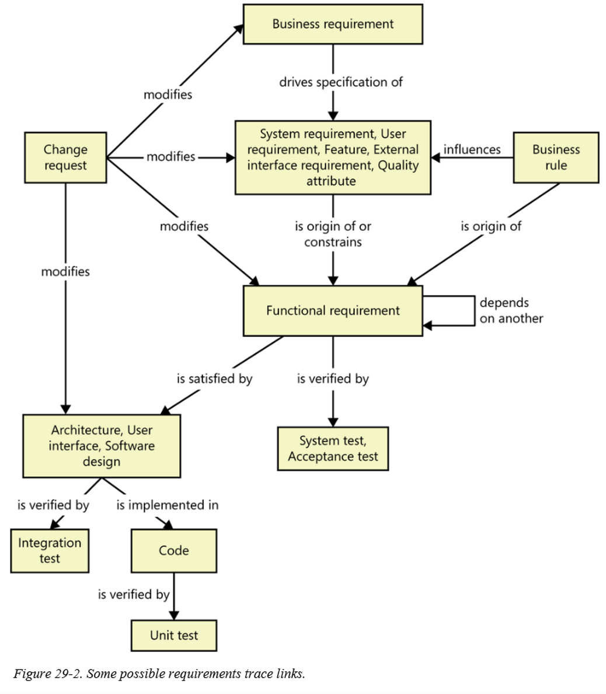
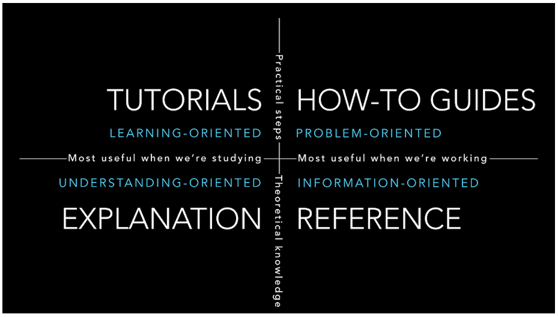

# :star: _Documentation-as-Code (DaC)_ :star:

<!-- TOC -->

* [:star: _Documentation-as-Code (DaC)_ :star:](#-star--_documentation-as-code-dac_--star-)
  * [What should be documented?](#what-should-be-documented)
    * [When there is a change request, it modifies  many artifacts, so be intelligent while keeping & maintaining these artifacts in a project.](#when-there-is-a-change-request-it-modifies--many-artifacts-so-be-intelligent-while-keeping--maintaining-these-artifacts-in-a-project)
  * [Four Types of Documentation](#four-types-of-documentation)
  * [Project Documentation: Examples and Templates](#project-documentation--examples-and-templates)
  * [What is project documentation?](#what-is-project-documentation)
  * [Examples of project documents](#examples-of-project-documents)
  * [Project proposal](#project-proposal)
  * [Project charter](#project-charter)
  * [Project plan](#project-plan)
  * [Project status report](#project-status-report)
  * [Project retrospective](#project-retrospective)
  * [Other project document examples](#other-project-document-examples)
  * [The value of project documentation](#the-value-of-project-documentation)
  * [Choosing the right documentation software](#choosing-the-right-documentation-software)
  * [How to document a project](#how-to-document-a-project)
  * [Organize all project documentation in one place](#organize-all-project-documentation-in-one-place)
  * [Make it easy to access and search](#make-it-easy-to-access-and-search)
  * [Keep it lightweight](#keep-it-lightweight)
  * [Collaboratively maintain it](#collaboratively-maintain-it)
  * [Project documentation template](#project-documentation-template)

<!-- TOC -->

## [What should be documented?](https://blog.codecentric.de/architecture-documentation-as-code-with-structurizr-and-asciidoctor-part-2-asciidoctor)

One of the main questions when writing architecture documentation is:

What should we document about our architecture? 👀️

This question is not easy to answer. While there are aspects of the architecture like quality requirements, architecture decisions, or the system context which are essential parts of architecture documentation, other aspects might not be relevant. What is relevant or not depends on things like the system to be documented, external factors like legal requirements, and the documentation's target audience?

Another aspect to consider it is the level of detail. Detailed information tends to outdate faster than more general information. As a result, detailed documents need to be updated more often, resulting in more efforts to keep the documentation up-to-date. Therefore, the goal is to find the right balance between what’s really relevant and the efforts needed to maintain the documentation.

However, architecture document templates can help with answering the question of what should be documented.
Such templates describe the contents as well as the document structure of an architecture documentation.
Multiple of those templates is freely available on the internet.

### When there is a change request, it modifies  many artifacts, so be intelligent while keeping & maintaining these artifacts in a project.

**Figure 29-2** (given below) illustrates many kinds of traceability relationships that can be defined on a project. _**Of course, you don’t need to define and manage all these trace link types.**_ On many projects, you can gain most of the traceability benefits you want for just a fraction of the potential effort. _**Maybe you only need to trace system tests back to functional requirements or user requirements.**_ Perform a **cost-benefit analysis** to decide which links will contribute to the success of your project, both in terms of **development** and long-term **maintenance** effort. Don’t ask **team members** to spend time recording information unless you know how they can use it.

<iframe width="600" height="200" src="https://www.youtube.com/embed/qMBSBMDUJVM" title="YouTube video player" frameborder="0" allow="accelerometer; autoplay; clipboard-write; encrypted-media; gyroscope; picture-in-picture" allowfullscreen></iframe>

<iframe width="600" height="200" src="https://www.youtube.com/embed/3ikkOSqtKQU" title="YouTube video player" frameborder="0" allow="accelerometer; autoplay; clipboard-write; encrypted-media; gyroscope; picture-in-picture" allowfullscreen></iframe>

## [Four Types of Documentation](https://documentation.divio.com/)

**Documentation** is fundamentally not one thing, but four related, yet different things:

1. **Tutorials**, which are learning-oriented, practical steps.
2. **How-to guides**, which are task-oriented, practical steps.
3. **Technical references**, which capture information-oriented, theoretical knowledge.
4. **Explanations (or discussions)**, which capture understanding-oriented, theoretical knowledge.

[**Daniele**](https://www.writethedocs.org/videos/eu/2017/the-four-kinds-of-documentation-and-why-you-need-to-understand-what-they-are-daniele-procida/) argues that to have effective and clear technical documentation, content should be structured explicitly around these four types, all kept separate and distinct from each other.

<iframe width="600" height="200" src="https://www.youtube.com/embed/t4vKPhjcMZg" title="YouTube video player" frameborder="0" allow="accelerometer; autoplay; clipboard-write; encrypted-media; gyroscope; picture-in-picture" allowfullscreen></iframe>

## Project Documentation: Examples and Templates

Learn how to keep your project documentation organized and up-to-date with the simple best practices.

Project documentation is a vital part of project management. It's also every project manager's least favorite task.

"We have no time for this right now."

"We're doing Agile."

"No one reads that stuff."

It may seem tedious, but comprehensive documentation is what can make the difference between the success and failure of your project. Let's dive deeper into what project documentation actually is and why it's worth your time.

* What is project documentation?
* Examples of project documents
* The value of project documentation
* Choosing the right documentation software
* How to document a project
* Project documentation template

## What is project documentation?

**Project documentation** is the process of recording the key project details and producing the documents that are required [po-098c] to implement it successfully. Simply put, it's an umbrella term which includes all the documents created over the course of the project.

Project documents come in many forms – from _**project proposals**_ and business cases, to **_project plans_** and project status reports.

**_Your team's collective brain, bring all your knowledge, docs, and projects together in one place._**

## Examples of project documents

It's difficult to strictly define what should be documented over the course of a project, as it's strongly dependent on the kind of project you are managing. A major project at a big enterprise usually requires a lot more paperwork than a small-scale initiative at an early-stage startup.

But some basic documents are needed in most cases. Here are five project document examples that your project will likely require.

## Project proposal

A **_project proposal_** is written to initiate a **project** – it is the first step in the project **_management process._** The goal of this document is to convince the decision-makers and stakeholders that the idea behind the project is worth pursuing. A project proposal needs to outline the project's core value proposition, which is often done in the form of a business case.

## Project charter

A project charter is another key project documentation example. This document lays the foundation for the project by covering the high-level project planning. It needs to outline how the business goals of the project will be achieved by explaining the key requirements, budget, tasks, roles, and responsiblities of the project. It’s the first document you write after your project proposal is formally approved.

## Project plan

After high-level planning is complete, the project manager creates a more detailed **_project plan_**. It serves as a roadmap for the project, defining the key project milestones and placing them on a timeline. This document evolves together with the project, capturing all changes and decisions and facilitating communication among project stakeholders.

## Project status report

Depending on the scope of your project and the size of our team, keeping everyone up-to-date may become difficult. Project status reports are written to keep all project stakeholders – both internal and external – on the same page. These documents usually contain an overview of the progress you've made so far and the next steps you are planning to take.

## Project retrospective

Every project is a learning opportunity. What went well? What could be improved next time? After you conclude the project, sit together with your team and do a project retrospective. Document your lessons learned in a separate document and use it as a reference for your next project.

## Other project document examples

This was by no means an exhaustive list. Some large-scale projects require hundreds of separate documents and forms, while smaller projects tend to simplify and combine them.

Depending on the type of project you are planning to undertake, you may want to additionally create some of the following project documents:

* Project scope statement
* Business requirements document
* Risk management plan
* Cost management plan
* Communication plan
* Financial plan
* QA plan

## The value of project documentation

The first and perhaps the most important reason why you should document your project is simple – **writing things down forces you to think through your idea** and to verify if it actually makes sense. It also makes your project much easier to manage by helping your team to:

* Clarify the project expectations and objectives
* Break down the work into manageable blocks
* Plan and assign resources
* Ensure that all stakeholders are informed about the progress
  But it can also create long-term benefits for your organization even after the project is concluded:

1. [X]  **Faster** _**new employees onboarding**_. Good project documentation gives new team members access to all the knowledge that has been collected over the course of your projects, both past and ongoing. New team members are able to immediately understand decisions made in the past and to find relevant information without having to ask others on the team over the course of many weeks.
2. [X]  **Better cross-team alignment**. Thorough documentation brings clarity and transparency to what everyone is working on. As a result, decisions and discussions don't get scattered over chat and email, less time is spent in meetings, and work is less likely to get duplicated.
3. [X]  **More effective knowledge management**. The insights and lessons learned from one project can be transferred to new projects. Capturing and sharing this knowledge can help you develop new best practices, prevent repeated mistakes, and continuously improve your team's overall performance.
   But in order to deliver on these goals, your **internal documentation** needs to be well-written, accurate, and up-to-date. In this guide, we will cover the tools and best practices you can use to improve the quality of your project documentation.

## Choosing the right documentation software

There are many tools you can use to document a project – Google Docs, Confluence (and a variety of Confluence alternatives), different types of internal wikis and knowledge bases, and more.

Depending on the size of your team and your approach to project management, your requirements may differ. Some teams need complex solutions with advanced features, such as built-in approval workflows and automated tasks, while others prefer simpler and easier tools with no learning curve. Whatever tool you choose, make sure all project stakeholders know how to use it.

In any case, an ideal **project documentation tool** should:

1. [X]  Be easily editable even by non-technical users, ideally, in real time.
2. [X]  Provide an instant and reliable search function.
3. [X]  Have intuitive navigation.
4. [X]  Make it easy to organize content.
5. [X]  Integrate with other tools to keep all your project assets in sync.

## How to document a project

Part of what makes project documentation seem so frustrating – and even useless – is that the finished documents are often not read by anyone. Documentation is created only because it's what you're expected to do, and then immediately forgotten and discarded.

There are a few ways to ensure that the time you invest in documenting your project is not wasted:

## Organize all project documentation in one place

Project-related communication tends to scatter across meetings, chat, email, and shared drives, leaving your team without a single source of truth. Instead, bring all project-related documents together in one place and don't waste time hunting through outdated Confluence pages or stale emails.

## Make it easy to access and search

The easier you make it for people to find the information they need, the more likely they will be to read the documentation. Make sure your documentation tool is equipped with a reliable and fast search feature.

## Keep it lightweight

While it's important to keep your project documentation thorough, it also needs to be concise. No one will bother reading pages and pages of text – write down what you need and only what you need, with a clear purpose and audience in mind. Follow the rules of Agile documentation.

## Collaboratively maintain it

Don't rush to laminate your project documents. As your project evolves and progresses, many key details may change, and your documentation needs to keep up. Create living documentation and give stakeholders access to share feedback, ask questions, and update it as needed.

## Project documentation template

Every project is different and there is no one-size-fits-all when it comes to project documentation. But this simple one-page project documentation template can be a good starting point.

As your project evolves and your documentation becomes more detailed, you may want to split it into separate documents to keep things more organized.
