_Even if you aren't using #*DDD or event sourcing*#, you can use event storming because it is a general technique/tool/strategy._

image::{docdir}/../VU-course/../../3-programming-languages/Venkat-Subramaniam/images/img_612.png[Part-2]

image::{docdir}/../VU-course/../../3-programming-languages/Venkat-Subramaniam/images/img_613.png[Event Storming Technique Part-1]

.What is event storming?
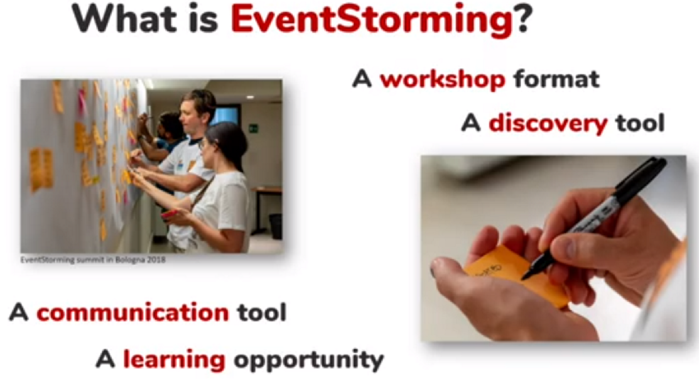

.What is a complex business domain?
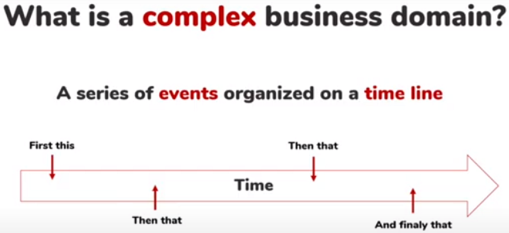

.When does event storming apply?
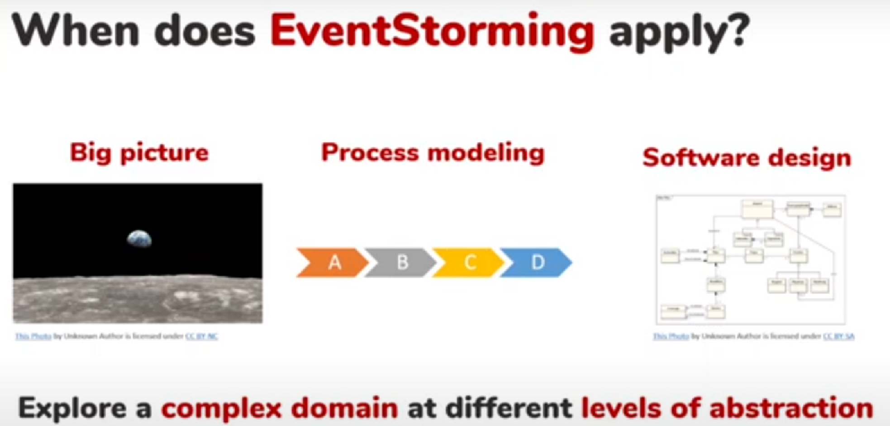

.Temporal modeling VS Structural modeling
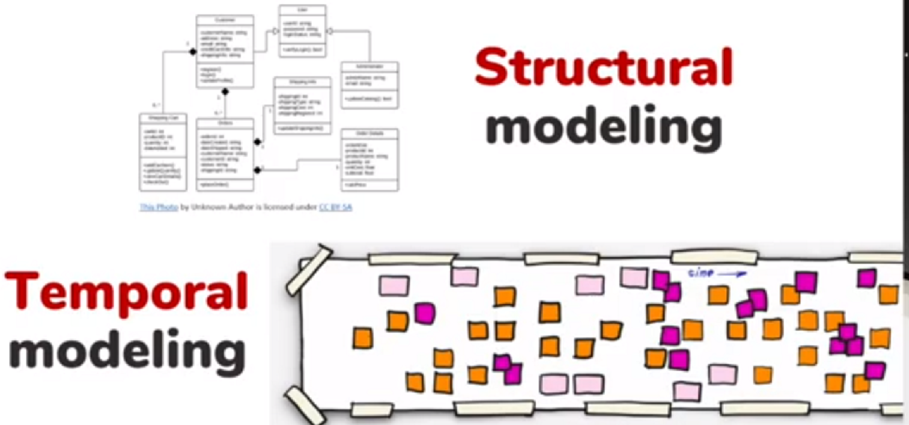

We are interested in temporal modeling that is:

* What's going on?
* What changes?
* What are interactions b/w different actors?

That's why we are using something like event storming.

.Knowledge is distributed
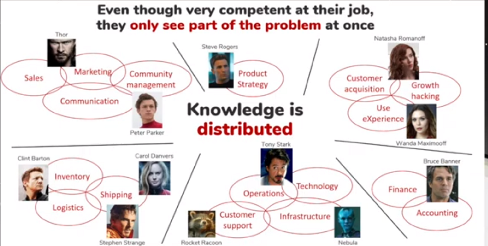

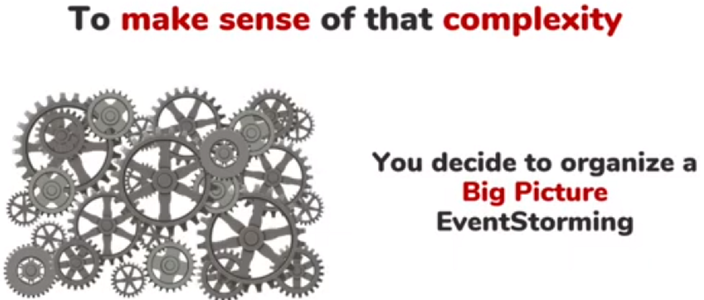

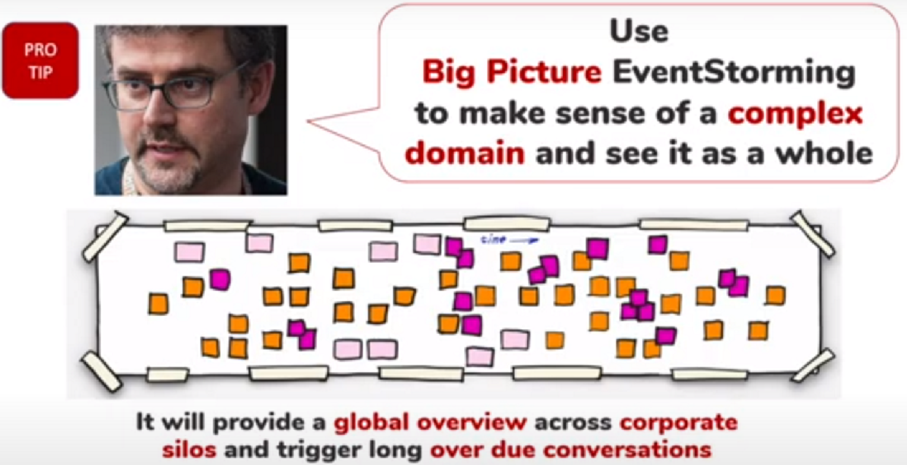

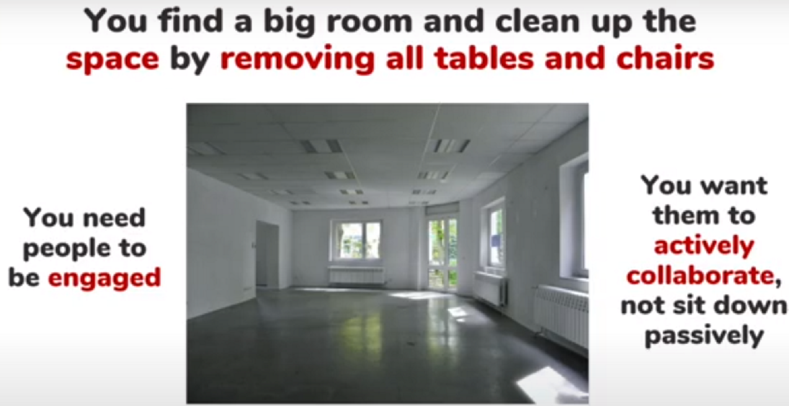

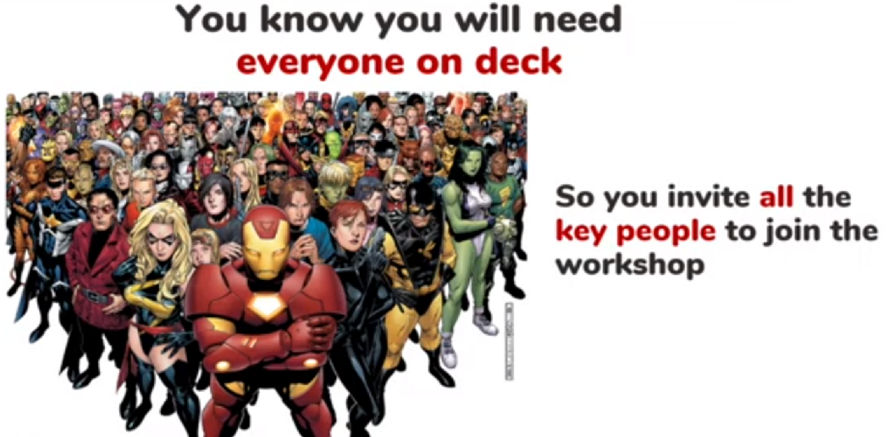

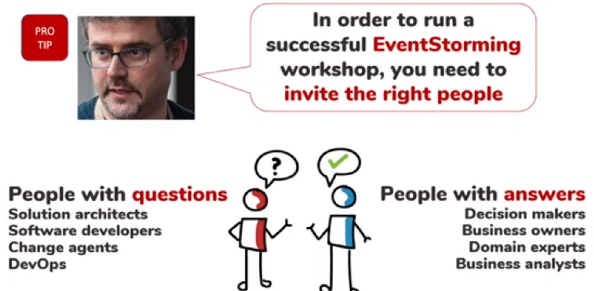

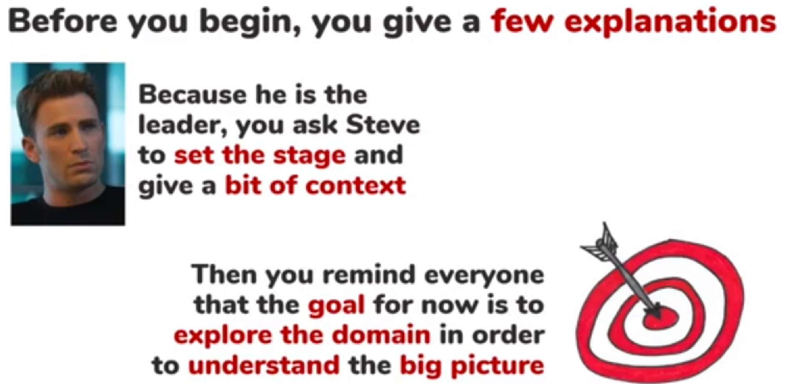

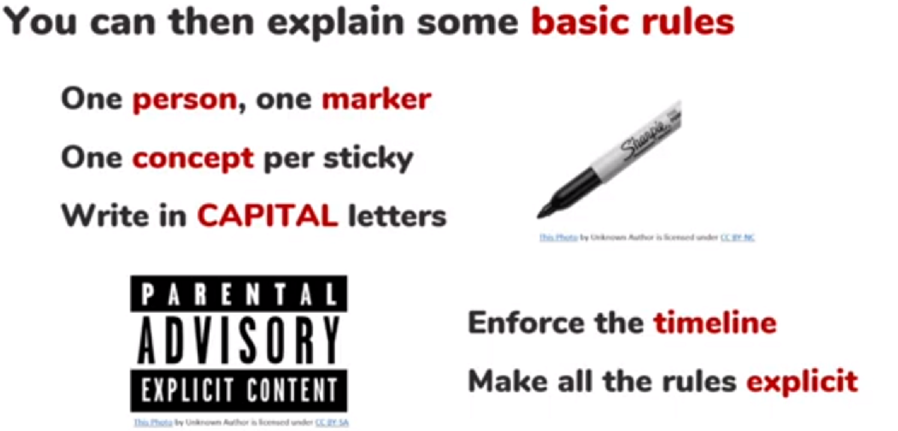

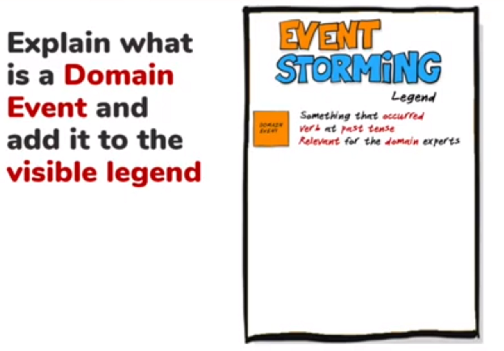

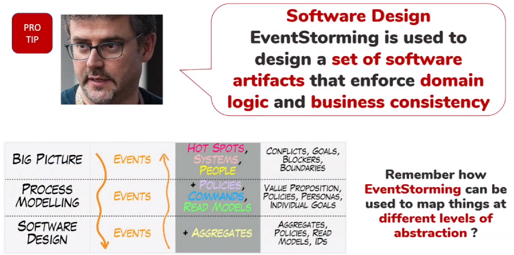