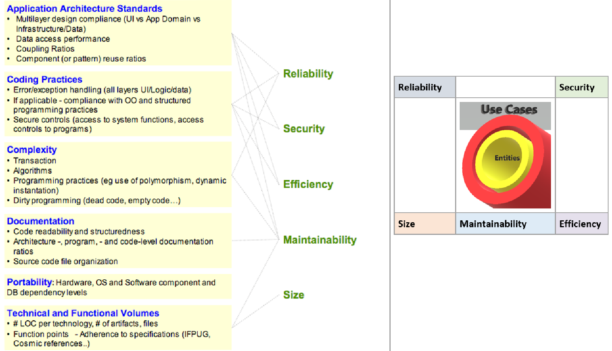

:doctype: pdf

1.	Availability
2.	Scalability (Nowadays in the cloud using #*docker and Kubernetes*# technology)
a.	*Vertical scalability* (By *scaling up*, you increase the capacity of a single machine and increase its throughput. Vertical scaling allows data to live on a single node, and scaling spreads the load through CPU and RAM resources for your machines.)
b.	*Horizontal scalability* (is [red]#*elasticity*#, Horizontal scaling simply adds more #*instances*# of machines without first implementing improvements to existing specifications. By *_[.underline]#scaling out#_*, you share the [.underline]#*processing power and load balancing*# across [.underline]#*multiple machines*#.)
3.	Elasticity (especially in cloud apps, dynamically scale up or down of an application on demand)
4.	Deploy-ability #*(CI/CD)*#
.	Continuous Integration Server (CI) like #*Jenkins*# is required?
. Continuous Deployment?
... https://www.youtube.com/watch?v=8Kw3a6eHaOs&ab_channel=VideonetChannel[*Faster deployments*] (at time 00:8:00)
5.	Energy Efficiency
6.	Integrability (means #*Interoperability*#)
7.	*Portability* (Nowadays in the cloud “*[red]#docker#*” *#technology#* [.underline]#is also used to achieve portability, or supporting Windows O/S, Mac O/S, and Linux O/S)#
8.	#Modifiability# (SOLID, Design patterns, YAGNI, DIP, Clean architecture, Onion architecture, layered architecture, etc.)
9.	Performance (is Algorithms & data structures, Network)
10.	Safety
11.	Security (authorization & authentication, captcha, biometric login, etc.)
12.	Testability (TDD, coupling & cohesion, reusability)
13.	Usability (HCI, UI/UX, Wireframe, mockups & prototypes

*#Kubernetes#* (an orchestration tool) & provides declarative primitives for the "desired state"

1. [red]#*Self-healing*# (if you tell me I need 3-instances for my "application" it makes sure there are exactly three instances if there is an additional one for some reason, it kills it if there is one less it will create one for you)

2. [red]#*Auto-restarting*# (automatically restarts a container as well)

3. [red]#*Schedule across hosts*# (works across multiple hosts that is you can start up a Kubernetes cluster & run across multiple hosts & it works with multiple VM providers etc. Amazon, Google computer engine VMware, etc.)

4. [red]#*Replicating*# (it allows you to replicate those containers as well)

