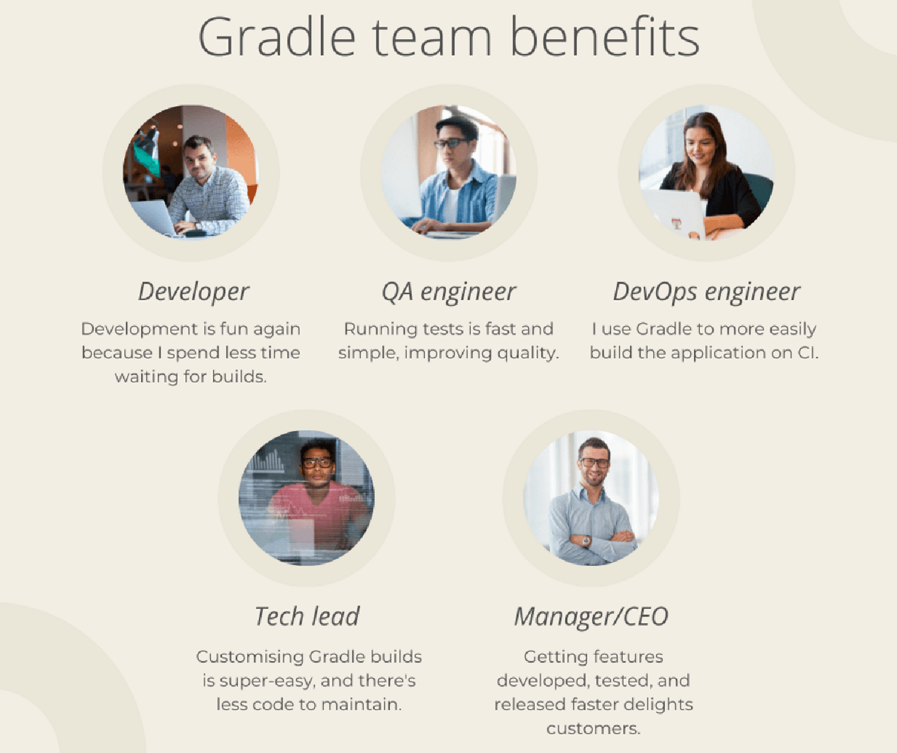
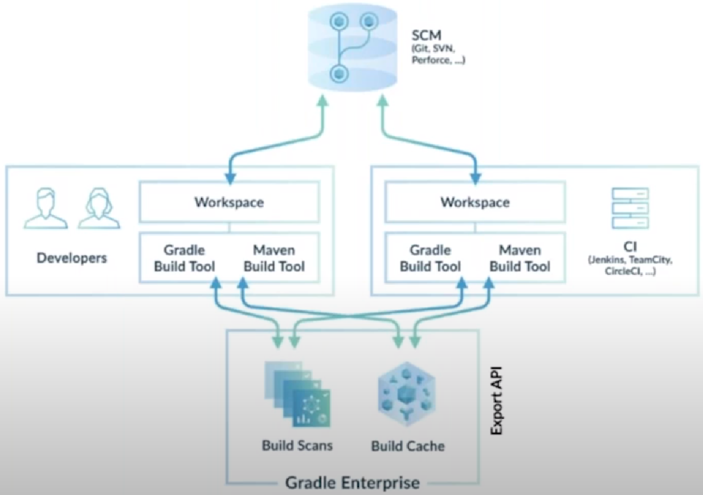

= Gradle
Author Name Mehmood-ur-Rehman
:sectnumlevels: 4
:toclevels: 4
:sectnums: 4
:toc: left
:icons: font
:toc-title: Table of contents
:doctype: article

== https://tomgregory.com/maven-vs-gradle-comparison/[Gradle build tool (article)]

Your team and Gradle

If you know you want to migrate to Gradle, but need to convince your team, here are some benefits from different team-members’ perspectives.

* https://www.youtube.com/watch?v=6yFdhwlckTo&ab_channel=NikolayPanyukov[*Gradle basics* | concepts | build.gradle | project structure | files | configuration]

- what is the Gradle
- how does a project structure looks like
- basic concepts
- crucial files
- basic configuration

+++
<iframe width="560" height="315" src="https://www.youtube.com/embed/6yFdhwlckTo" title="YouTube video player" frameborder="0" allow="accelerometer; autoplay; clipboard-write; encrypted-media; gyroscope; picture-in-picture; web-share" allowfullscreen></iframe>
+++

* https://www.youtube.com/watch?v=w6b5dhGs_Yc&ab_channel=NikolayPanyukov[Gradle dependencies | *tasks* | *api scope* | *lifecycle* | create own task from java class]

Gradle *dependencies* #*scopes*# *#(compileOnly, runtimeOnly, implementation, api etc.)#* and *#tasks#*. Because I found, that this topic is usually difficult to understand.

+++
<iframe width="560" height="315" src="https://www.youtube.com/embed/w6b5dhGs_Yc" title="YouTube video player" frameborder="0" allow="accelerometer; autoplay; clipboard-write; encrypted-media; gyroscope; picture-in-picture; web-share" allowfullscreen></iframe>
+++

* https://www.youtube.com/watch?v=pSKY3-K9_qc&ab_channel=NikolayPanyukov[Multi module java project with Gradle | basics | sub project import | manage dependencies]

    1. how to create a multi-module gradle project
    2. how to import one module to another
    3. share dependencies between modules
    4. store dependencies in an external file

+++
<iframe width="560" height="315" src="https://www.youtube.com/embed/pSKY3-K9_qc" title="YouTube video player" frameborder="0" allow="accelerometer; autoplay; clipboard-write; encrypted-media; gyroscope; picture-in-picture; web-share" allowfullscreen></iframe>
+++

* https://www.youtube.com/watch?v=c4b2Qio9OOQ&ab_channel=TomGregory[Gradle Multi-Project Builds in 100 Seconds]
Gradle multi-project builds (a.k.a. multi-module) are a way to structure your software project to encourage *#reuse#* and *maintainability through modularisation*. If your Gradle project setup is slowing you down, this video is the first step to fix that.
+++
<iframe width="560" height="315" src="https://www.youtube.com/embed/c4b2Qio9OOQ" title="YouTube video player" frameborder="0" allow="accelerometer; autoplay; clipboard-write; encrypted-media; gyroscope; picture-in-picture; web-share" allowfullscreen></iframe>
+++

====
.*Summary*
Both Maven and Gradle are tools to build modern Java applications. This article has highlighted the key differences between them in terms of *performance, code, usability, and customisation*.
The comparisons indicate that Gradle is now the better build tool for increased developer productivity. Maven still has some use cases where it may be more suitable https://tomgregory.com/maven-vs-gradle-comparison/#choosing[Choosing between Maven and Gradle]
[(see Choosing between Maven and Gradle and the comparison table)], but in general Gradle is the best choice for both small and large projects.

====

.Gradle Enterprise
