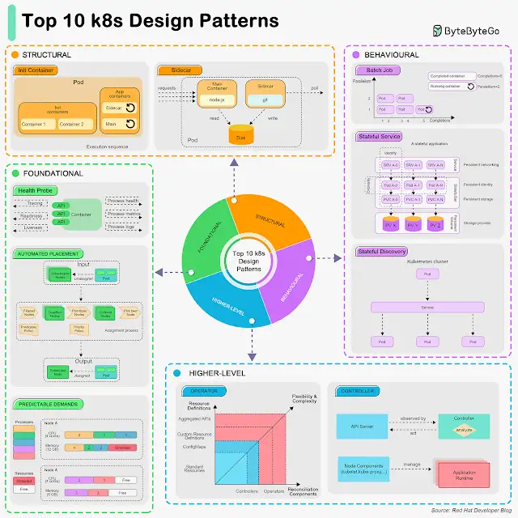

Top 10 k8s Design Patterns
.
.
🔹 Foundational Patterns
These patterns are the fundamental principles for applications to be automated on k8s, regardless of the application's nature.

1. Health Probe Pattern
This pattern requires that every container must implement observable APIs for the platform to manage the application.

2. Predictable Demands Pattern
This pattern requires that we should declare application requirements and runtime dependencies. Every container should declare its resource profile.

3. Automated Placement Pattern
This pattern describes the principles of Kubernetes’ scheduling algorithm.

🔹 Structural Patterns
These patterns focus on structuring and organizing containers in a Pod.

4. Init Container Pattern
This pattern has a separate life cycle for initialization-releated tasks.

5. Sidecar Pattern
This pattern extends a container’s functionalities without changing it.

🔹 Behavioral Patterns
These patterns describe the life cycle management of a Pod. Depending on the type of the workload, it can run as a service or a batch job.

6. Batch Job Pattern
This pattern is used to manage isolated atomic units of work.

7. Stateful Service Pattern
This pattern creates distributed stateful applications.

8. Service Discovery Pattern
This pattern describes how clients discover the services.

🔹 Higher-Level Patterns
These patterns focus on higher-level application management.

9. Controller Pattern
This pattern monitors the current state and reconciles with the declared target state.

10. Operator Pattern
This pattern defines operational knowledge in an algorithmic and automated form.

