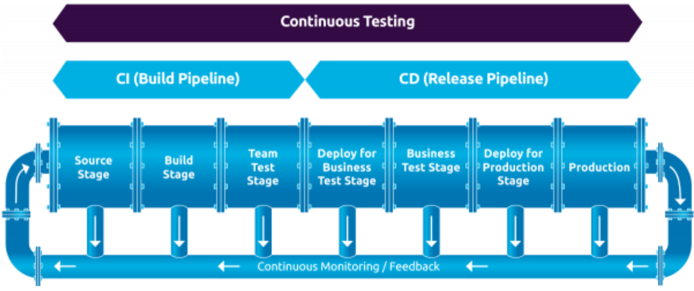
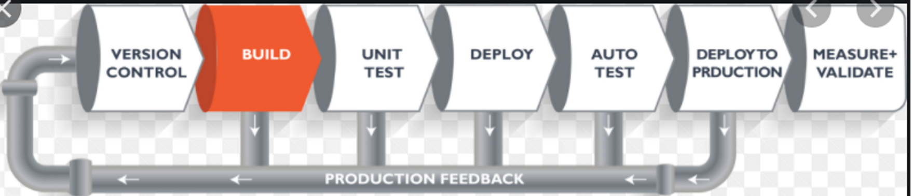

= What is CI/CD Pipeline| What is Jenkins and how it works | CI/CD Pipeline using Jenkins
Author Name Mehmood-ur-Rehman
:sectnumlevels: 4
:toclevels: 4
:sectnums: 4
:toc: left
:icons: font
:toc-title: Table of contents
:doctype: article

Lec-36  How to compile a code that is present in GitHub, Review that code and Analyze the test cases present in the GitHub repository. The Hands-On session also explains how to create a build pipeline using Jenkins and how to add Jenkins Slaves.

Issues before Jenkins came in, what is continuous integration, features of Jenkins, Jenkins architecture, and you will also see a case study using Jenkins. Jenkins is a continuous integration tool that allows continuous development, test and deployment of newly created codes. Jenkins is primarily a build and release tool, it was written originally by the community as a build and release tool. They did not target it as a continuous integration, continuous deployment or an orchestration tool, it was simply used for releasing builds to production but now Jenkins has a lot of other uses like it's a continuous integration tool. It allows developers to make sure that their environments have the exact same code as their code repositories.

=== CI/CD pipelines and tooling

https://www.tmap.net/building-blocks/CICD-pipelines[*_CI/CD pipelines and tooling_*]

.CI/CD pipelines and tooling

.CI/CD pipelines and tooling

* *Continuous delivery:* if your client is technical then you deliver app/code to the client & he can deploy himself or client's employee can *deploy* the #app/code#
* *Continuous deployment:* if your client is not technical then you will *deploy* #app/code#

== Teamcity Jetbrains CI/CD tool

.CI/CD with JetBrains TeamCity | TeamCity Tutorial
+++
<iframe width="560" height="315" src="https://www.youtube.com/embed/zqi4fDF-S60" title="YouTube video player" frameborder="0" allow="accelerometer; autoplay; clipboard-write; encrypted-media; gyroscope; picture-in-picture; web-share" allowfullscreen></iframe>
+++

== Jenkins (open source)

.*Complete Jenkins Pipeline Tutorial | Jenkinsfile explained*
+++
<iframe width="560" height="315" src="https://www.youtube.com/embed/7KCS70sCoK0" title="YouTube video player" frameborder="0" allow="accelerometer; autoplay; clipboard-write; encrypted-media; gyroscope; picture-in-picture; web-share" allowfullscreen></iframe>
+++

*▬▬▬▬▬▬ T I M E S T A M P S ⏰  ▬▬▬▬▬▬*

0:00    Intro

0:11    #What is Jenkinsfile?#

0:50    #From Scripted to Declarative Pipeline Syntax#

2:48    Basic Structure of Jenkinsfile

8:40    Post Build Actions in Jenkinsfile

10:15  Define Conditionals / When expression

12:45  Using Environmental Variables in Jenkinsfile

20:13  Using Tools attribute for making build tools available

22:30  Using Parameters for a Parameterized Build

27:29  #Using external Groovy scripts#