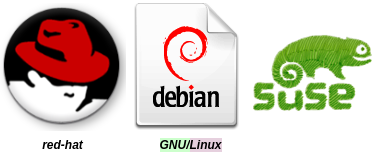
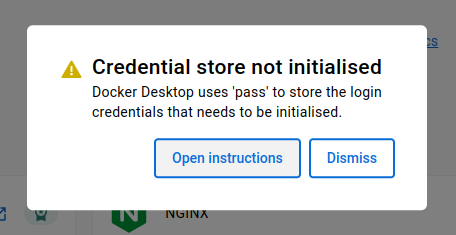
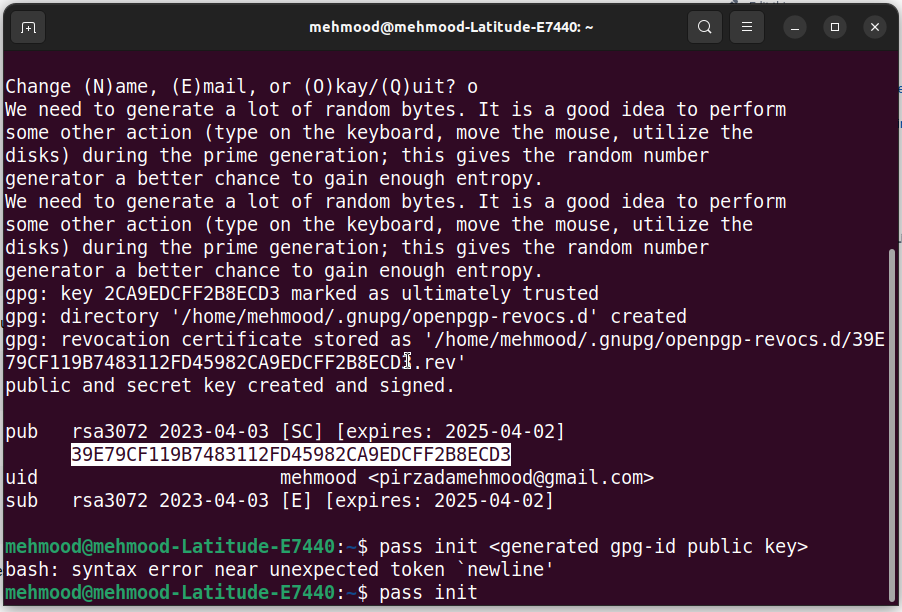
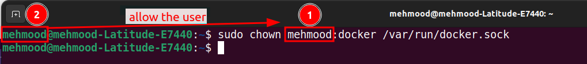
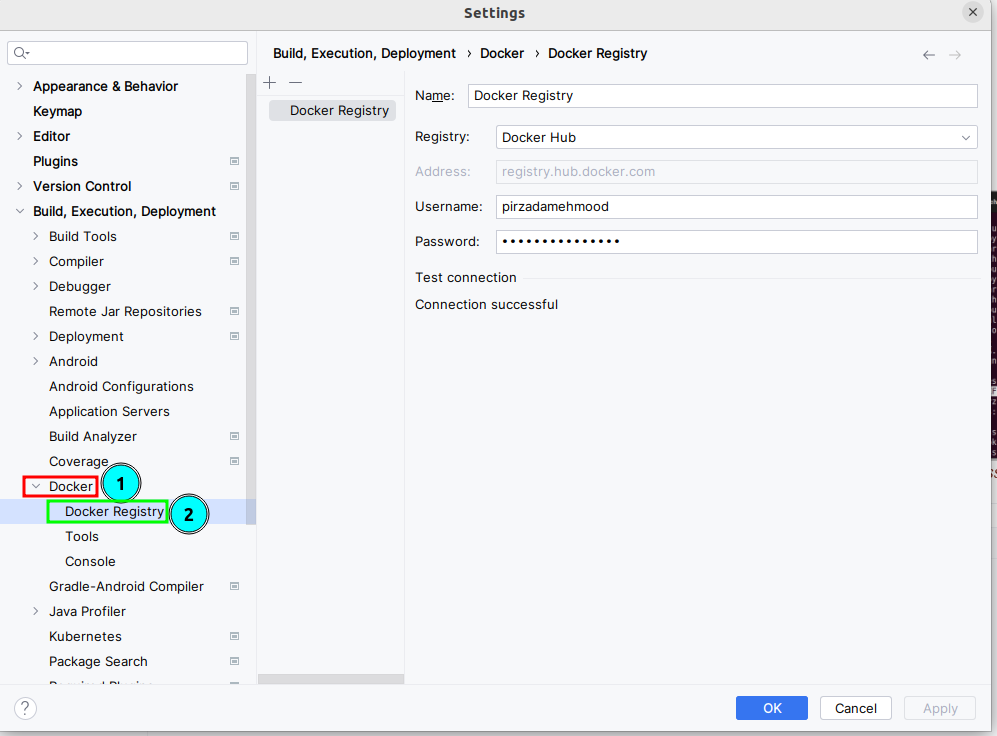

= What are the 3 Linux distributions?

There are three main “*families*” of _**Linux distributions**_: #_Debian GNU/Linux, redhad, and suse_# . Most other Linux distributions use one of these three distributions as their foundation.

.How to install Docker-desktop on Ubuntu-22.0 LTS release

. https://www.youtube.com/watch?v=Vplj9b0L_1Y&ab_channel=Abstractprogrammer[Youtube Video link]
. https://docs.docker.com/engine/install/ubuntu/[*Download and install #docker-engine#*]
. https://docs.docker.com/desktop/install/linux-install/[*Now, install #docker-desktop# on the Linux machine*]
** https://docs.docker.com/desktop/get-started/#credentials-management-for-linux-users[Sign-in in the Docker-desktop]

.Sign-in in the Docker-desktop

.this highlighted key is different each time you sign in, and has to be passed in along with the command as shown in the terminal

** https://phoenixnap.com/kb/cannot-connect-to-the-docker-daemon-error[*How to Resolve, the “cannot connect to the Docker daemon” Error*] 

** *_The execution of Step-3_* will fix IntelliJ-IDEA docker-plugin  issues as shown in the through labels

.fixing docker registery and docker daemon in intelliJ-idea

.ubuntu:

. https://www.youtube.com/watch?v=snN--wBu3xw&list=LL&index=24&ab_channel=OSTechHelp[How to install Oracle JDK 17 (Java 17) on Ubuntu 22.04 LTS]
. https://www.youtube.com/watch?v=pbOqobwlueU&list=LL&index=3&ab_channel=KskRoyal[Top 10 Best GNOME Extensions For Ubuntu 22.04 [2022 Edition]]

. https://www.youtube.com/watch?v=Cu4hrOYRt0c&list=LL&index=13&t=595s&ab_channel=AverageLinuxUser[15 Things to Do After Installing Ubuntu 22.04]
** *#How to add urdu font in ubuntu?#*
*** *open the terminal and type* `sudo apt install fonts-nafees`
*** You may need to log out and log back in for the changes to take effect.
. https://www.youtube.com/watch?v=GrI5c9PXS5k&list=LL&index=24&t=353s&ab_channel=LinuxTex[20 Things You MUST DO After Installing Ubuntu (Right Now!)]

. https://www.youtube.com/watch?v=p0TfTWndCtk&list=LL&index=8&ab_channel=TechSolutionZ[How to Install VirtualBox on Ubuntu 22.04 Jammy Jellyfish + Extensions Pack - VM VirtualBox]

. https://www.youtube.com/watch?v=zIChYaay0m4&list=LL&index=10&ab_channel=AmazeTips[How to fix Invalid partition table! QUICK FIX! Invalid Partition Table! Error while installing.]

. https://www.youtube.com/watch?v=UVccSRU8jXA&list=LL&index=26&ab_channel=OSTechHelp[How To Install IntelliJ IDEA on Ubuntu 22.04 LTS]

. https://www.youtube.com/watch?v=jSiIUpY4LEE&list=LL&index=22&t=1006s&ab_channel=TechWithFoyzur[Docker in IntelliJ IDEA (2020 & 2021)]

. https://www.youtube.com/watch?v=uycJg7PNgZ8&list=LL&index=21&ab_channel=CodeWithArjun[Customize dock panel on Ubuntu]

. https://www.youtube.com/watch?v=Fjy4gUB_asM&list=LL&index=12&ab_channel=TechSolutionZ[How to Install Ubuntu 22.04 Jammy Jellyfish with Manual Partitions | Ubuntu Manual Partitions Linux]

. https://www.youtube.com/watch?v=8rmDF-5IxeI&list=LL&index=1&t=47s&ab_channel=RollyYesputra[*How to Install on Linux visual paradigm*]
** *run this command: #sudo chmod 755 Visual_Paradigm_17_0_20230401_Linux64.sh#*
** *now run this command: #./Visual_Paradigm_17_0_20230401_Linux64.sh#*

====
*Dockerfile* and *Bash* are both tools for building and running software applications, but they serve different purposes.

Dockerfile is a file format that defines how to build a Docker image, which is a lightweight, standalone, executable package that includes everything needed to run an application, including the code, runtime, libraries, environment settings, and dependencies. Dockerfile includes instructions for building the image, such as installing packages, copying files, setting environment variables, and exposing ports.e

Bash, on the other hand, is a popular shell scripting language used for automating tasks and running commands on Linux and Unix systems. Bash scripts are typically used for system administration tasks, such as installing software, configuring servers, and managing files and directories.

While Dockerfile instructions are written in a syntax similar to Bash commands, Dockerfile is more focused on building images for Docker containers, whereas Bash is more general-purpose and can be used for any scripting task on a Linux system.

In summary, Dockerfile is used for building Docker images, while Bash is a general-purpose scripting language used for automating tasks on Linux systems. While they may share some similarities in syntax, they serve different purposes and are used in different contexts.