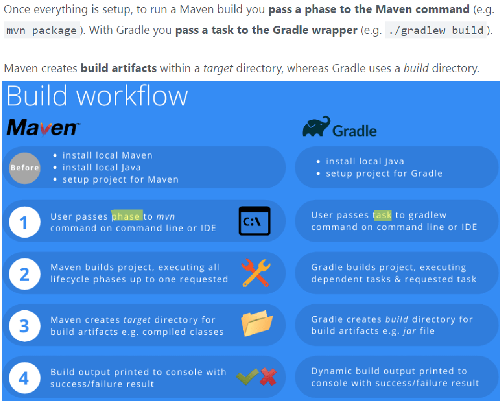

= Maven
Author Name Mehmood-ur-Rehman
:sectnumlevels: 4
:toclevels: 4
:sectnums: 4
:toc: left
:icons: font
:toc-title: Table of contents
:doctype: article

== https://tomgregory.com/maven-vs-gradle-comparison/[What is Maven and how it works (article) ]

* *Maven* is project management (#build#) tool.

* In *Gradle*, a #task# is a unit of work to get done in your build. It’s the equivalent of a *Maven goal*.

.maven vs gradle

.https://www.youtube.com/watch?v=NpZmjWBAWK8&ab_channel=TechPrimers[What is Gradle? How is it different from Maven? | DevOps |]
+++
<iframe width="560" height="315" src="https://www.youtube.com/embed/NpZmjWBAWK8" title="YouTube video player" frameborder="0" allow="accelerometer; autoplay; clipboard-write; encrypted-media; gyroscope; picture-in-picture; web-share" allowfullscreen></iframe>
+++

====
.*Summary:*
Gradle supports Incremental Builds, If a Java Class has not been changed from its last build it will avoid recompiling to generate .class file so that build-time will be saved.

*Transitive Dependencies* will be managed by Gradle, which is added later in Maven2
Concurrency Safe Cache.

You can run several builds on the Same Cache (Similar to the Local Repository in Maven) Gradle will ensure the Cache is concurrency safe.

Custom Repository Layout, unlike Maven in Gradle you can customize the Directory structure of a project File-based dependencies - In Maven to use your own dependency, you need to import it into the local maven repository but in Gradle you can refer to the Jar dependencies from File System as dependency
Fully Configurable - In Maven the only way of adding the build extensions is through plug-in. But in Gradle you can write Tasks like Ant and can customize the build behaviour easily
====

.https://www.youtube.com/watch?v=PHTw0XWGkDw&ab_channel=TechPrimers[How to create Custom Gradle Plugins and Extensions | Gradle Plugin Development]
+++
<iframe width="560" height="315" src="https://www.youtube.com/embed/PHTw0XWGkDw" title="YouTube video player" frameborder="0" allow="accelerometer; autoplay; clipboard-write; encrypted-media; gyroscope; picture-in-picture; web-share" allowfullscreen></iframe>
+++

image::images/maven.png[]