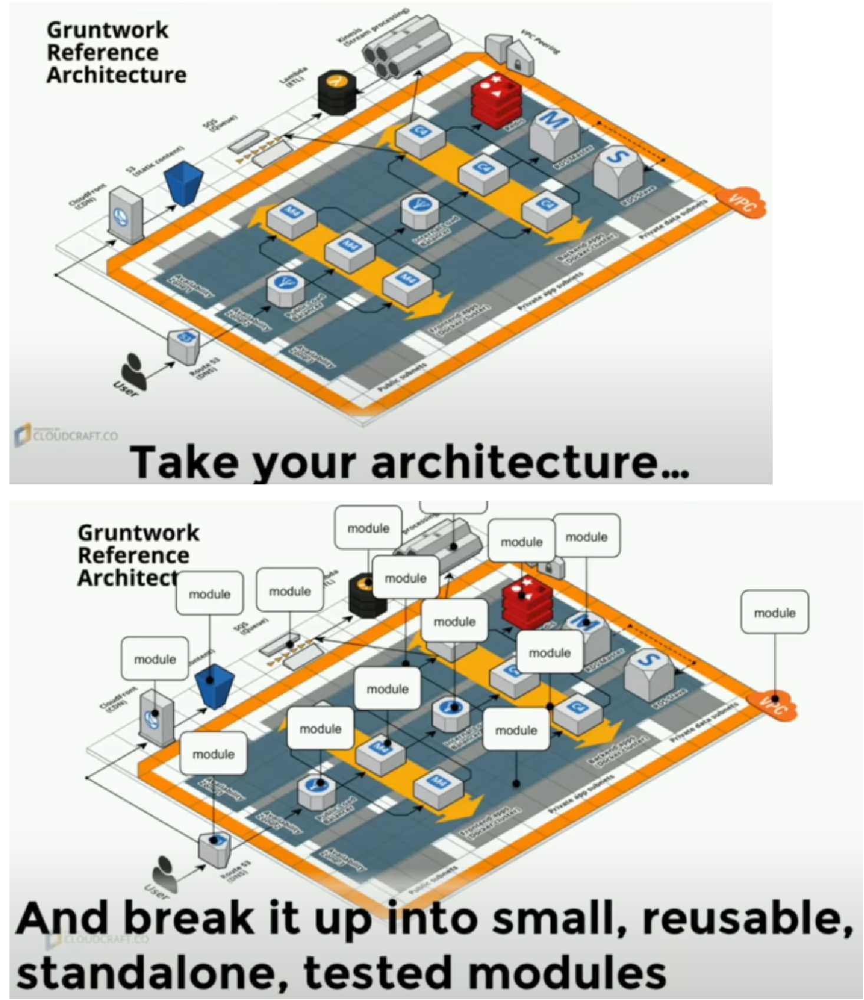

== 8 Terraform Best Practices that will improve your Terraform (TF)  workflow immediately

Terraform is one of the best Infrastructure as code *IaaC* tools in the world.

Many of the Terraform best practices are around the *state and statefile*.

*State:* Terraform is a tool that automates creation of infrastructure and then making changes and maintaining that infrastructure. And to keep track record of the current infrastructure state and change you want to make terraform uses state.

*Statefile:*

. manipulate state only through TF commands

. always set up a shared remote storage

. use state locking

. backup your statefile

. use #1-statefile# per *environment* (development, testing, production)

Next three best practices are about:

* How to manage Terraform code?

* How to apply the Infrastructure changes?

These can be grouped into the *#IaC#* trend which emerged recently which is called <<gitops>>

. Host Terraform code in its own git repository just like your application code.

. CI for the Terraform code

. apply infrastructure changes only through CD pipeline

. With terraform you will create infrastructure (server, router, switch, network, IP, ram, disk, cpu, etc.)
. with ansibile, cheff, puppet  you can install software on the infrastructure (machines)

* Terraform (laptop) #--connect-># AWS-provider or any other

* Terraform (laptop)#--login-># AWS-provider or anyother

** for login, you need *access key and secret key*

* Terraform (laptop)#-- after-login-># do resource/infrastructure creation

most used and basic terrform commands:
* TF init
* TF Plain
* TF validate
* TF apply
* TF destroy

.How to do log-in in terraform
https://www.youtube.com/watch?v=sMequBZimaw&t=2315s[*38:35*] it is important concept just 2-minutes

.how to create *ec2* instance
https://www.youtube.com/watch?v=sMequBZimaw&t=2795s[*46:35*] it is important concept just 2-minutes

.how to expose *ec2* instance *(apache/nginx)* to the outer world AWS
https://www.youtube.com/watch?v=sMequBZimaw&t=3900s[*1:05:00*] it is important concept just 2-minutes

.how to disable the *access key and secret key* on AWS
https://www.youtube.com/watch?v=sMequBZimaw&t=4189s[*1:09:50*] it is important concept just 2-minutes

.Installing PyCharm IDE and Add Terraform HCL Plugin Support
video::75FfuARSils[youtube, width="400"]

.Configure AWS CLI with IntelliJ IDEA to start working on Terraform
video::KK979xoKV5A[youtube, width="400"]

https://registry.terraform.io/[*_registry.terraform.io_*]

== Standardize your deployment workflow

[.image_root__MMhvi]#image:https://content.hashicorp.com/api/assets?product=tutorials&version=main&asset=public%2Fimg%2Fterraform%2Fterraform-iac.png[Terraform deployment workflow]#

.To deploy infrastructure with Terraform:
* *Scope* - Identify the infrastructure for your project.
* *Author* - Write the configuration for your infrastructure.
* *Initialize* - Install the plugins Terraform needs to manage the infrastructure.
* *Plan* - Preview the changes Terraform will make to match your configuration.
* *Apply* - Make the planned changes.

https://www.youtube.com/watch?v=RTEgE2lcyk4&list=LL&index=2&t=182s&ab_channel=HashiCorp

https://www.youtube.com/watch?v=yEdVklpli3Q&list=LL&index=4&ab_channel=Cloudcraft

https://www.youtube.com/watch?v=B8CmqQI1JFo&list=LL&index=5&ab_channel=SmartDraw

https://www.youtube.com/watch?v=dMzY3GiJPiY&list=LL&index=6&t=52s&ab_channel=JavaHomeCloud

https://www.youtube.com/watch?v=LVgP63BkhKQ&list=LL&index=7&ab_channel=HashiCorp

.5 Lessons Learned From Writing Over 300,000 Lines of Infrastructure Code

+++
<iframe width="560" height="315" src="https://www.youtube.com/embed/RTEgE2lcyk4" title="YouTube video player" frameborder="0" allow="accelerometer; autoplay; clipboard-write; encrypted-media; gyroscope; picture-in-picture; web-share" allowfullscreen></iframe>
+++

== A new standard for architecture

https://gruntwork.io/reference-architecture/[reference-architecture] most important

*Get a Detailed Walkthrough of the Reference Architecture Account Structure* +
See our guide https://gruntwork.io/guides/foundations/how-to-configure-production-grade-aws-account-structure/[How to configure a production-grade AWS account structure using Gruntwork AWS Landing Zone].

https://gruntwork.io/assets/img/ref-arch/gruntwork-landing-zone-ref-arch.png[image:https://gruntwork.io/assets/img/ref-arch/gruntwork-landing-zone-ref-arch-med.png[Gruntwork Reference Architecture] ]

.Terraform : AWS - How to build reusable terraform modules with example. This video demonstrated how to define modules and reuse them across different environments like *_##dev and prod##_*, and also illustrates cross-module reference
+++
<iframe width="560" height="315" src="https://www.youtube.com/embed/dMzY3GiJPiY" title="YouTube video player" frameborder="0" allow="accelerometer; autoplay; clipboard-write; encrypted-media; gyroscope; picture-in-picture; web-share" allowfullscreen></iframe>
+++

https://developer.hashicorp.com/terraform/language[*_Terraform Language Documentation_*]

----
include::terraformsyntax.tf[]
----

.Learn Terraform (and AWS) by Building a Dev Environment – Full Course for Beginners
+++
<iframe width="560" height="315" src="https://www.youtube.com/embed/iRaai1IBlB0" title="YouTube video player" frameborder="0" allow="accelerometer; autoplay; clipboard-write; encrypted-media; gyroscope; picture-in-picture; web-share" allowfullscreen></iframe>
+++
