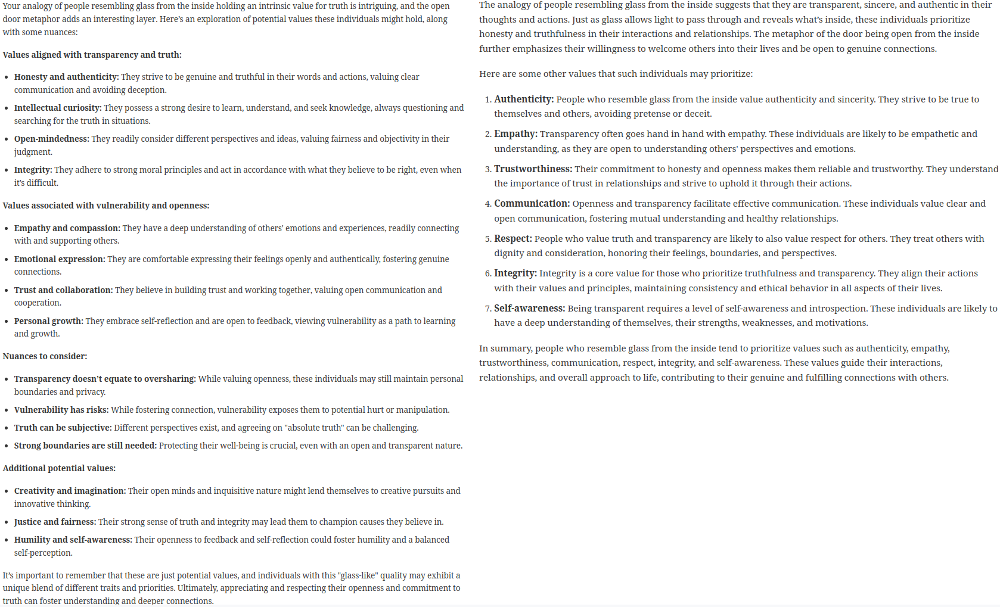

= Life is like an onion You peel it off one layer after another

.From 7-habbits of highly effective people

Today I'd like to write about an analogy that helps me to improve my communication and relationships with people. I usually called it *"The Onion Theory"*. This analogy can increase your *social awareness* and help you to interpret people better in your either business or personal life.

Life is like an onion because as human we are like onions. We have several layers on the top of a core which is very deep in side. An onion perfectly represents how humans  interact each other based on how they see each other from the first meeting till several years relationship.

== Why are these layers so important?
According to my own 10+ years observation in male dominant environment, there are 2 types of people and mindset: Emotional people-emotional thinking and Logical people-analytical thinking. If I would be in a room of 100 people and ask them which one they were, %99 would say they were logical people. This is actually not true.

According to statistics, the rate of  logical and emotional people are quite equal in an environment. So you may think now that %50 of the people are logical and the other half becomes emotional.You are still wrong.

The %50 of people who are statically logical are in fact very much emotional people. But since they are so good in suppressing and camouflaging their emotions, other people perceive them as if  they are very logical and reasonable. So the conclusion is *we are all emotional people.*

== What makes the difference between emotional and logical people?
It is all about layers they have. Emotional people have less layers such as 3-4 while logical people have more layers up to 9 depending on their age, life experience, environment and past relationships.These layers make people approachable or unreachable, easy-going or difficult, transparent or sophisticated.

Now we are ready to identify and peel each layer off one by one.

There are 3 major layers.The number of the layers can increase up to 9  depending on the person.

== Outer Layer

The first layer is like a mask. People usually take a mask on their faces everyday. There are  certain ways people behave and appear when they interact with others. They are very careful and watch themselves so that they don't show any of those behaviors that they would not want the world to know while communicating with the world. People tend to portray more logical, reasonable and analytic personality even though they are very emotional because it is what business world respect. Therefore they hide or camouflage their emotional side.

This first layer can have 3 sub layers : *_##They are Physical Appearance, Business Title and Wealth.##_*

In *#_business_#* people approach to other people based on these 3 sub layers.

Each of them has 2 sides. What I mean is that people promote, market and position themselves according to the most strongest layer they have. These layers also define how other people are attracted by you even though the layer they are captured at may not be your first or strongest layer.

. If they are physically fit, well shaped and attractive,they promote their physical appearance as first layer.

. If they have an executive position at a well known company or they are proud of their career then their appearance or wealth, then their first layer becomes their job title, their career or their company.

. If they are financially strong, rich and popular in society, then people promote themselves according to their wealth and it becomes their first layer.

== Middle Layer which is also called Main Core
The second layer is where  mask is taken off. People become more themselves when they are at home with  family, friends  or the ones closest to them. They are not  too cautious about how they are seen and communicate with others.

You become slightly different at this layer then the previous one when your mask is off. You have your  face that only your first connections know you.

* The *sub layers* of this *_##mid layer##_* are _##*personality, your values, your vision and your perspective of life.*##_

People are here more open to talk about their real inner self. It is much easier to communicate at this layer. People are more friendly, more welcoming and open in building longer relationship.

== Inner Core which is also called #_Bottom of Heart_#
The *_##third layer##_* is the #_deep layer_# _##which only the people know and access themselves.##_ It is where they *#_hide_#* their  #_feelings, emotions, thoughts, desires, wishes, fears nobody can reach_# . People have  the choice of bringing them out  or keeping it to themselves.  _##It is also the layer where people hide their hearts, loves, disappointments, burdens.##_ It is therefore  called the _##bottom of heart##_.

Here is the center of being that makes you. _##This layer is the sources of life time relationships and strong trust to each other.##_

== Hidden core
There is another layer which is the  _##deepest and hidden##_ that even people themselves  don't know or not #_**aware**_# about it. Some people with so called #_**6th sense**_# can #_reach or read this layer_#. _##This layer has direct connection to subconscious.##_

== Ok! What is next?
Since we finished all the layers, now we can talk about how this onion model can help us to improve our communication and relationships.

* All of the first meetings and contacts happen at #*_first layer_*#. _##*If you cannot pass second layer, the type of communication and relationship will be like "one night stand".*##_ At #*first layer*# people are always put themselves in *#defensive mode and careful to protect themselves#* against any kind of #_physical (money), mental (power) or emotional (love) loss._# People are not really themselves in this layer. _##In order to have long lasting relationships either in business or personal, you should find ways to pass second layer.##_

* _##*Middle core*##_ is the _##sources of long term relationships both in business and personal. You, your company or products & services can be most logical, reasonable with top quality or  best price  offer but unless people like you, trust you or enjoy doing business with you, you can't have long term relationship or business with them.##_

__##In this model either people let you in or you need to find ways to come into main core. ##__If you are not let in, *_it is very difficult to go inside._* You have to be patient and keep trying to find ways to _**earn people's trust, and be likable person**_. _##People are very different, so their middle core are.##_ They can be made of *stone, metal, wood or glass*. Sometimes you need to *#_crack, other times, you need to melt, or burn it_#*. If the person's _##middle core##_ is made of *glass*, there is no way you can go in. *_The door of the layer is open from inside._* You have to be careful when you approach glass type of layers. *A small mistake can crack or break the glass and you completely lose the person.*

.What else values resemble glass?

* The *inner core* is more related to *personal relationship such as falling in love, marriage, several years friendship*. You have to *conquer people's heart* to reach this layer, it usually takes *_##minimum 4 months up to several years.##_* _##This layer is open only from inside. You have to deserve to be hosted in this core with your personality, character, your love, your caring, close interest and attention.##_

_##Some people look like very difficult or others think in that way. In my opinion there are no difficult people. There people who have more layers than others to be discovered, reached or conquered. The people with more layers seem to be unreachable, unreadable, difficult to approach by other who have fewer layers.##_

* The more layer you have, the more *#emotional and fragile#* you are even though you don't want to accept.

* The more layer you have, the more #*difficult, cool or cold*#  you become  or look like for others.

* The more layer you have, the more #*interest, attention and love*# you need although you are not even aware of it.

There are some *#keys#* that makes easy to pass each *layer* such as showing #_intimacy, loving them, showing real personal interest, accepting people as they are with their imperfections and mistakes, being proud of them, appreciating them, being honest to them._#

[NOTE]
====
_##*In my perspective,  winning people's trust and earning their hearts are more important than winning their contract or business deals. And building new friendship are more important than building just commercial relationship.*##_
====

I hope you enjoy this analogy. Thanks for reading till end.

I'd like to finish my post with Zig Ziglar quote:

