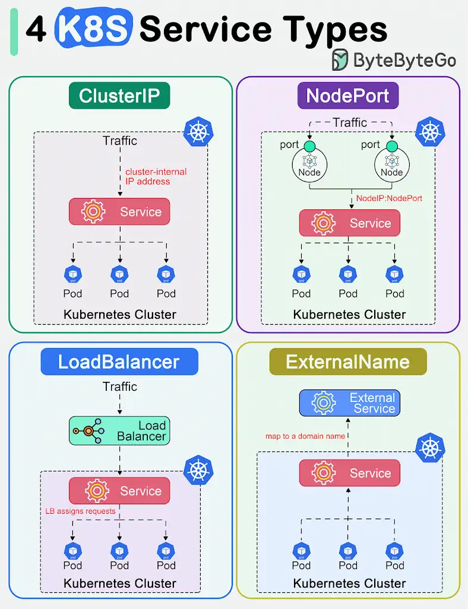

The diagram below shows 4 ways to expose a Service.

In Kubernetes, a Service is a method for exposing a network application in the cluster. We use a Service to make that set of Pods available on the network so that users can interact with it.

There are 4 types of Kubernetes services: ClusterIP, NodePort, LoadBalancer and ExternalName. The “type” property in the Service's specification determines how the service is exposed to the network.

🔹 **ClusterIP **is the default and most common service type. Kubernetes will assign a cluster-internal IP address to ClusterIP service. This makes the service only reachable within the cluster.

🔹 *NodePort*
This exposes the service outside of the cluster by adding a cluster-wide port on top of ClusterIP. We can request the service by NodeIP:NodePort.

🔹 *LoadBalancer*
This exposes the Service externally using a cloud provider’s load balancer.

🔹 *ExternalName*
This maps a Service to a domain name. This is commonly used to create a service within Kubernetes to represent an external database.

.K8 service type

