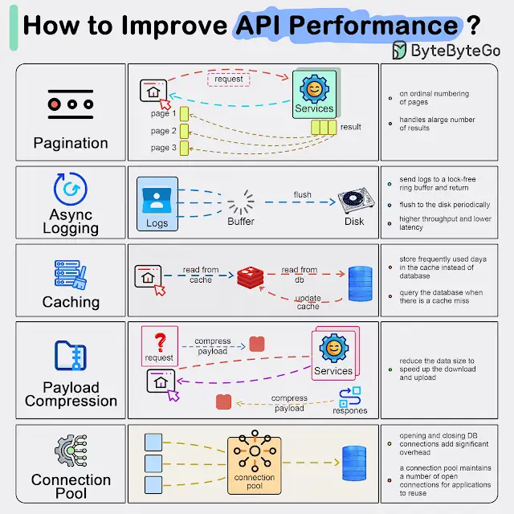

*_Top 5 common ways to improve API performance._*

.Result Pagination:
This method is used to optimize large result sets by streaming them back to the client, enhancing service responsiveness and user experience.

.Asynchronous Logging:
This approach involves sending logs to a lock-free buffer and returning immediately, rather than dealing with the disk on every call. Logs are periodically flushed to the disk, significantly reducing I/O overhead.

.Data Caching:
Frequently accessed data can be stored in a cache to speed up retrieval. Clients check the cache before querying the database, with data storage solutions like Redis offering faster access due to in-memory storage.

.Payload Compression:
To reduce data transmission time, requests and responses can be compressed (e.g., using gzip), making the upload and download processes quicker.

.Connection Pooling:
This technique involves using a pool of open connections to manage database interaction, which reduces the overhead associated with opening and closing connections each time data needs to be loaded. The pool manages the lifecycle of connections for efficient resource use.