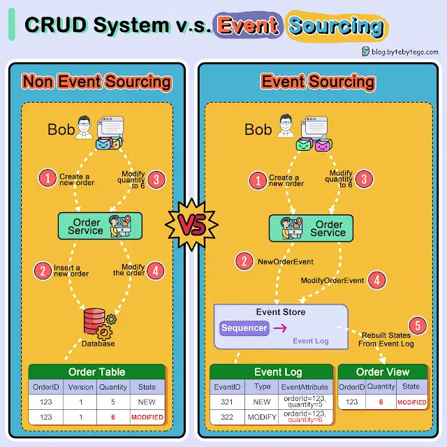

*What is Event Sourcing? How is it different from normal CRUD design?*

The diagram below shows a comparison of normal CRUD system design and event sourcing system design. We use an order service as an example.

The *_##event sourcing paradigm##_* is used to design a system with determinism. This changes the philosophy of normal system designs.

How does this work? Instead of recording the order states in the database, the event sourcing design persists the events that lead to the state changes in the event store. The event store is an append-only log. The events must be sequenced with incremental numbers to guarantee their ordering. The order states can be rebuilt from the events and maintained in OrderView. If the OrderView is down, we can always rely on the event store which is the source of truth to recover the order states.

Let's look at the detailed steps.

🔹*Non-Event Sourcing*

*Steps 1 and 2:* Bob wants to buy a product. The order is created and inserted into the database.

*Steps 3 and 4:* Bob wants to change the quantity from 5 to 6. The order is modified with a new state.

🔹*Event Sourcing*

*Steps 1 and 2:* Bob wants to buy a product. A NewOrderEvent is created, sequenced, and stored in the event store with #*_eventID=321._*#

*Steps 3 and 4:* Bob wants to change the *quantity* from *#5 to 6#*. A *#ModifyOrderEvent#* is created, sequenced, and persisted in the event store with #*_eventID=322._*#

*Step 5:* The order view is rebuilt from the order events, showing the latest state of an order.

Over to you: Which type of system is suitable for event sourcing design? Have you used this paradigm in your work?

