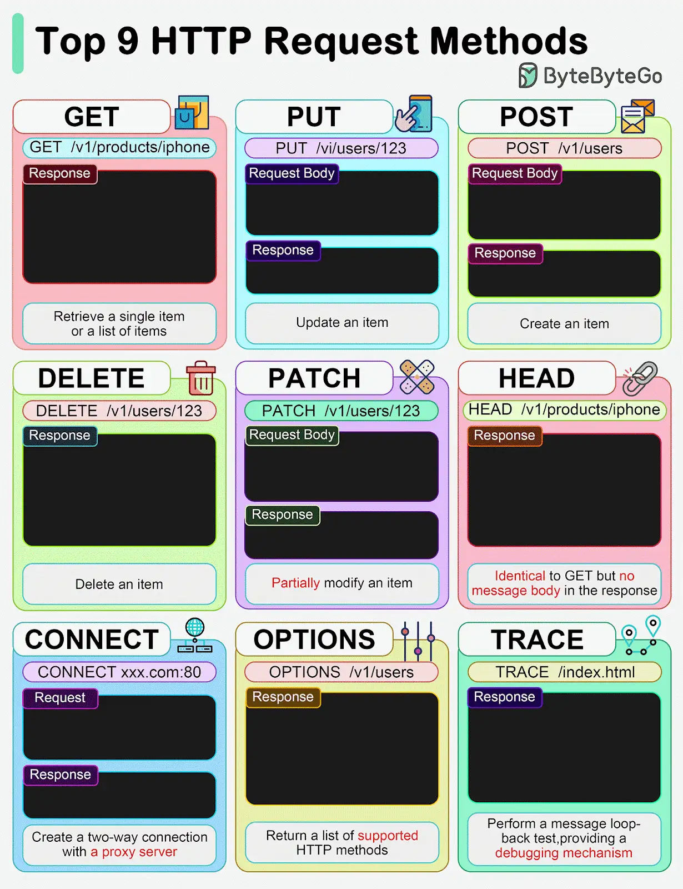

GET, POST, PUT... Common HTTP “verbs” in one figure. Next week's topics will be listed at the end.

*1. HTTP GET*
This retrieves a resource from the server. It is idempotent. Multiple identical requests return the same result.

*2. HTTP PUT*
This updates or Creates a resource. It is idempotent. Multiple identical requests will update the same resource.

*3. HTTP POST*
This is used to create new resources. It is not idempotent, making two identical POST will duplicate the resource creation.

*4. HTTP DELETE*
This is used to delete a resource. It is idempotent. Multiple identical requests will delete the same resource.

*5. HTTP PATCH*
The PATCH method applies partial modifications to a resource.

*6. HTTP HEAD*
The HEAD method asks for a response identical to a GET request but without the response body.

*7. HTTP CONNECT*
The CONNECT method establishes a tunnel to the server identified by the target resource.

*8. HTTP OPTIONS*
This describes the communication options for the target resource.

*9. HTTP TRACE*
This performs a message loop-back test along the path to the target resource.

Over to you: What other HTTP verbs have you used?