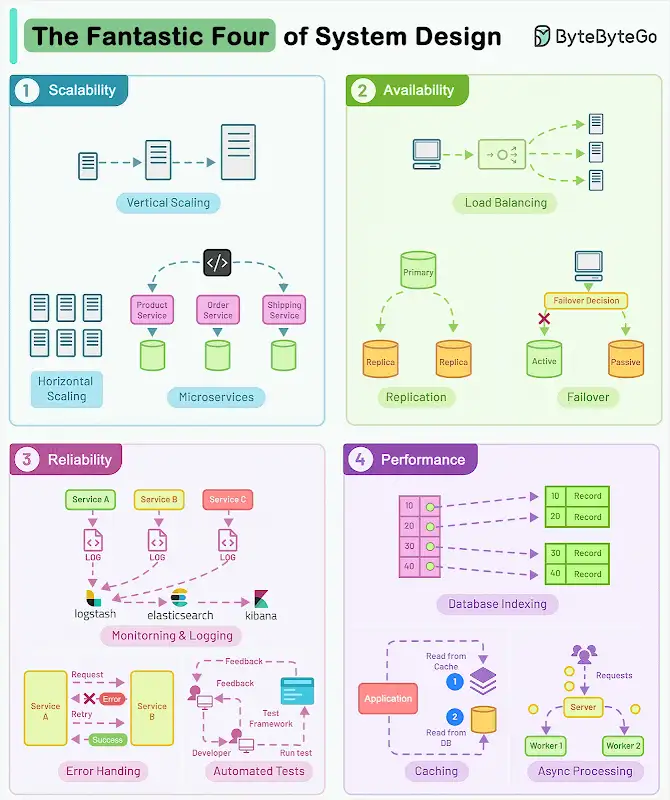

.*Who are the Fantastic Four of System Design?*

#_**Scalability, Availability, Reliability, and Performance.**_#

They are the most critical components to crafting successful software systems. Let’s look at each of them with implementation techniques:

.1 - Scalability
ensures that your application can handle more load without compromising performance.

.2 - Availability
makes sure that your application is always ready to serve the users and downtime is minimal.

.3 - Reliability
is about building software that consistently delivers correct results.

.4 - Performance
is the ability of a system to carry out its tasks at an expected rate under peak load using available resources.