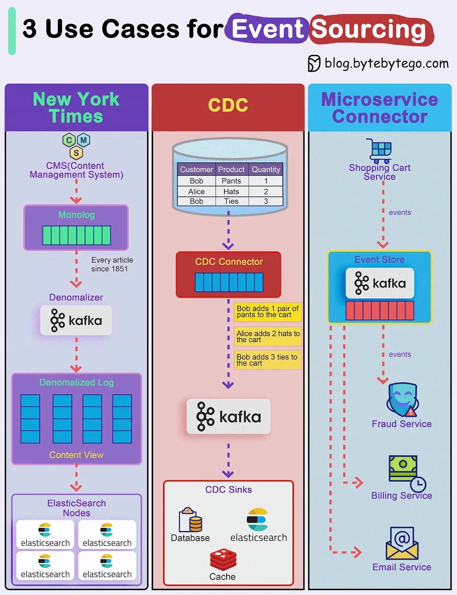

How do we incorporate Event Sourcing into the systems?

Event sourcing changes the programming paradigm from persisting states to persisting events. The event store is the source of truth. Let's look at three examples.

*1. New York Times*

The newspaper website stores every article, image, and byline since 1851 in an event store. The raw data is then denormalized into different views and fed into different ElasticSearch nodes for website searches.

*2. CDC (Change Data Capture)*

A CDC connector pulls data from the tables and transforms it into events. These events are pushed to Kafka and other sinks consume events from Kafka.

*3. Microservice Connector*

We can also use event event-sourcing paradigm for transmitting events among microservices. For example, the shopping cart service generates various events for adding or removing items from the cart. Kafka broker acts as the event store, and other services including the fraud service, billing service, and email service consume events from the event store. Since events are the source of truth, each service can determine the domain model on its own.

Over to you: Have you used event sourcing in production?