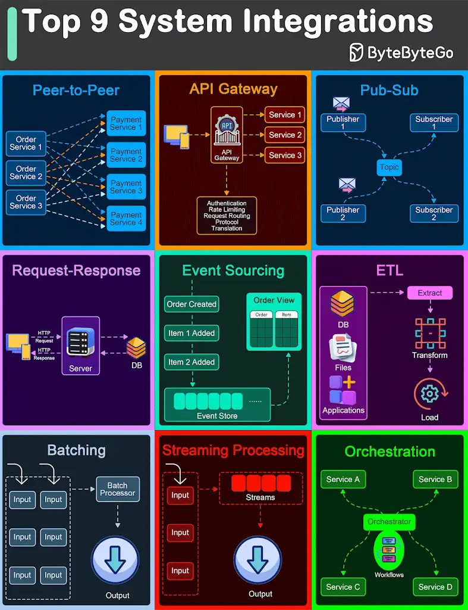

.*Top 9 Architectural Patterns for Data and Communication Flow*

🔹 Peer-to-Peer
The Peer-to-Peer pattern involves direct communication between two components without the need for a central coordinator.

🔹 API Gateway
An API Gateway acts as a single entry point for all client requests to the backend services of an application.

🔹 Pub-Sub
The Pub-Sub pattern decouples the producers of messages (publishers) from the consumers of messages (subscribers) through a message broker.

🔹 Request-Response
This is one of the most fundamental integration patterns, where a client sends a request to a server and waits for a response.

🔹 Event Sourcing
Event Sourcing involves storing the state changes of an application as a sequence of events.
🔹 ETL
ETL is a data integration pattern used to gather data from multiple sources, transform it into a structured format, and load it into a destination database.

🔹 Batching
Batching involves accumulating data over a period or until a certain threshold is met before processing it as a single group.

🔹 Streaming Processing
Streaming Processing allows for the continuous ingestion, processing, and analysis of data streams in real-time.

🔹 Orchestration
Orchestration involves a central coordinator (an orchestrator) managing the interactions between distributed components or services to achieve a workflow or business process.

