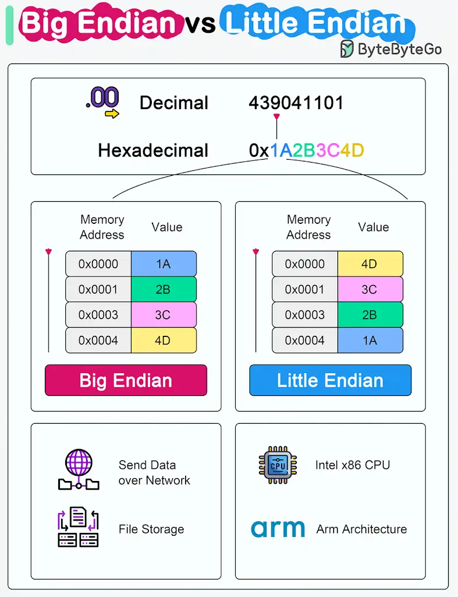
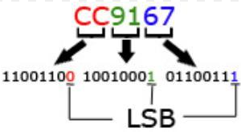
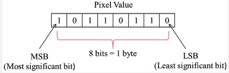
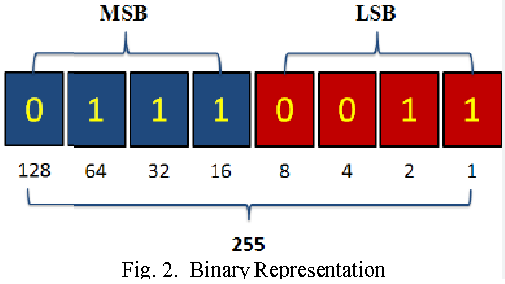
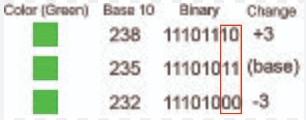
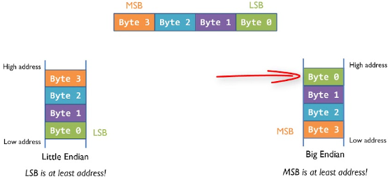
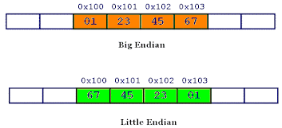

.Big Endian vs Little Endian

Microprocessor architectures commonly use two different methods to store the individual bytes in memory. This difference is referred to as “byte ordering” or “endian nature”.

🔹*Little Endian*

Intel x86 processors store a two-byte integer with the least significant byte first, followed by the most significant byte. This is called little-endian byte ordering.

🔹*Big Endian*
In big endian byte order, the most significant byte is stored at the lowest memory address, and the least significant byte is stored at the highest memory address. Older PowerPC and Motorola 68k architectures, often use big endian. In network communications and file storage, we also use big endian.

The byte ordering becomes significant when data is transferred between systems or processed by systems with different endianness. It's important to handle byte order correctly to interpret data consistently across diverse systems.

