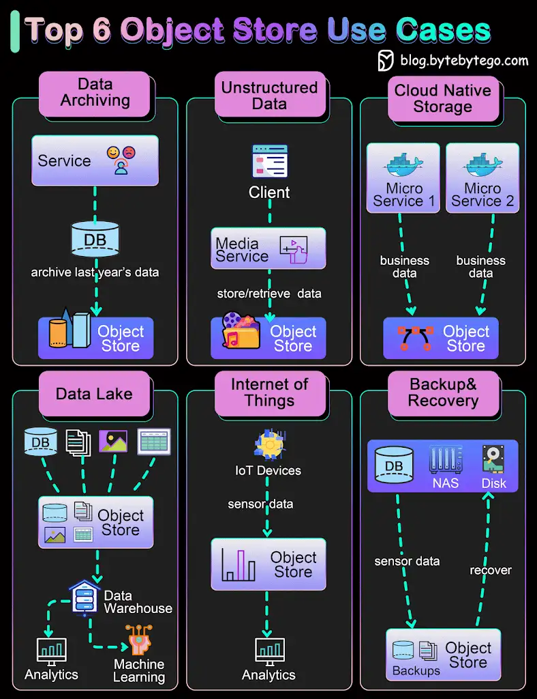

*🔹 What is an object store?*

Object store uses objects to store data. Compared with file storage which uses a hierarchical structure to store files, or block storage which divides files into equal block sizes, object storage stores metadata together with the objects. Typical products include AWS S3, Google Cloud Storage, and Azure Blob Storage.

An object store provides flexibility in formats and scales easily.

*🔹 Case 1: Data Archiving*

With the ever-growing amounts of business data, we cannot store all the data in core storage systems. We need to have layers of storage plan. An object store can be used to archive old data that exists for auditing or client statements. This is a cost-effective approach.

*🔹 Case 2: Unstructured Data Storage*

We often need to deal with unstructured data or semi-structured data. In the past, they were usually stored as blobs in the relational database, which was quite inefficient. An object store is a good match for music, video files, and text documents. Companies like Spotify or Netflix uses object store to persist their media files.

*🔹 Case 3: Cloud Native Storage*

For cloud-native applications, we need the data storage system to be flexible and scalable. Major public cloud providers have easy API access to their object store products and can be used for economical storage choices.

*🔹 Case 4: Data Lake*

There are many types of data in a distributed system. An object store-backed data lake provides a good place for different business lines to dump their data for later analytics or machine learning. The efficient reads and writes of the object store facilitate more steps down the data processing pipeline, including ETL(Extract-Transform-Load) or constructing a data warehouse.

*🔹 Case 5: Internet of Things (IoT)*

IoT sensors produce all kinds of data. An object store can store this type of time series and later run analytics or AI algorithms on them. Major public cloud providers provide pipelines to ingest raw IoT data into the object store.

*🔹 Case 6: Backup and Recovery*

An object store can be used to store database or file system backups. Later, the backups can be loaded for fast recovery. This improves the system’s availability.

🔹 Over to you: What did you use object store for?

