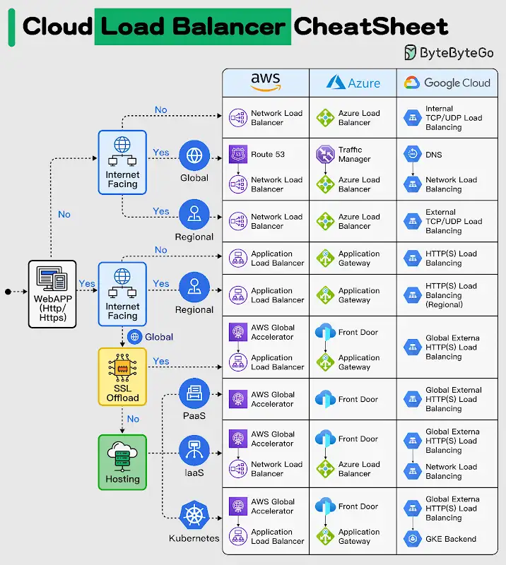

Creating a system using microservices is extremely difficult unless you follow some strong principles.

9 best practices that you must know before building microservices:

.1 - Design For Failure
A distributed system with microservices is going to fail.

You must design the system to tolerate failure at multiple levels such as infrastructure, database, and individual services. Use circuit breakers, bulkheads, or graceful degradation methods to deal with failures.

.2 - Build Small Services
A microservice should not do multiple things at once.
A good microservice is designed to do one thing well.

.3 - Use lightweight protocols for communication

Communication is the core of a distributed system. Microservices must talk to each other using lightweight protocols. Options include REST, gRPC, or message brokers.

.4 - Implement service discovery

To communicate with each other, microservices need to discover each other over the network. Implement service discovery using tools such as Consul, Eureka, or Kubernetes Services

.5 - Data Ownership

In microservices, data should be owned and managed by the individual services.
The goal should be to reduce coupling between services so that they can evolve independently.

.6 - Use resiliency patterns

Implement specific resiliency patterns to improve the availability of the services.
Examples: retry policies, caching, and rate limiting.

.7 - Security at all levels

In a microservices-based system, the attack surface is quite large. You must implement security at every level of the service communication path.

.8 - Centralized logging

Logs are important to finding issues in a system. With multiple services, they become critical.

.9 - Use containerization techniques

To deploy microservices in an isolated manner, use containerization techniques.

Tools like Docker and Kubernetes can help with this as they are meant to simplify the scaling and deployment of a microservice.

