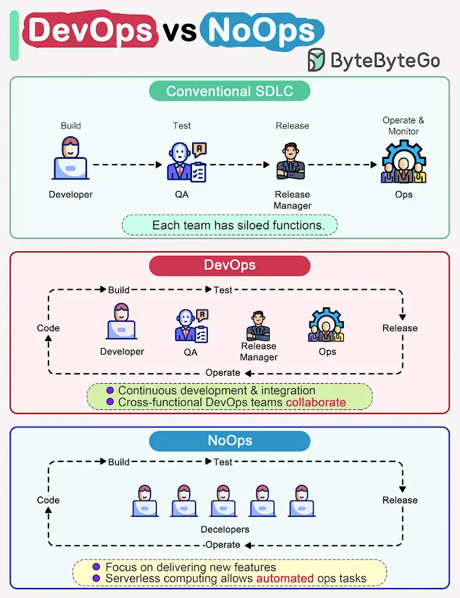

How do DevOps, NoOps change the software development lifecycle (SDLC)?

The diagram below compares traditional SDLC, DevOps and NoOps.

In a *traditional software development*, code, build, test, release and monitoring are siloed functions. Each stage works independently and hands over to the next stage.

*DevOps*, on the other hand, encourages continuous development and collaboration between developers and operations. This shortens the overall life cycle and provides continuous software delivery.

*NoOps* is a newer concept with the *#_development of serverless computing_#*. Since we can architect the system using *_##FaaS (Function-as-a-Service) and BaaS (Backend-as-a-Service),##_* the cloud service providers can take care of most operations tasks. The developers can focus on feature development and automate operations tasks.

*NoOps* is a pragmatic and effective methodology for *_startups or smaller-scale applications_*, which moves *_##shortens the SDLC even more than DevOps##_*.

