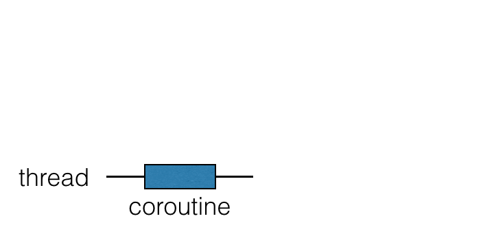
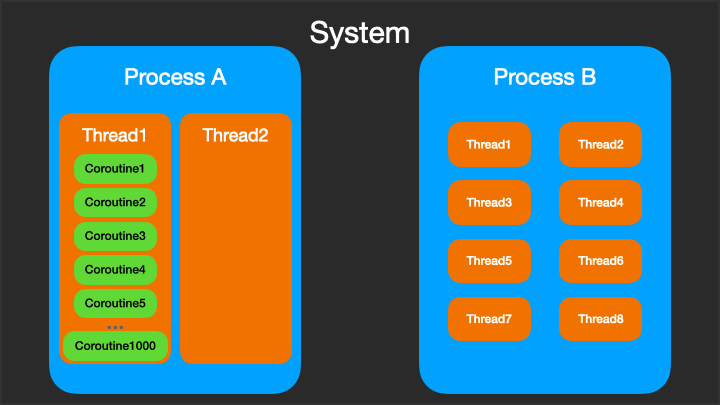

.coroutines & continuations with gifs in detail
https://gist.github.com/chaxiu/d87870528bbfe3e9d7e481e1f6acace1[*Click me for the article one of the best resource on the internet*]

.coroutines

 Process != Thread =! Coroutine (is functions or tasks)

.coroutines-kotlin

.coroutines-kotlin

