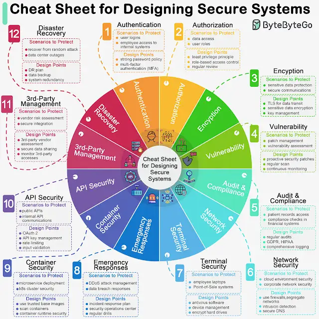

.*How do we design a secure system?*

Designing secure systems is important for a multitude of reasons, spanning from protecting sensitive information to ensuring the stability and reliability of the infrastructure. As developers, we should design and implement these security guidelines by default.

The diagram below is a pragmatic cheat sheet with the use cases and key design points.

🔹 Authentication
🔹 Authorization
🔹 Encryption
🔹 Vulnerability
🔹 Audit & Compliance
🔹 Network Security
🔹 Terminal Security
🔹 Emergency Responses
🔹 Container Security
🔹 API Security
🔹 3rd-Party Vendor Management
🔹 Disaster Recovery