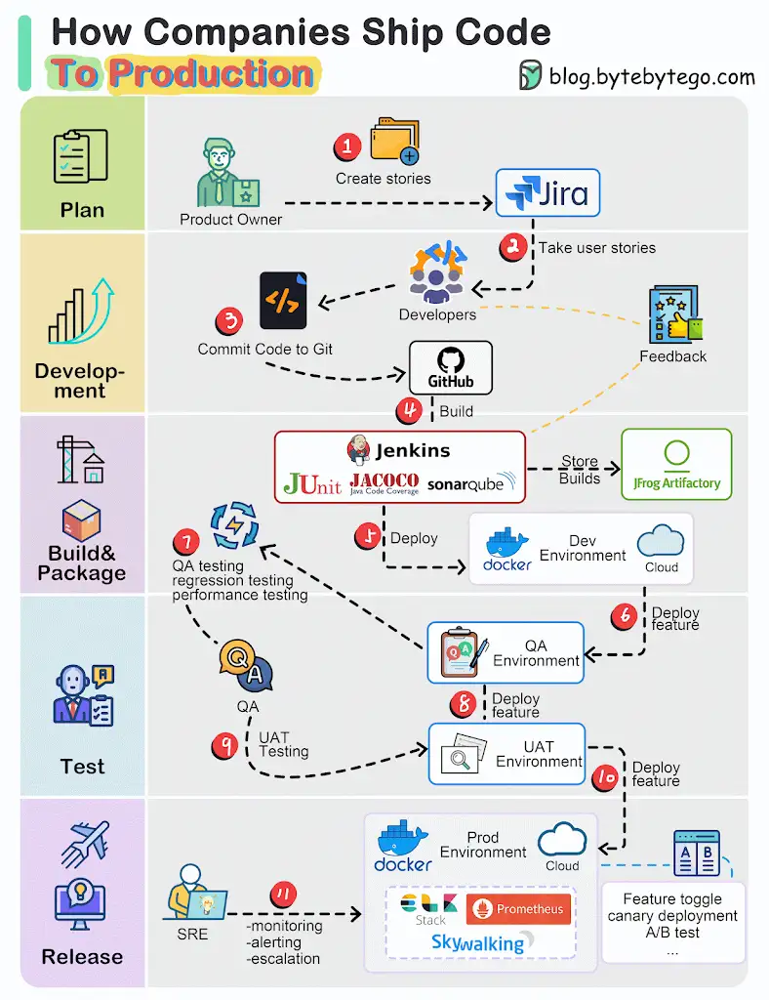

The diagram below illustrates the typical workflow.

#*_Step 1:_*# The process starts with a product owner creating user stories based on requirements.

#*_Step 2:_*# The dev team picks up the user stories from the backlog and puts them into a sprint for a two-week dev cycle.

#*_Step 3:_*# The developers commit source code into the code repository Git.

#*_Step 4:_*# A build is triggered in Jenkins. The source code must pass unit tests, code coverage threshold, and gates in SonarQube.

#*_Step 5:_*# Once the build is successful, the build is stored in artifactory. Then the build is deployed into the dev environment.

#*_Step 6:_*# There might be multiple dev teams working on different features. The features need to be tested independently, so they are deployed to QA1 and QA2.

#*_Step 7:_*# The QA team picks up the new QA environments and performs QA testing, regression testing, and performance testing.

#*_Steps 8:_*# Once the QA builds pass the QA team’s verification, they are deployed to the UAT environment, where the QA team, dev team, and even the product owner perform UAT testing.

#*_Step 9:_*# If the UAT testing is successful, the builds become release candidates and will be deployed to the production environment on schedule. Here we might not want to deploy to all the users in one go to mitigate the change risks, so some techniques like feature toggle, canary deployment can be used.

#*_Step 10:_*# SRE (Site Reliability Engineering) team is responsible for prod monitoring. They leverage a bunch of log-analyzing tools and process-tracing tools like ELK stack, Prometheus, and Skywalking. They report production issues to QA and dev teams, and teams need to fix them based on defined priority.

