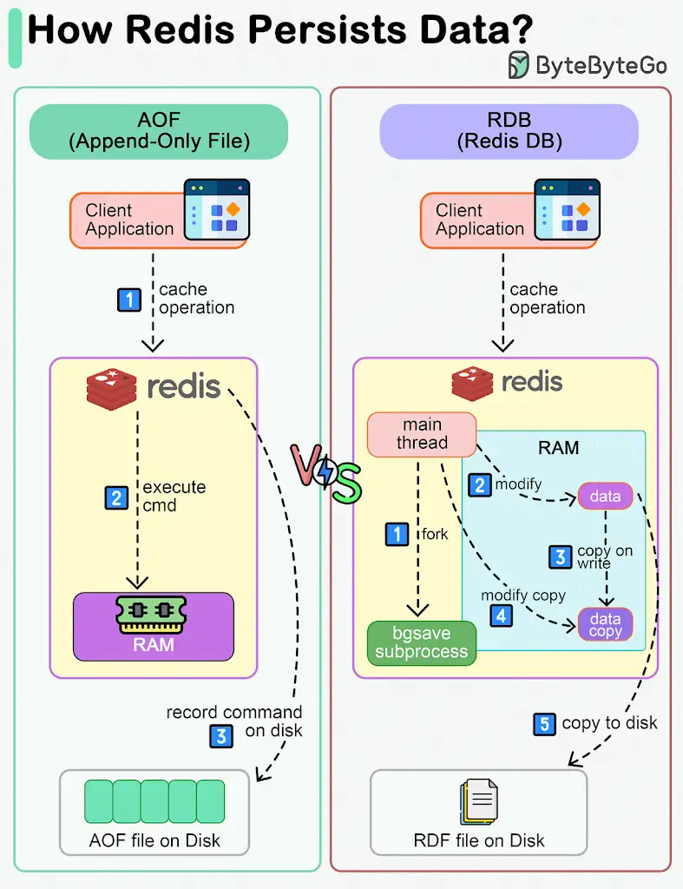

*Redis* is an in-memory database. If the server goes down, the data will be lost.

The diagram below shows two ways to persist Redis data on disk:

1. *AOF (Append-Only File)*
2. *RDB (Redis Database)*

Note that data persistence is not performed on the critical path and doesn't block the write process in Redis.

🔹 #*AOF*#
Unlike a write-ahead log, the Redis AOF log is a write-after log. Redis executes commands to modify the data in memory first and then writes it to the log file. AOF log records the commands instead of the data. The event-based design simplifies data recovery. Additionally, AOF records commands after the command has been executed in memory, so it does not block the current write operation.

🔹 #*RDB*#
The restriction of AOF is that it persists commands instead of data. When we use the AOF log for recovery, the whole log must be scanned. When the size of the log is large, Redis takes a long time to recover. So Redis provides another way to persist data - RDB.

#*RDB*# records snapshots of data at specific points in time. When the server needs to be recovered, the data snapshot can be directly loaded into memory for fast recovery.

#*Step 1:*# The main thread forks the‘ bgsave’ sub-process, which shares all the in-memory data of the main thread.  ‘bgsave’ reads the data from the main thread and writes it to the RDB file.

#*Steps 2 and 3:*#  If the main thread modifies data, a copy of the data is created.

#*Steps 4 and 5:*# The main thread then operates on the data copy. Meanwhile ‘bgsave’ sub-process continues to write data to the RDB file.

🔹 #*Mixed*#
Usually in production systems, we can choose a mixed approach, where we use RDB to record data snapshots from time to time and use AOF to record the commands since the last snapshot.

