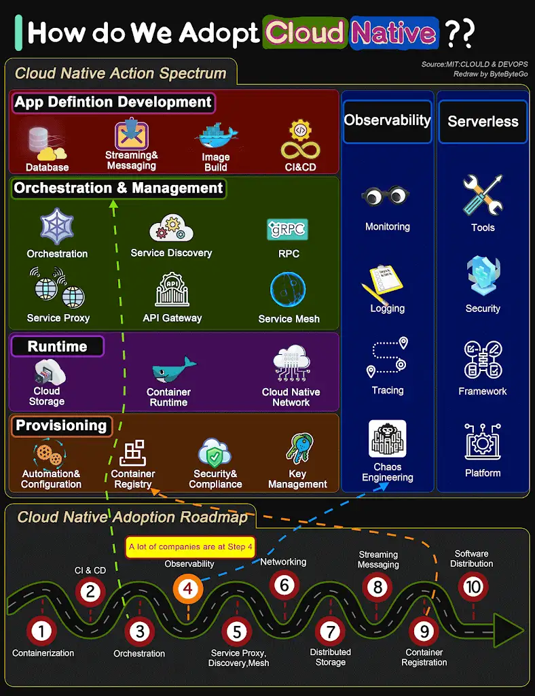

How do we *transform* a *system* to be *Cloud Native*?

The diagram below shows the action spectrum and adoption roadmap. You can use it as a blueprint for adopting cloud-native in your organization.

For a *#company#* to adopt cloud native architecture, there are *#_6 aspects in the spectrum:_#*

#*1. Application definition development*#

#*2. Orchestration and management*#

#*3. Runtime*#

#*4. Provisioning*#

#*5. Observability*#

#*6. Serverless*#

Most *#companies#* start from *Step 1 containerization* and gradually *adopt CI/CD, service orchestration*. This microservice architecture significantly increases the number of instances to manage, so systematic testing and monitoring are required to increase plant *observability*.

In fact, a *lot of companies stop* at *Step 4* without moving to *service mesh and cloud-native networking* due to the *complexity and the required DevOps talent*.

Over to you: Where does your system stand in the adoption roadmap?

