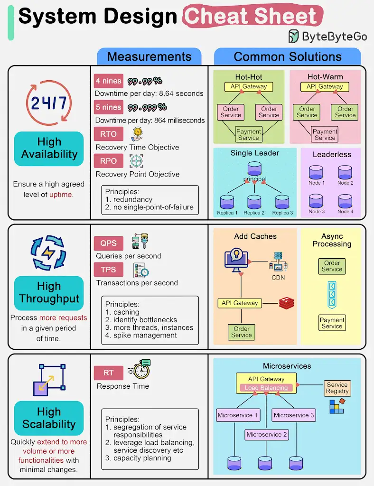

*1. High Availability*
This means we need to ensure a high agreed level of uptime. We often describe the design target as *#“3 nines” or “4 nines”. “4 nines”, 99.99%#* uptime, means the service can only be down 8.64 seconds per day.

To achieve high availability, we need to design redundancy in the system. There are several ways to do this:

- #*Hot-hot:*# two instances receive the same input and send the output to the downstream service. In case one side is down, the other side can immediately take over. Since both sides send output to the downstream, the downstream system needs to dedupe.

- #*Hot-warm:*# two instances receive the same input and only the hot side sends the output to the downstream service. In case the hot side is down, the warm side takes over and starts to send output to the downstream service.

- #*Single-leader cluster:*# one leader instance receives data from the upstream system and replicates to other replicas.

- #*Leaderless cluster:*# there is no leader in this type of cluster. Any write will get replicated to other instances. As long as the number of write instances plus the number of read instances are larger than the total number of instances, we should get valid data.

*2. High Throughput*
This means the service needs to handle a high number of requests given a period of time. Commonly used metrics are QPS (query per second) or TPS (transaction per second).

To achieve high throughput, we often add caches to the architecture so that the request can return without hitting slower I/O devices like databases or disks. We can also increase the number of threads for computation-intensive tasks. However, adding too many threads can deteriorate the performance. We then need to identify the bottlenecks in the system and increase its throughput. Using asynchronous processing can often effectively isolate heavy-lifting components.

*3. High Scalability*
This means a system can quickly and easily extend to accommodate more volume (horizontal scalability) or more functionalities (vertical scalability). Normally we watch the response time to decide if we need to scale the system.

To achieve high scalability, it is important to segregate the responsibilities of the services. Microservices are widely adopted for this purpose. We also leverage the service registry and load balancer to route requests to the proper instance.

