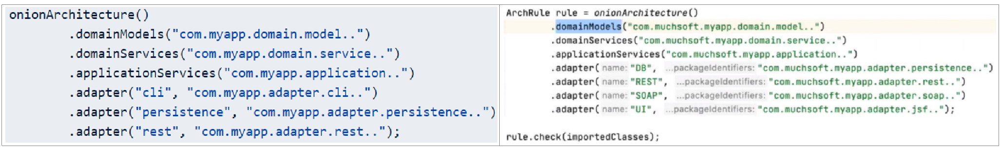
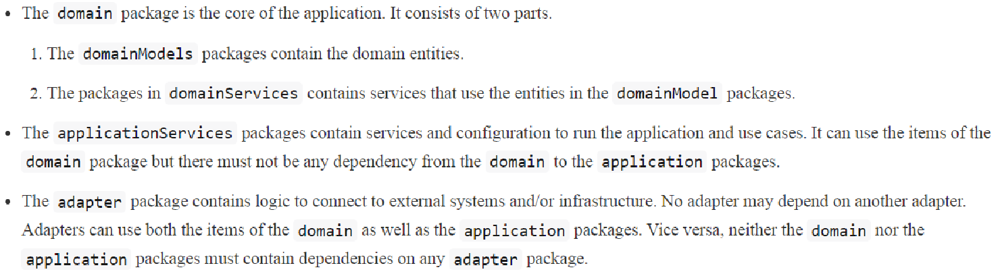
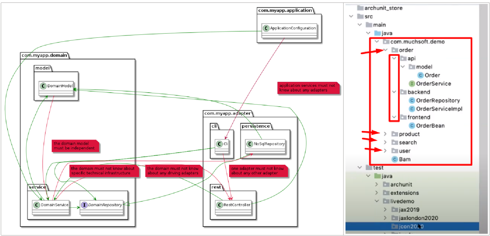
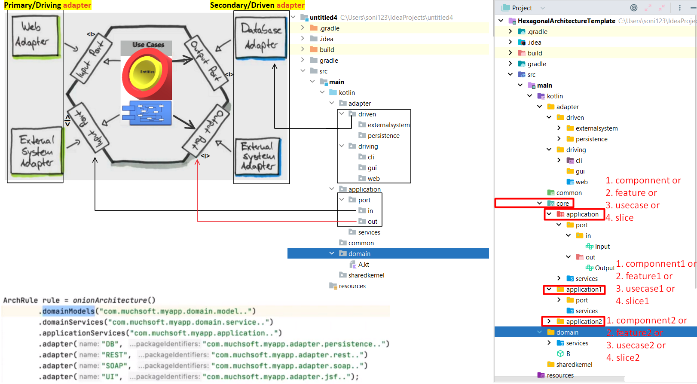
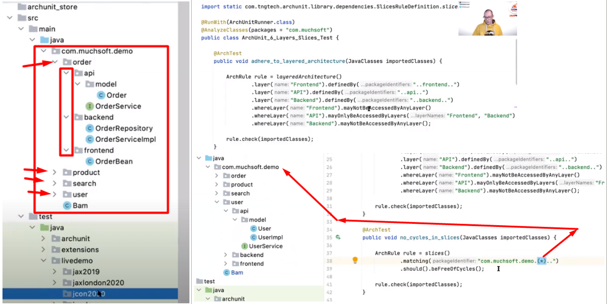
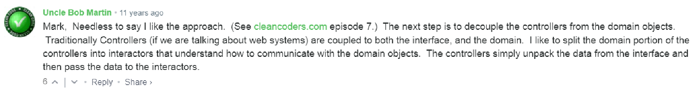
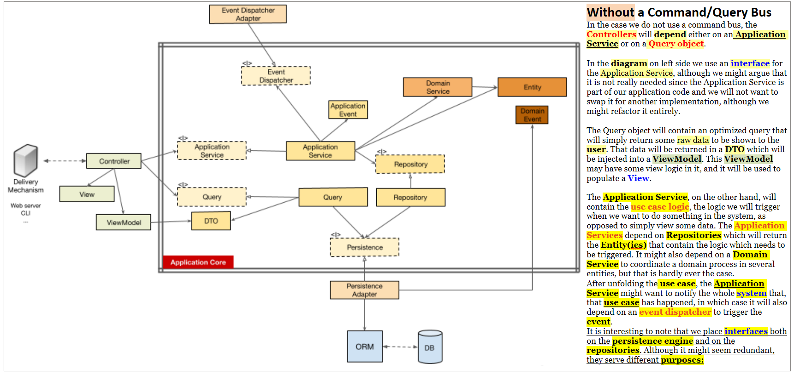
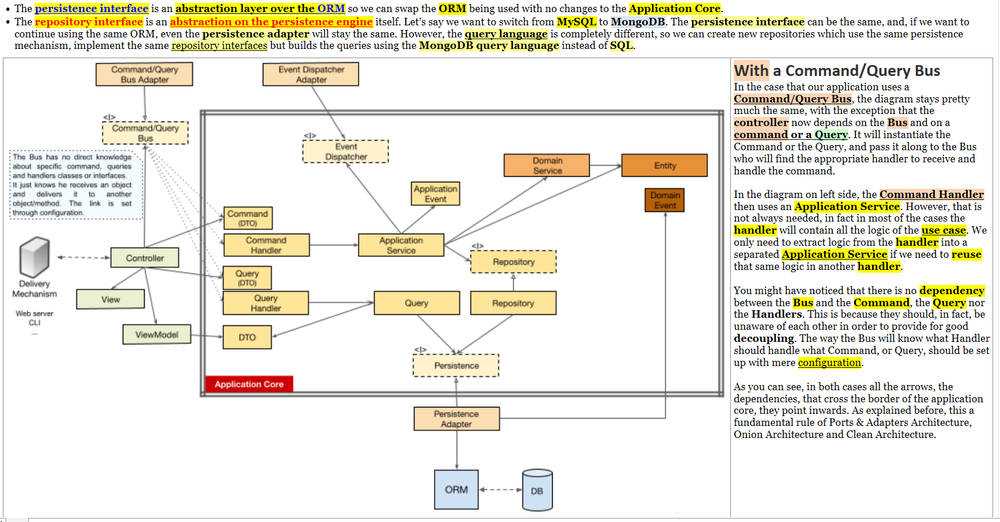

= How to check Onion, Hexagonal, ports & adapter, Clean architecture violations in source code
Author Name Mehmood-ur-Rehman
:sectnumlevels: 4
:toclevels: 4
:sectnums: 4
:toc: left
:icons: font
:toc-title: Table of contents
:doctype: article

== ArchUnit

A *java DSL and library* for *architecture tests*

https://www.archunit.org/userguide/html/000_Index.html#_advanced_configuration[ArchUnit User Guide]

The semantic follows the descriptions in  https://jeffreypalermo.com/2008/07/the-onion-architecture-part-1/[jeffrey-palermo "The-onion-architecture-part-1 2008"].

More precisely, the following holds:

In case you want each *#_feature or slice or component or use case_#* has its own *#layered architecture#*, and none of them has *_dependency_* on between each other.

== Coding: Packaging by vertical slice 20 Feb 2012

In the last couple of applications that I’ve worked on, we’ve been trying to group code around a domain concept or vertical slice of functionality.

Therefore, instead of the above code we’d end up with something more like this:

* com.awesome.project

** location

*** Address
*** Location
*** LocationController
*** LocationRepository
*** LocationService

** platform

*** StringUtils

** price

*** Cost
*** CostFactory
*** Distance
*** Price
*** PriceController
*** PriceRepository

We were having a discussion about grouping code like this last week, and I was struggling to describe what I prefer about the latter approach.

In the code base that I’m currently working on, which provides an API for other systems to do stuff with, it seems to lead to a design where we have created lots of potential http://2012.33degree.org/talk/show/67[*micro services*] which could be #*deployed*# separately if we wanted.

That possibility wasn’t as clear to me until we started grouping code this way.

Another cool thing is that it’s made us think about the domain of the code more and whether the grouping of classes actually makes sense. We can also see which classes fall inside an aggregate root.

In the above example, under 'pricing' we can tell that *Price* is an #*aggregate root*# because it has a #*repository*# which allows us to get one (*price object* from the #*database*#,) and we can also tell that *Cost* #is probably contained by# *Price* since #we don’t have a way of directly getting a# *Cost*.

We stop thinking about the _*domain classes as a whole*_, instead we think about them in their *groups* and how their #*aggregate roots*# might interact with each other if at all.

One disadvantage of grouping code like this is that if we’re writing a new repository, for example, we’ve got further to navigate to find another one to base ours on.

On the other hand, you could argue that if we are doing that, then perhaps there is an abstraction we can pull out to remove the problem.

It’s an interesting approach to grouping code and one thing we’ve started noticing is that we end up with some packages which have a lot of classes in them and others which have very few.

We are not sure whether this is a symptom of us not breaking down those particular packages enough or if there are just some areas of the domain that are bigger than others.

These are just some of my early observations, so it’d be interesting to hear other’s thoughts on whether this is a good/bad idea.

== Flow of control

As I said above, the flow of control goes, of course, from the user into the Application Core, over to the infrastructure tools, back to the Application Core and finally back to the user. But how exactly do classes fit together? Which ones depend on which ones? How do we compose them?

Following Uncle Bob, in his article about Clean Architecture, I will try to explain the flow of control with UMLish diagrams…

.without a command/query bus

.with a command/query bus

As you can see, in both cases all the arrows, the dependencies, that cross the border of the application core, they point inwards. As explained before, this is a fundamental rule of Ports & Adapters Architecture, Onion Architecture and Clean Architecture.

image::images/Screenshot_8.png[]
