= Use Case Modeling
Author Name Mehmood-ur-Rehman
:sectnumlevels: 4
:toclevels: 4
:sectnums: 4
:toc: left
:icons: font
:toc-title: Table of contents
:doctype: article

[[uee-case-modeling]]
[width="100%",cols="100%",]
|===
|*Use Case Diagram*
a|
In https://en.wikipedia.org/wiki/Software_engineering[software] and https://en.wikipedia.org/wiki/Systems_engineering[systems engineering], the phrase use case is a https://en.wikipedia.org/wiki/Polysemy[polyseme] with two https://en.wikipedia.org/wiki/Word_sense[senses]:

[arabic]
. A *usage scenario* اِستفادہ کاری , اِستعمال کرنے کا عمل , استعمال میں لانا کا عمل ,for a piece of software; often used in the plural to suggest situations where a piece of software may be useful.
. A potential *scenario* مَنظَر نامَہ , خاکَہ  in which a system receives an external request (such as user input) and responds to it.

|===

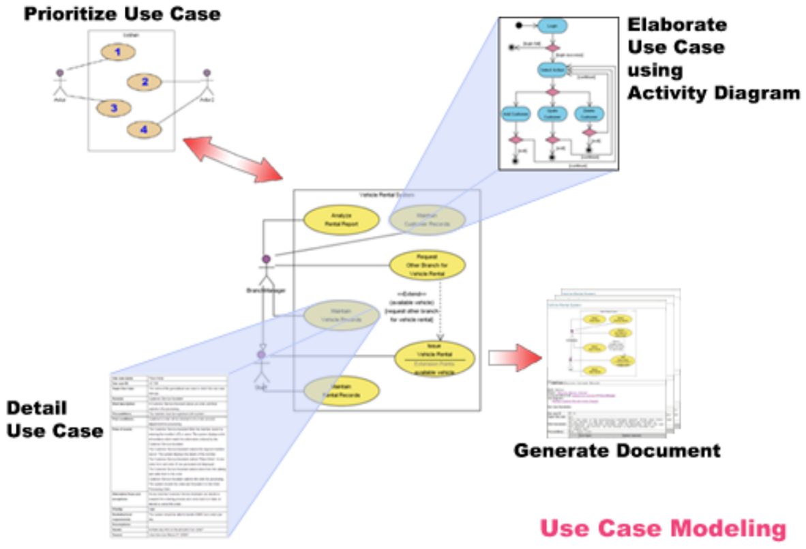

Use case diagrams are usually referred to as https://www.uml-diagrams.org/uml-25-diagrams.html#behavior-diagram[behavior diagrams] used to describe a set of actions (https://www.uml-diagrams.org/use-case.html[use cases]) that some system or systems (https://www.uml-diagrams.org/use-case-subject.html[subject]) should or can perform in collaboration with one or more external users of the system (https://www.uml-diagrams.org/use-case-actor.html[actors]). Each use case should provide some observable and valuable result to the actors or other stakeholders of the system.

Note, that UML 2.0 to 2.4 specifications also described use case diagram as a specialization of a https://www.uml-diagrams.org/class-diagrams-overview.html[class diagram], and class diagram is a https://www.uml-diagrams.org/uml-25-diagrams.html#structure-diagram[structure diagram].

Use case diagrams are in fact twofold ایک سے زیادہ - they are both https://www.uml-diagrams.org/uml-25-diagrams.html#behavior-diagram[behavior diagrams], because they describe behavior of the system, and they are also https://www.uml-diagrams.org/uml-25-diagrams.html#structure-diagram[structure diagrams] - as a special case of class diagrams where classifiers درجہ بندی کرنے والا

are restricted to be either https://www.uml-diagrams.org/use-case-actor.html[actors] or https://www.uml-diagrams.org/use-case.html[use cases] related to each other with https://www.uml-diagrams.org/association.html[associations].

https://www.uml-diagrams.org/references.html#ref-uml-25-b1[[UML 2.5 FTF - Beta 1]] moved use cases out of behavior modeling to UML supplementary  معاون concepts. So, it is an unfortunate quandary پریشانی  what kind of UML diagrams use case diagrams are.

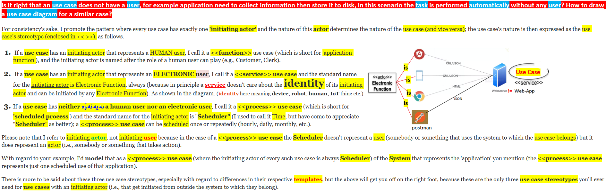
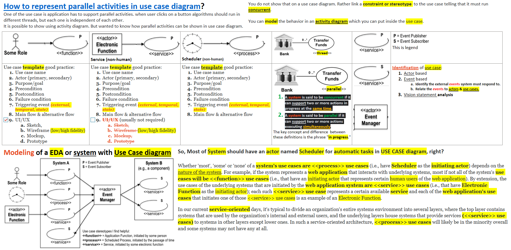
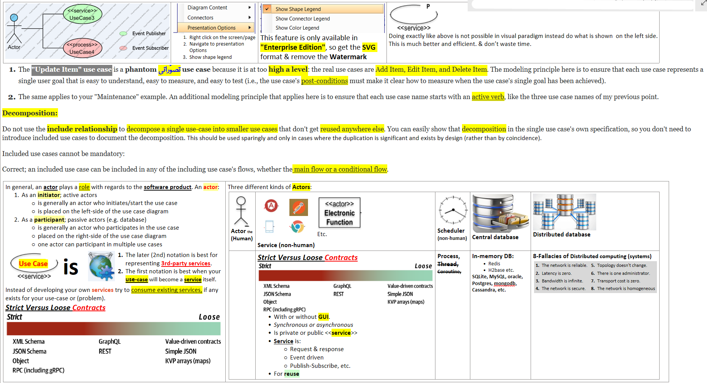
If a *#use case is <service>#* and also there exists an *integration service* that can fulfill *use-case* needs then in such a scenario you have to look for the *API documentation* and determine the following:

. *OpenAPI or swagger* and determine what function to use
. If doest not exist then design the API by determining  all data that  will be consumed and produced by this API.
** The API can synchronous or asynchronous
** REST is only about state (Resource) bu no action, still some people hack the API to include action but that should be avoided
** REST only performs *#CRUD#* operations

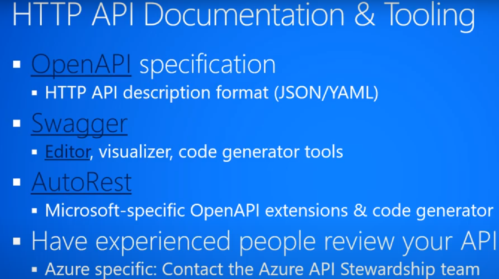

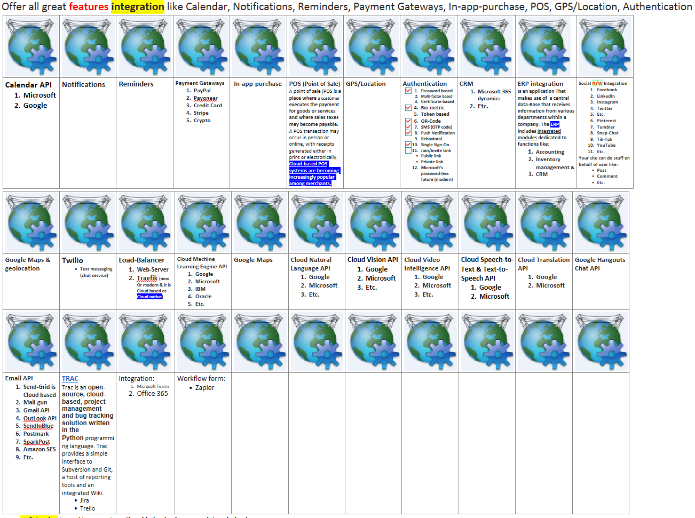

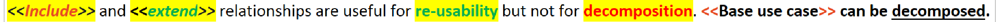
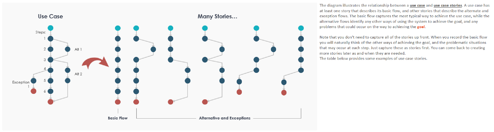
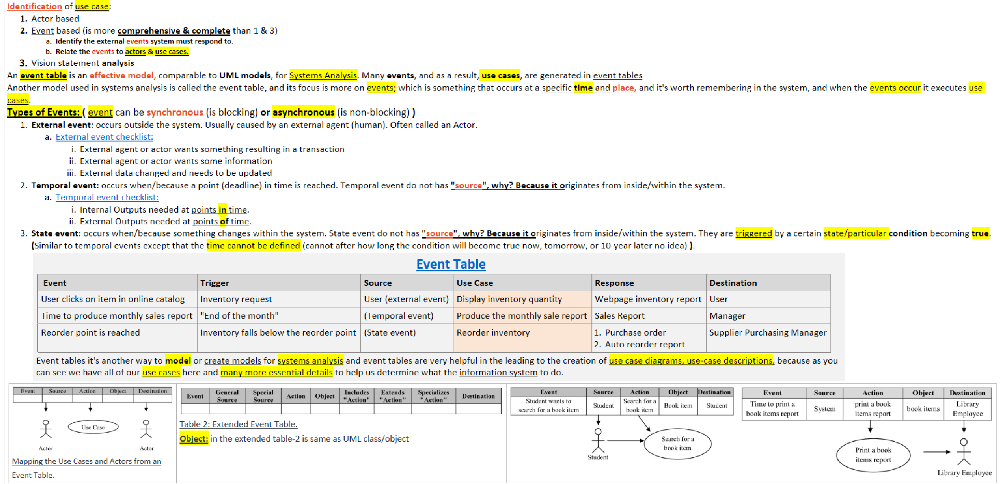
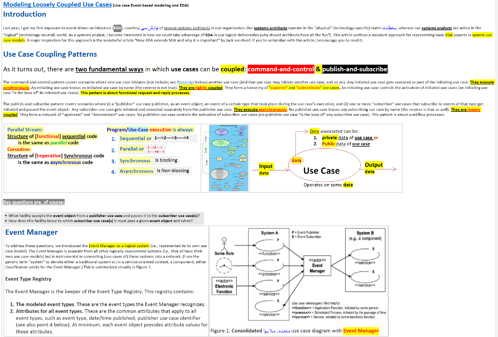

. https://embeddedartistry.com/fieldatlas/differentiating-observer-and-publish-subscribe-patterns/[_**Differentiating Observer and Publish-Subscribe Patterns**_] follow the link to learn more.

. https://www.agilecaterpillar.com/blog/observer/[_**Observer vs Publisher-Subscriber Pattern**_]

*#_API (OpenAPI or swagger)_#*

.APIs Vs. Events | Can they coexist? | API First or Event First
+++
<iframe width="560" height="315" src="https://www.youtube.com/embed/3t7pMx35Reg" title="YouTube video player" frameborder="0" allow="accelerometer; autoplay; clipboard-write; encrypted-media; gyroscope; picture-in-picture; web-share" allowfullscreen></iframe>
+++

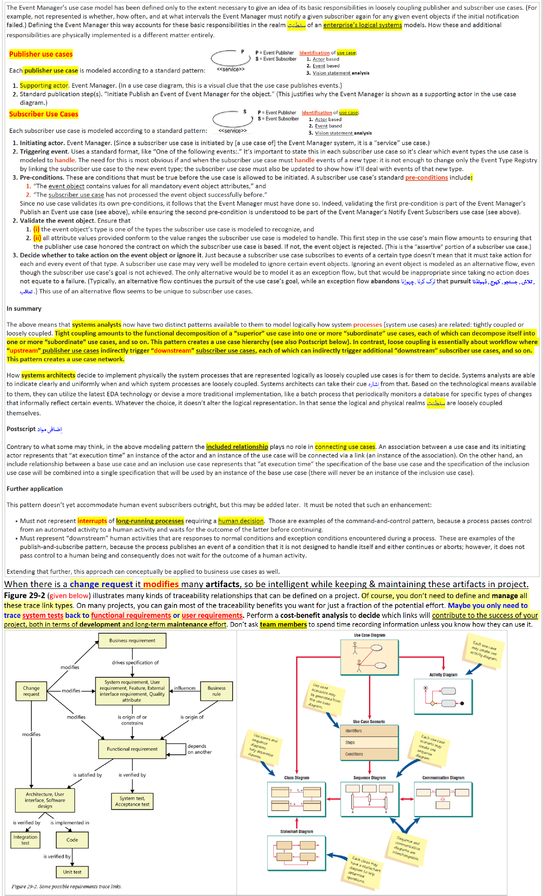

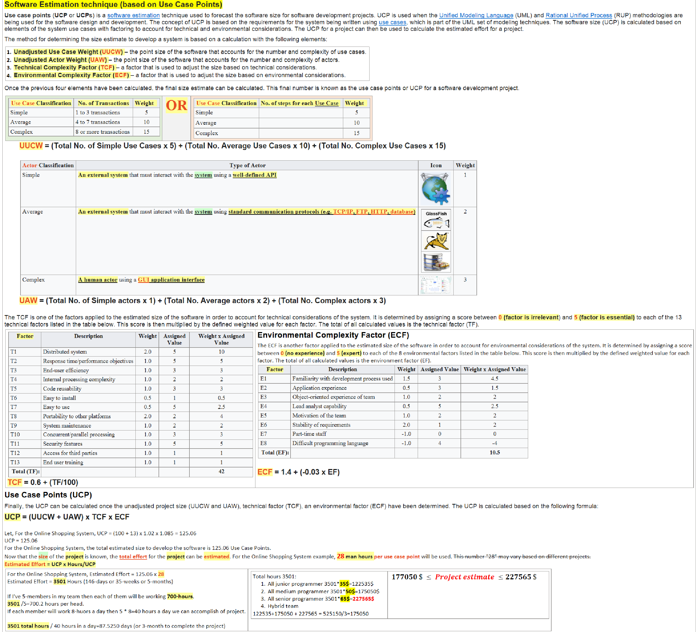