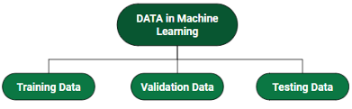
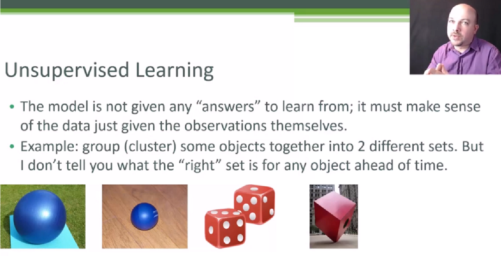
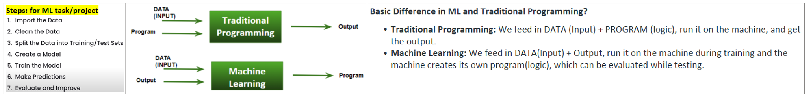
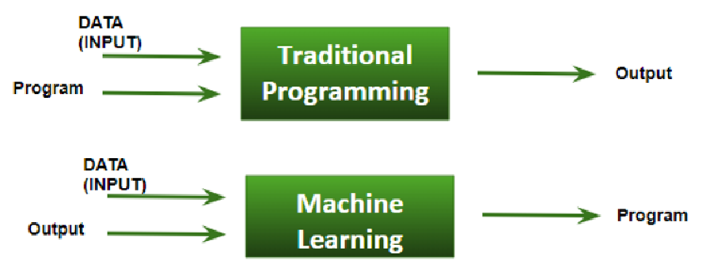

= ML | Introduction to Data in Machine Learning

:icons: font

*DATA:* It can be any #*unprocessed*# [.underline]#_##*fact, value, text, sound, video or picture*##_# that is not being *#interpreted and analyzed#*. Data is the most important part of all Data Analytics, Machine Learning, Artificial Intelligence. Without data, we can’t train any model and all modern research and automation will go in vain. Big Enterprises are spending lots of money just to gather as much certain data as possible.

[.underline]#_##*Example: Why did Facebook acquire WhatsApp by paying a huge price of $19 billion?*##_#

The answer is very simple and logical – it is to have access to the users’ information that *Facebook* may not have but *WhatsApp* will have. This information of their users is of paramount importance to Facebook as it will facilitate the task of improvement in their services.

====
*INFORMATION:* Data that has been interpreted and manipulated and has now some meaningful inference for the users.

*KNOWLEDGE:* Combination of inferred information, experiences, learning, and insights. Results in awareness or concept building for an individual or organization.

.data information and knowledge transformations

====

*How we split data in Machine Learning?*

* *Training Data:* The part of data we use to train our model. This is the data that your model actually sees(both input and output) and learns from.
* *Validation Data:* The part of data that is used to do a frequent evaluation of the model, fit on the training dataset along with improving involved hyperparameters (initially set parameters before the model begins learning). This data plays its part when the model is actually training.
* *Testing Data:* Once our model is completely trained, testing data provides an unbiased evaluation. When we feed in the inputs of Testing data, our model will predict some values(without seeing actual output). After prediction, we evaluate our model by comparing it with the actual output present in the testing data. This is how we evaluate and see how much our model has learned from the experiences feed in as training data, set at the time of training.

.data in ML

.*Consider an example:*

There’s a Shopping Mart Owner who conducted a survey for which he has a long list of questions and answers that he had asked from the customers, this list of questions and answers is DATA. Now every time when he wants to infer anything and can’t just go through each and every question of thousands of customers to find something relevant as it would be time-consuming and not helpful. In order to reduce this overhead and time wastage and to make work easier, data is manipulated through software, calculations, graphs, etc. as per own convenience, this inference from manipulated data is Information. So, Data is a must for Information. Now *#Knowledge#* has its role in differentiating between two individuals having the same information. Knowledge is actually not technical content but is linked to the human thought process.

Different [.underline]#*Forms of Data*#  OR [.underline]#*Categories of data*#

. *Numeric Data:* If a feature represents a characteristic measured in numbers , it is called a numeric feature.
. *Categorical Data:* A categorical feature is an attribute that can take on one of the limited , and usually fixed number of possible values on the basis of some qualitative property . A categorical feature is also called a nominal feature.
. *Ordinal Data:* This denotes a nominal variable with categories falling in an ordered list . Examples include clothing sizes such as small, medium , and large , or a measurement of customer satisfaction on a scale from “not at all happy” to “very happy”

.*Properties of Data*

. *Volume:* Scale of Data. With the growing world population and technology at exposure, huge data is being generated each and every millisecond.
. *Variety:* Different forms of data – healthcare, images, videos, audio clippings.
. *Velocity:* Rate of data streaming and generation.
. *Value:* Meaningfulness of data in terms of information that researchers can infer from it.
. *Veracity:* Certainty and correctness in data we are working on.

You might apply different techniques to different types of data or different techniques you apply depending on what kind of data you are dealing with. So there might be some different concepts  where we can do one type of implementation for categorical data and a different type of implementation for numerical data.

'''

What is machine learning?

* Algorithms that can learn from observational data, and can make predictions based on it.

Two different kinds of machine learning:

. Supervised learning
. Unsupervised learning

Working on "machine learning project" use "Jupyter environment", you can use IntelliJ and VS code but jupyter is preferred. As these IDE's are not ideal for machine learning projects Because we frequently need to inspect the data and this is very hard in environments like VS code and terminal/console. Furthermore, if you are working with a table of 10 or 20 columns visualizing this data in terminal window is very difficult & messy that's why we use jupyter. With jupyter its very easy to inspect our data.

* [.line-through]#To install jupyter you have to install a platform called "anaconda"#
** Instead, use https://www.youtube.com/watch?v=Ax9jXToHsIo&ab_channel=DemoHub%7CDemosForModernDataTools[*_Dataspell IDE_*] form jetbrains or zepplin in IntelliJ IDEA + Big Data Tools plugin
* *#Kaggle#* website from here you can download datasets

* Measuring the accuracy of a "model", in order to do you 've to split the data-set into two sets.

** One for training & another for testing
** A general rule is 70% to 80% of data for training & 20% to 30% of data for testing.
** Using very little data for the training model (is our algorithm) results in less accuracy of the model. Hence, This is one of the key concepts in ML, the more data we give to our model (is our algorithm) and cleaner data is then/resultantly we get the better result. So, if you have duplicates (records), irrelevant data, or incomplete values then our model (algorithm) will learn bad/back patterns in our data. That is why it's really important to clean our data before training our model (algorithm).

Some machine learning problems, require, thousands or even millions of samples, to train model (algorithm), the more complex a problem is, the more data we need. For example, here we're only dealing with a table of three columns, but if you want to build a model to tell if a picture of a cat or a dog or a horse, or a lion, we will need millions of pictures, the more animal it will support the more pictures we need.

Next lecture, we're going to talk about *#model persistence#*.

** Now, to simplify things I have removed all the code that you wrote in the last lecture for calculating the accuracy, because in this lecture, you're going to focus on a different topic, So basically we import our data set. Create a model, train it, and then ask it to make predictions, now this piece of code that you see here, is not what we want to run every time we have a new user or every time we want to make recommendations to an existing user sometimes it's really time consuming. In this example, we're dealing with a very small data set that only has 20 records. But in a real application, you might have a data set with thousands or trillions of examples, training for that might take seconds or minutes or even hours. And that is wy model persistence is important, once in a while, you build and train our model and then we save it to a file.

*** Now, next time we want to make predictions, we simply load the model from the file and ask it to make predictions. That model is already trained you don't need to retrain it, it's like an intelligent person.
Let me show you how to do this.

*** VS code + graph-Viz (dot) extension to visualize our model

*Arthur Samuel*, a pioneer in the field of artificial intelligence and computer gaming, coined the term *“Machine Learning”*. He defined machine learning as – a *“Field of study that gives computers the capability to learn without being explicitly programmed”.* In a very layman’s manner, Machine Learning(ML) can be explained as automating and improving the learning process of computers based on their experiences without being actually programmed i.e. without any human assistance. The process starts with feeding good quality data and then training our machines(computers) by building machine learning models using the data and different algorithms. The choice of algorithms depends on what type of data do we have and what kind of task we are trying to automate.   *Example: Training of students during exams*. While preparing for the exams students don’t actually cram the subject but try to learn it with complete understanding. Before the examination, they feed their machine(brain) with a good amount of high-quality data (questions and answers from different books or teachers’ notes, or online video lectures). Actually, they are training their brain with input as well as output i.e. what kind of approach or logic do they have to solve a different kinds of questions. Each time they solve practice test papers and find the performance (accuracy /score) by comparing answers with the answer key given, Gradually, the performance keeps on increasing, gaining more confidence with the adopted approach. That’s how actually models are built, train machine with data (both inputs and outputs are given to the model), and when the time comes test on data (with input only) and achieve our model scores by comparing its answer with the actual output which has not been fed while training. Researchers are working with assiduous efforts to improve algorithms, and techniques so that these models perform even much better.

.*Basic Difference in ML and Traditional Programming?*

* *Traditional Programming:* We feed in DATA (Input) + PROGRAM (logic), run it on the machine, and get the output.
* *Machine Learning:* We feed in DATA(Input) + Output, run it on the machine during training and the machine creates its own program(logic), which can be evaluated while testing.

.*What does exactly learning mean for a computer?* A computer is said to be learning from Experiences with respect to some class of Tasks if its performance in a given task improves with the Experience.

A computer program is said to learn from experience E with respect to some class of tasks T and performance measure P, if its performance at tasks in T, as measured by P, improves with experience E Example: playing checkers. E = the experience of playing many games of checkers T = the task of playing checkers. P = the probability that the program will win the next game In general, any machine learning problem can be assigned to one of two broad classifications: Supervised learning and Unsupervised learning.

.*How things work in reality:-*
* Talking about online shopping, there are millions of users with an unlimited range of interests with respect to brands, colors, price range, and many more. While online shopping, buyers tend to search for a number of products. Now, searching a product frequently will make buyers’ Facebook, web pages, search engines or online stores start recommending or showing offers on that particular product. There is no one sitting over there to code such a task for each and every user, all this task is completely automatic. Here, ML plays its role. Researchers, data scientists, and machine learners build models on the machine using good quality and a huge amount of data and now their machine is automatically performing and even improving with more and more experience and time. Traditionally, the advertisement was only done using newspapers, magazines and radio but now technology has made us smart enough to do *Targeted advertisement* (online ad system) which is a way more efficient method to target the most receptive audience.
* Even in health care also, ML is doing a fabulous job. Researchers and scientists have prepared models to train machines for *detecting cancer* just by looking at slide-cell images. For humans to perform this task it would have taken a lot of time. But now, no more delay, machines predict the chances of having or not having cancer with some accuracy and doctors just have to give an assurance call, that’s it. The answer to – how is this possible is very simple -all that is required, is, a high computation machine, a large amount of good quality image data, ML model with good algorithms to achieve state-of-the-art results. Doctors are using ML even to *diagnose patients* based on different parameters under consideration.
* You all might have to use *IMDB ratings, Google Photos* where it recognizes faces, *Google Lens* where the ML image-text recognition model can extract text from the images you feed in, and Gmail which categories E-mail as social, promotion, updates, or forums using text classification, which is a part of ML.

.*How does ML work?*

* *_##Gathering past data##_* in any form suitable for processing. The better the quality of data, the more suitable it will be for modeling

* *#_Data Processing_#* – Sometimes, the data collected is in raw form and it needs to be pre-processed. Example: Some tuples may have missing values for certain attributes, and, in this case, it has to be filled with suitable values in order to perform machine learning or any form of data mining. Missing values for numerical attributes such as the price of the house may be replaced with the mean value of the attribute whereas missing values for categorical attributes may be replaced with the attribute with the highest mode. This invariably depends on the types of filters we use. If data is in the form of text or images then converting it to numerical form will be required, be it a list or array or matrix. Simply, Data is to be made relevant and consistent. It is to be converted into a format understandable by the machine

* [.underline]#_##*Divide the input data into training, cross-validation, and test sets. The ratio between the respective sets must be 6:2:2*##_#

* Building models with suitable algorithms and techniques on the training set.

* Testing our conceptualized model with data that was not fed to the model at the time of training and evaluating its performance using metrics such as F1 score, precision, and recall.

. Linear Algebra
. Statistics and Probability
. Calculus
. Graph theory
. Programming Skills – Languages such as Python, R, MATLAB, C++, or Octave
