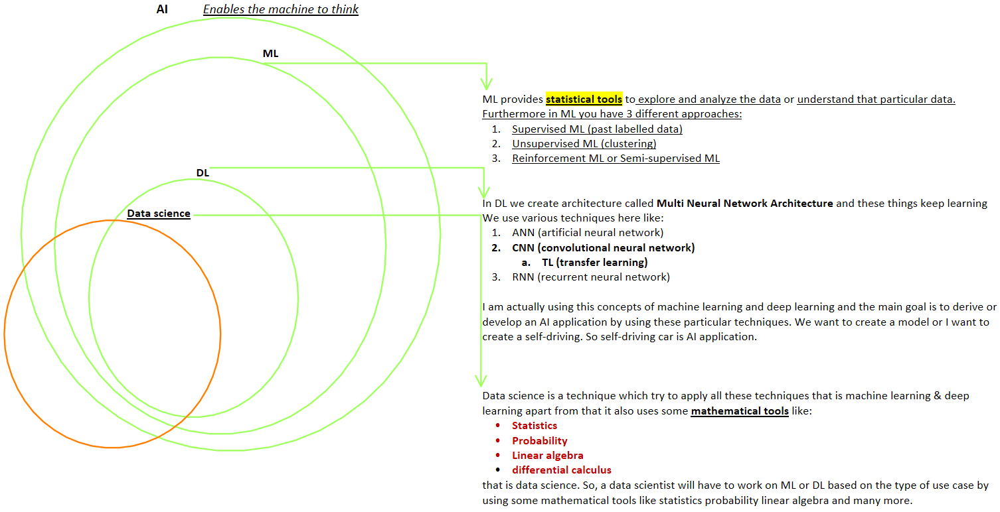

= MATLAB vs python
Author Name Mehmood-ur-Rehman
:sectnumlevels: 4
:toclevels: 4
:sectnums: 4
:toc: left
:icons: font
:toc-title: Table of contents
:doctype: article

== What is the difference b/w AI, ML, DL, Data science?

.AI, ML, DL, Data science

== WHAT TO LEARN TO BE ABLE TO DO data visualization

As I just noted, this entire data exploration was performed with a few foundational tools:

* https://www.sharpsightlabs.com/r-bar-chart-basic/[the bar chart]
* https://www.sharpsightlabs.com/histogram-in-r-basic/[the histogram]
* https://www.sharpsightlabs.com/how-to-create-a-scatterplot-in-r/[the scatterplot]
* https://www.sharpsightlabs.com/small-multiples-ggplot/[the small multiples design]
* https://www.sharpsightlabs.com/dplyr-intro-data-manipulation-with-r[the 5 dplyr verbs]

After learning these, learn a little about ggplot2 themes, the “overview, filter, zoom” method, and the iterative process for creating visualizations, and you’ll be very well prepared to explore your own data.

From <https://www.sharpsightlabs.com/blog/data-analysis-example-r-supercars-part2/>

== YOUR FIRST MILESTONE: MASTER [.underline]#DATA ANALYSIS#

.*What does this mean for you, the beginning data scientist?*

The take-away here is that for beginning data scientists and ML practitioners, data expertise beats math expertise. You’ll get much farther if you really know your way around a dataset, than if you know calculus and college-level math.

So if your goal is to get a job in business or industry, your first milestone is mastering data analysis.

* It’s not mastering calculus.

* It’s not being able to write proofs or grind through math problems.

* It’s data analysis.

.*ETL (Extract ---> Transform ---> Load)*

You need to master how to gather data, explore it, and prepare it. This means that you need to master data visualization and data wrangling (including aggregation). Then you need to be able to use data visualization and data wrangling together to be able to perform exploratory data analysis.

If you’re working in #*_R_*#, then I recommend that you learn the following:

– ggplot2 for data visualization, including https://www.sharpsightlabs.com/how-to-create-a-scatterplot-in-r/[basic visualizations like scatterplots], histograms, bar charts

– https://www.sharpsightlabs.com/dplyr-intro-data-manipulation-with-r/[dplyr for aggregating and reshaping a dataset]

– Learn how to use https://www.sharpsightlabs.com/data-analysis-example-r-supercars-part2/[ggplot and dplyr together for exploratory data analysis]

If you’re working in *#Python#*, learn the following:

– Base python

– Pandas, for aggregating and reshaping your data

– Matplotlib for data visualization. In particular, learn pyplot for basic visualizations, and use https://stanford.edu/~mwaskom/software/seaborn/[Seaborn for more advanced statistical graphics]

– Learn to use Pandas and data visualizations together for exploratory data analysis.

If you’re a beginner, and you want to get started with machine learning, you can get by without knowing calculus and linear algebra, but you absolutely can’t get by without data analysis.

If you master data analysis, you’ll be well prepared to start building machine learning models that work.

The only pre-requisites to start learning ML are:

* *Basic Linear Algebra* - Having a good knowledge of linear algebra would be very helpful.  For the beginning topics of ML like regression analysis, etc; knowing the basics of Linear Algebra would suffice. But as one goes on to more deeper in ML, a bit more knowledge of LA would be required.
* *Programming Experience* - Prior  programming experience would be very useful. People mostly program in Python, Java and R. But Python and R clearly stand out to be the leaders in the recent days.  Learning Python is very easy and shouldn't take more than two months to get through with the basics.
* *Statistics and Probability* - ML is all about Stats and Probability. So, having a prior knowledge in that area would come very handy. One need to be pretty good in identifying distributions and deal with them.
* Having a solid Math background is very important for any starter in ML or AI. Don't panic if you don't have one, both of us are in the same league. Just take the online math courses at Coursera, Udacity and Khan Academy; they would be sufficient.

. From <https://www.quora.com/What-are-prerequisites-to-start-learning-machine-learning>
. From <https://www.sharpsightlabs.com/blog/machine-learning-prerequisite-isnt-math/>

'''

➢ What are random variables in statistics

➢ What is variance around the variable  in statistics

➢ What is expectation in statistics

Familiarity with basic linear algebra

If you do not know its ok you can review on these sections to have refresher

MATLAB or python are the tools for this course

I've been programming with Matlab for about 15 years, and with Python for about 10. It usually breaks down this way:

If you can satisfy the following conditions:

[arabic]
.   You primarily use matrices and matrix operations
.  You have the money for a Matlab license
.  You work on a platform that mathworks supports

Then, by all means, use Matlab. Otherwise, if you have data structures other than matrices, want an open-source option that allows you to deliver solutions without worrying about licenses, and need to build on platforms that mathworks does not support; then, go with Python.

The matlab language is clunky, but the user interface is slick. The Python language is very nice -- with iterators, generators, and functional programming tools that matlab lacks; however, you will have to pick and choose to put together a nice slick interface if you don't like (or can't use) SAGE.

I hope that helps.

There are three aspects to consider when replacing Matlab with Python; the core language capabilities, the IDE and the Price.

Capabilities Comparison

This section outlines all of the capabilities of each platform. In short everything Matlab can do, Python can also do plus much more. However, things like linear algebra and rapid prototyping Matlab does more cleanly.

Matlab

**__##Everything in Matlab is ready bundled and toolboxes are seamlessly integrated. It is also much more mature - but was not designed for general purpose programming meaning anything not linear algebra related is painful to implement.
##__**

* *Toolboxes*: The Matlab toolboxes are very good and python implementations often struggle to compete with them (even for not so specialised things like optimisation algorithms).
* *Linear Algebra*: Matlab has concise linear algebra capabilities which are easier to read and interpret.
* *Visualisation Capabilities*: Has very good and very broad range of visualisation capabilities.

Python

Python will require a number of additional modules for it to become a good Matlab replacement.

* General Purpose Programming: Python is a proper programming language which offers a lot more flexibility over Matlab.
* Numpy: Provides arrays and linear algebra routines, however has more awkward syntax than Matlab. I have fallen in love with the http://docs.scipy.org/doc/numpy/user/basics.broadcasting.html[broadcasting] feature however, no more repmat rubbish.
* SciPy: Stats, optimization and other useful mathematical stuff.
* MatPlotLib: Provides, in my opinion, higher quality plots than Matlab. Furthermore it is designed to be syntactically similar to Matlab so should be easy to pick up.
* SymPy: Good symbolic programming package.

IDE Comparison

This is where python is lacking in my opinion. I simply find algorithm development (particularly involving a lot of linear algebra) less painful in the Matlab IDE.

Matlab

Here are some key Matlab features which will be hard to live without as an engineering student. Note that Python IDEs do have some of these capabilities also, but are more sloppily implemented.

* Powerful Debugging: Can easily explore functions in a very non-restrictive manner. Python also allows for debugging but is often not as cleanly implemented in the IDEs.
* Variable Explorer: MATLAB has a good variable explorer which always good for viewing of many supported data types. Some python IDEs struggle to display numpy arrays which can be annoying.
* Variable Survival: If code breaks during runtime, the variables still persist which helps debugging. Furthermore it is easier to run different scripts in a row assuming persistent variables. In Python you will have to manually save variables in a script to have them available for other scripts.
* Profiler: Very good for a breakdown of where your algorithms are bottlenecking.
* Command Line Single line instructions can be executed on the command line. Python is full support for this also in all good IDEs.
* GUI Plotting Tools: Results and variables can be quickly and painlessly plotted from the user interface. Most Python IDEs are geared towards software development and so don't support this (although sypder does have limited support through matplotlib).
* Documentation: All functions have native documentation within the IDE.

Python

There are some new python IDEs which are starting to compete with some of MATLAB's key advantages. I personally like http://www.jetbrains.com/pycharm/[PyCharm] which was recently released as a free community version. It has the following capabilities and is very well designed from a UI perspective.

* Bebugging
* Variable Explorer
* Command Line
* Documentation

Price Comparison

Python is free and has an active support community. Matlab also had a good support community too, but is anything but free.

From <https://stackoverflow.com/questions/1776290/replacing-matlab-with-python>
