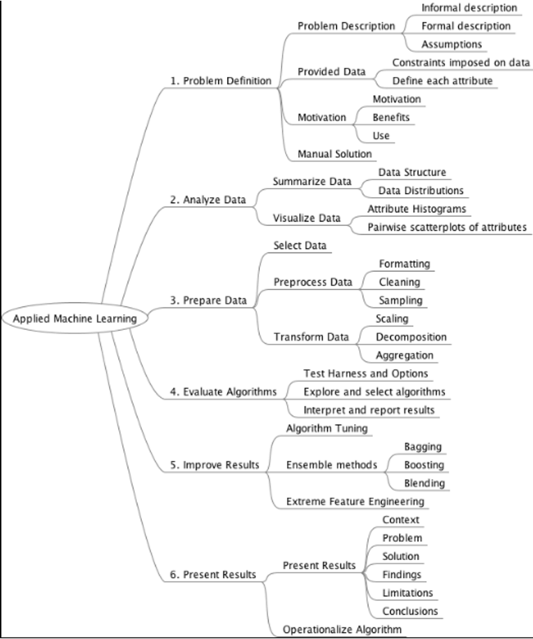

= Applied Machine Learning Process
Author Name Mehmood-ur-Rehman
:sectnumlevels: 4
:toclevels: 4
:sectnums: 4
:toc: left
:icons: font
:toc-title: Table of contents
:doctype: article

== 6-step process for classification and regression type problems

A 6-step process for *_classification and #regression# type problems_*, the common problem types at the heart of most machine learning problems. The process is as follows:

.Applied Machine Learning Process

Applied Machine Learning Process

. *Problem Definition:* Understand and clearly describe the problem that is being solved.
. *Analyze Data:* Understand the information available that will be used to develop a model.
. *Prepare Data:* Discover and expose the structure in the dataset.
. *Evaluate Algorithms:* Develop a robust test harness and baseline accuracy from which to improve and spot check algorithms.
. *Improve Results:* Leverage results to develop more accurate models.
. *Present Results:* Describe the problem and solution so that it can be understood by third parties.

.ML use case examples

.core_principles of data visualization

*#Geometry#* Contents

. https://www.scratchapixel.com/lessons/mathematics-physics-for-computer-graphics/geometry/points-vectors-and-normals[Points, Vectors and Normals]

[arabic]
. https://www.scratchapixel.com/lessons/mathematics-physics-for-computer-graphics/geometry/coordinate-systems[Coordinate Systems]
. https://www.scratchapixel.com/lessons/mathematics-physics-for-computer-graphics/geometry/math-operations-on-points-and-vectors[Math Operations on Points and Vectors]
. https://www.scratchapixel.com/lessons/mathematics-physics-for-computer-graphics/geometry/matrices[Matrices]
. https://www.scratchapixel.com/lessons/mathematics-physics-for-computer-graphics/geometry/how-does-matrix-work-part-1[How Does Matrix Work: Part 1]
. https://www.scratchapixel.com/lessons/mathematics-physics-for-computer-graphics/geometry/how-does-matrix-work-part-2[How Does Matrix Work: Part 2]
. https://www.scratchapixel.com/lessons/mathematics-physics-for-computer-graphics/geometry/transforming-points-and-vectors[Transforming Points and Vectors]
. https://www.scratchapixel.com/lessons/mathematics-physics-for-computer-graphics/geometry/row-major-vs-column-major-vector[Row Major vs Column Major Vector]
. https://www.scratchapixel.com/lessons/mathematics-physics-for-computer-graphics/geometry/matrix-operations[Matrix Operations]
. https://www.scratchapixel.com/lessons/mathematics-physics-for-computer-graphics/geometry/spherical-coordinates-and-trigonometric-functions[Spherical Coordinates and Trigonometric Functions]
. https://www.scratchapixel.com/lessons/mathematics-physics-for-computer-graphics/geometry/creating-an-orientation-matrix-or-local-coordinate-system[Creating an Orientation Matrix or Local Coordinate System]
. https://www.scratchapixel.com/lessons/mathematics-physics-for-computer-graphics/geometry/transforming-normals[Transforming Normals]

Machine Learning problems can be solved in numerous ways, and you can *#choose algorithms#* based on several factors like *#accuracy, objective, size, and nature of data#*. You can refer the cheat sheet and get a head start in building the model. Once, you have implemented the solution and got results then you can further explore different algorithms to see what is the best algorithm that is suited for that particular problem.

.*Choosing the right estimator*

Often the hardest part of solving a machine learning problem can be finding the right *_##estimator##_* for the job. Different estimators are better suited for different types of data and different problems. The flowchart below is designed to give users a bit of a rough guide on how to approach problems with regard to which estimators to try on your data.

.scikit-learn_algorithm_cheat-sheet

== Choosing a Scikit-learn Linear Regression Algorithm

A brief overview of the various [.underline]#_**Scikit-learn linear regression algorithms**_#, and what cases they are typically most effective for. Includes a summary table and flowchart to quickly decide on a model to fit your data.

.Choosing a Scikit-learn Linear Regression Algorithm
[width="100%",cols="50%,50%",]
|===
|Description |Brief description of the model

a|
Prevents Overfitting

|Model easily tuned to prevent overfitting
a|
Handles Outliers

|Model intended to handle outliers
a|
Handles Several Features

|Model effectively handles large numbers of features
|Adaptive Regularization |Model adaptive learns regularization terms during training
|Large Dataset |Model computationally efficient on very large datasets (>100000 samples)
|Nonlinear |Base model fits well to nonlinear data (linear models can also fit nonlinear data but takes some tuning)
|Interpretability Score |From 5 (highly interpretable) - 1 (not interpretable). Theses really no science behind the score given; more of just my best judgement.
|When to Use |Brief keywords describing what scenarios to use
|When to Use Expanded |Expands on When to Use
|Advantages |Lists advantages of the model
|Disadvantages |Lists disadvantages of the model
|Sklearn Package |The package the model resides in, in scikit-learn (import sklearn.*package*.*model*)
|Required Args |Required arguments of the model
a|

Helpful Args

|Some of the most helpful optional arguments. See documentation for complete list of args.
a|

Variations

|Variations off of the base model listed. See documentation for use cases of each.
|===
.*Choosing a Scikit-learn Linear Regression Algorithm*

✪ https://www.theinsaneapp.com/2020/12/machine-learning-and-data-science-cheat-sheets-pdf.html[https://www.theinsaneapp.com/2020/12/machine-learning-and-data-science-cheat-sheets-pdf.html]

* This link contains more than what you require. Check it out anytime you need help.

Top 10 Python Math Cheat Sheets.

✪ https://laptrinhx.com/top-10-python-math-cheat-sheets-3353110854/[https://laptrinhx.com/top-10-python-math-cheat-sheets-3353110854/]

.*Very important link:*
* https://nhadep247.net/machine-learning-algorithms-cheat-sheet-pdf-1657186855/[https://nhadep247.net/machine-learning-algorithms-cheat-sheet-pdf-1657186855/]
* https://www.kaggle.com/general/294829[https://www.kaggle.com/general/294829]
* https://www.kdnuggets.com/2018/10/top-news-week-0924-0930.html[https://www.kdnuggets.com/2018/10/top-news-week-0924-0930.html]
* https://www.iapa.org.au/news-and-articles/2019-09-05.html[https://www.iapa.org.au/news-and-articles/2019-09-05.html]
* https://medium.com/machine-learning-in-practice/cheat-sheet-of-machine-learning-and-python-and-math-cheat-sheets-a4afe4e791b6[https://medium.com/machine-learning-in-practice/cheat-sheet-of-machine-learning-and-python-and-math-cheat-sheets-a4afe4e791b6]
* https://www.globalsqa.com/cheatsheets/[https://www.globalsqa.com/cheatsheets/]
