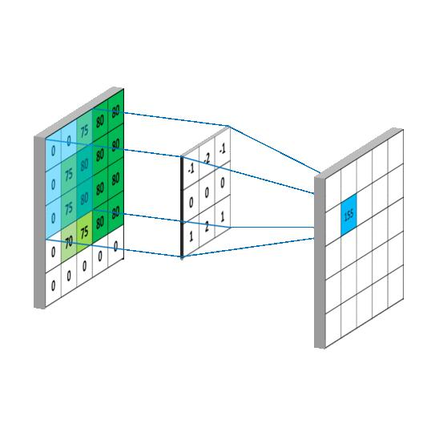
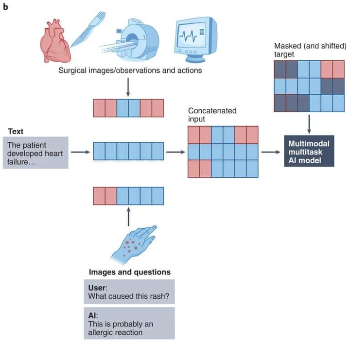

= Let's Understand Convolutional Neural Networks (CNNs) in Image Classification 🔎

CNN (Convolutional Neural Network) is a deep learning model for visual data processing. It uses convolutional layers to learn hierarchical representations and extract meaningful features from images.

Image Input

• An image is represented as a matrix of pixel values, with each pixel having 3 values (Red, Green, Blue), ranging from 0 (black) to 255 (white).

Convolutional Layers

• Convolutional layers apply filters or kernels to the input image, creating feature maps that identify important features like edges, lines, and textures.

ReLU (Rectified Linear Unit)

• The ReLU layer applies the non-linear function max(0, x) to all inputs, increasing the CNN model's non-linearity.

Pooling Layers

• Pooling layers reduce feature map dimensionality while retaining essential information. Max pooling selects the maximum value from the filter-covered section of the image.

Fully Connected Layers

• Fully connected layers enable high-level reasoning as neurons connect to all activations in the previous layer.

Output Layer

• The final layer uses softmax and sigmoid functions to output class probabilities. Softmax for multi-class, sigmoid for binary classification.

Classification Result

• The class with the highest probability is the CNN's final prediction for the input image.

CNNs learn hierarchical patterns, achieving impressive accuracy in image classification tasks. Understanding CNNs enhances machine learning and artificial intelligence skills.

== new concept
Multimodality and Large Multimodal Models (LMMs)

"For a long time, each ML model operated in one data mode – text (translation, language modeling), image (object detection, image classification), or audio (speech recognition).

However, natural intelligence is not limited to just a single modality. Humans can read and write text. We can see images and watch videos. We listen to music to relax and watch out for strange noises to detect danger. Being able to work with multimodal data is essential for us or any AI to operate in the real world."

