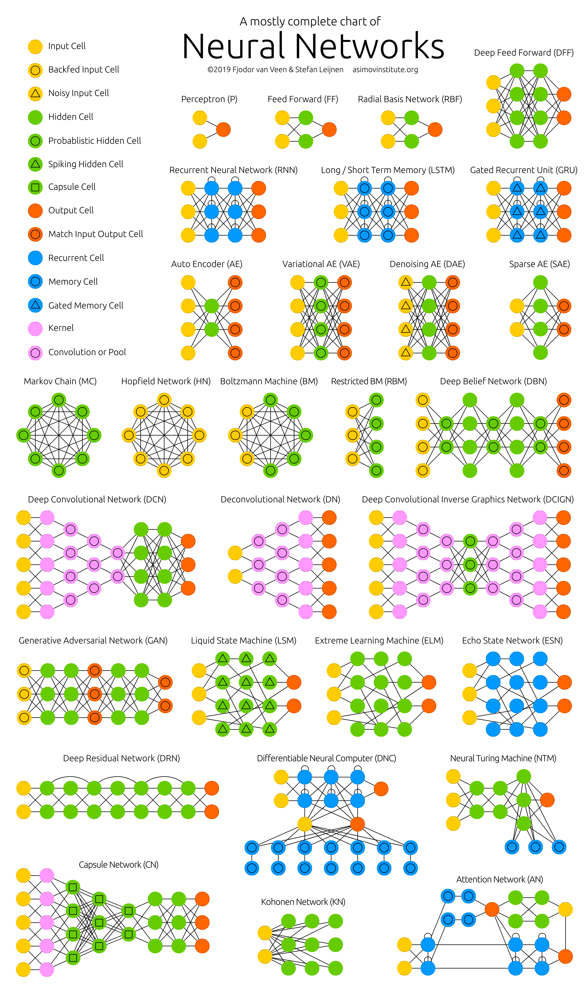

== *Blogposts*

=== https://www.asimovinstitute.org/neural-network-zoo/[Neural Network Zoo]

With new neural network architectures popping up every now and then, it’s hard to keep track of them all. Knowing all the abbreviations being thrown around (DCIGN, BiLSTM, DCGAN, anyone?) can be a bit overwhelming at first. So I decided to compose a cheat sheet containing many of those architectures. Most of https://www.asimovinstitute.org/neural-network-zoo/[*Read More*]

.Neural Network Architectures

=== https://www.asimovinstitute.org/neural-network-zoo-prequel-cells-layers/[Neural Network Zoo Prequel: Cells and Layers]

The Neural Network Zoo shows different types of cells and various layer connectivity styles, but it doesn’t really go into how each cell type works. A number of cell types I originally gave different colours to differentiate the networks more clearly, but I have since found out that these cells work more or less the same way, so you’ll find https://www.asimovinstitute.org/neural-network-zoo-prequel-cells-layers/[*Read More*]

.neural network cells
image::images/neuralnetworkcells.png[]

.neural network graphs
image::images/neuralnetworkgraphs.png[]

