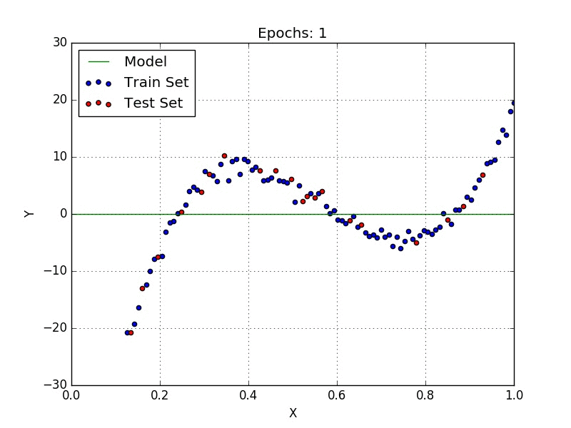

.Convergence and Divergence
image::convergence-divergence.gif[]

.Gradient_descent
image::Gradient_descent.gif[]

.confusion-matrix
image::confusion-matrix.gif[]

.kernel-or-filter
image::kernel-or-filter.gif[]

.linear-regression
image::linear-regression.gif[]

.logistic-regression

.sgd_learning_rates

.tree-forest
image::tree-forest.gif[]

.Why-the-*#“Bell-Curve”#*-is-so-Normal-by-Russell-Lim-Math-Simplified

.3_Dimensional_Space

.plane Bi Vector

.4-dimension
image:4-dimension.gif[]

.1-to-4-dimension

.sphere

