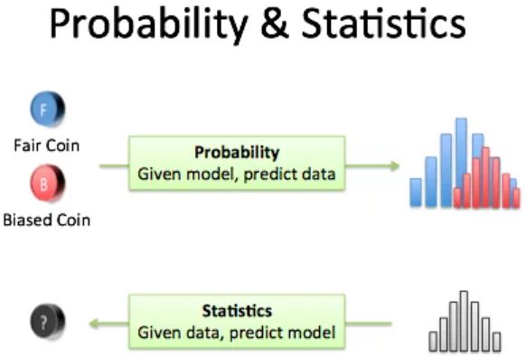

= A Brief Introduction to Probability & Statistics
I've studied probability and statistics without experiencing them. What's the difference? What are they trying to do?

This analogy helped:

*Probability* is starting with an animal, and figuring out what footprints it will make.

*Statistics* is seeing a footprint, and guessing the animal.
Probability vs Statistics Diagram

.probability vs statistics

**Probability is straightforward: **you have the bear. Measure the foot size, the leg length, and you can deduce the footprints. "Oh, Mr. Bubbles weighs 400lbs and has 3-foot legs, and will make tracks like this." More academically: "We have a fair coin. After 10 flips, here are the possible outcomes."

*Statistics is harder.* We measure the footprints and have to guess what animal it could be. A bear? A human? If we get 6 heads and 4 tails, what're the chances of a fair coin?

== The Usual Suspects
Here's how we "find the animal" with statistics:

*Get the tracks.* Each piece of data is a point in "connect the dots". The more data, the clearer the shape (1 spot in connect-the-dots isn't helpful. One data point makes it hard to find a trend.)

*Measure the basic characteristics.* Every footprint has a depth, width, and height. Every data set has a mean, median, standard deviation, and so on. These universal, generic descriptions give a rough narrowing: "The footprint is 6 inches wide: a small bear, or a large man?"

*Find the species.* There are dozens of possible animals (probability distributions) to consider. We narrow it down with prior knowledge of the system. In the woods? Think horses, not zebras. Dealing with yes/no questions? Consider a binomial distribution.

*Look up the specific animal.* Once we have the distribution ("bears"), we look up our generic measurements in a table. "A 6-inch wide, 2-inch deep pawprint is most likely a 3-year-old, 400-lbs bear". The lookup table is generated from the probability distribution, i.e. making measurements when the animal is in the zoo.

*Make additional predictions.* Once we know the animal, we can predict future behavior and other traits ("According to our calculations, Mr. Bubbles will poop in the woods."). Statistics helps us get information about the origin of the data, from the data itself.

Ok! The metaphor isn't perfect, but more palatable than "Statistics is the study of the collection, organization, analysis, and interpretation of data". Need proof? Let's see if we can ask intuitive "I tasted it!" questions:

* What are the most common species? (Common distributions)
* Are new ones being discovered?
* Can we predict the next footprint? (Extrapolation)
* Are the tracks following a path? (Regression / trend line)
* Here's two tracks, which animal was faster? Bigger? (Data from two drug trials: which was more effective?)
* Is one animal moving in the same direction as another? (Correlation)
* Are two animals tracking a common source? (Causation: two bears chasing the same rabbit)

These questions are much deeper than what I pondered when first learning stats. Every dry procedure now has a context: are we learning a new species? How to take the generic footprint measurements? How to make a table from a probability distribution? How to lookup measurements in a table?

Having an analogy for the statistics process makes later data crunching click. Happy math.

PS. The forwards-backwards difference between probability and statistics shows up all over math. Some procedures are easy to do (derivatives) but difficult to undo (integrals). (Thanks Denis)