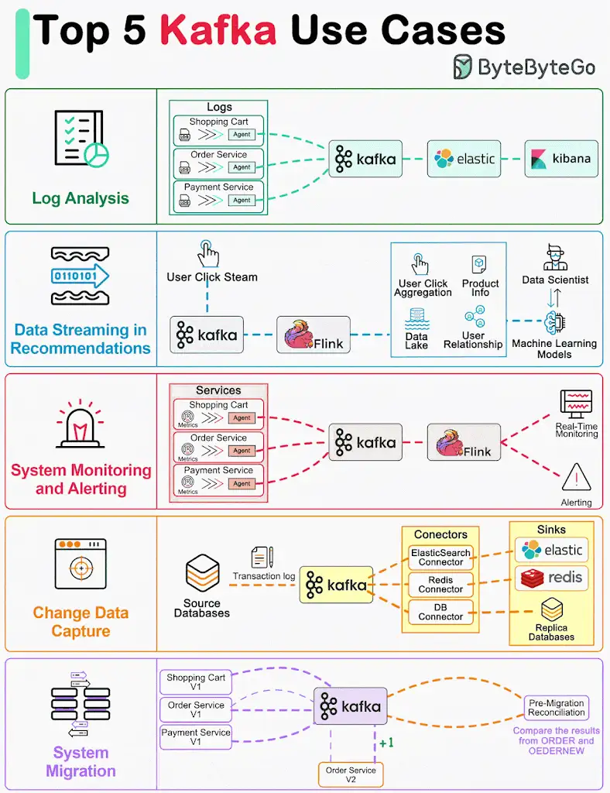

Kafka was originally built for massive log processing. It retains messages until expiration and lets consumers pull messages at their own pace.

Let’s review the popular Kafka use cases.

- Log processing and analysis
- Data streaming in recommendations
- System monitoring and alerting
- CDC (Change data capture)
- System migration