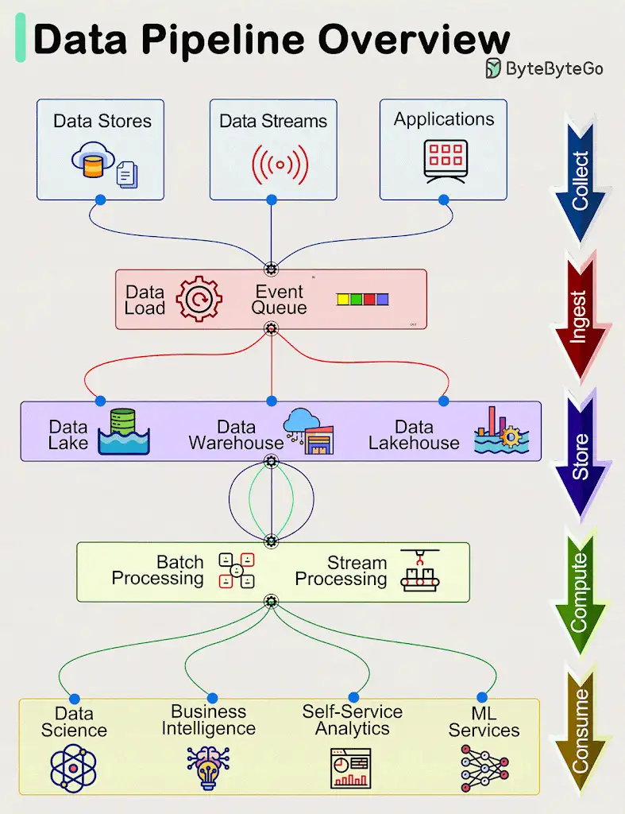

Data pipelines are a fundamental component of managing and processing data efficiently within modern systems. These pipelines typically encompass 5 predominant phases: *Collect, Ingest, Store, Compute, and Consume.*

1. *#Collect:#*
Data is acquired from data stores, data streams, and applications, sourced remotely from devices, applications, or business systems.

2. *#Ingest:#*
During the ingestion process, data is loaded into systems and organized within event queues.

3. *#Store:#*
Post ingestion, organized data is stored in data warehouses, data lakes, and data lakehouses, along with various systems like databases, ensuring post-ingestion storage.

4. *#Compute:#*
Data undergoes aggregation, cleansing, and manipulation to conform to company standards, including tasks such as format conversion, data compression, and partitioning. This phase employs both batch and stream processing techniques.

5. *#Consume:#*
Processed data is made available for consumption through analytics and visualization tools, operational data stores, decision engines, user-facing applications, dashboards, data science, machine learning services, business intelligence, and self-service analytics.

The efficiency and effectiveness of each phase contribute to the overall success of data-driven operations within an organization.
