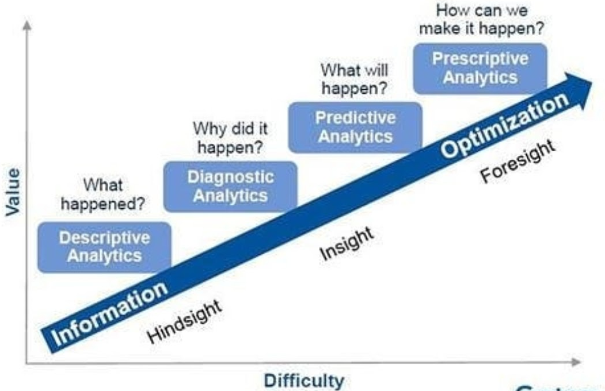

[cols=",,",]
|===
|*Feature* |*Inference* |*Diagnosis*
|Definition |The process of drawing a conclusion from evidence or premises. |The identification of a disease or condition based on the patient's symptoms, signs, and medical history.
|Type of reasoning |Inductive or abductive |Abductive
|Certainty |Inferences can be more or less certain, depending on the strength of the evidence. |Diagnoses are typically made with a high degree of certainty.
|Role of evidence |Evidence is used to support the inference. |Evidence is used to rule out other possible diagnoses and to support the most likely diagnosis.
|Goal |To arrive at a conclusion about something. |To identify the cause of a patient's symptoms.
|Examples |Inferring that someone is angry based on their facial expression, inferring that a drug is effective based on the results of a clinical trial. |Diagnosing a patient with pneumonia based on their symptoms and a chest X-ray, diagnosing a patient with depression based on their mood, thoughts, and behavior.
|===

In other words, inference is the process of drawing conclusions from evidence, while diagnosis is the process of identifying a disease or condition. Inference is a broader concept that can be used in any situation where evidence is used to draw a conclusion. Diagnosis is a more specific concept that is used in medicine to identify the cause of a patient's symptoms.

For example, if you see someone crying, you might infer that they are sad. This is an inference because you are drawing a conclusion about someone's emotional state based on their behavior. However, if you are a doctor and you see a patient who is crying, you might diagnose them with depression. This is a diagnosis because you have identified a specific disease or condition that is causing the patient's symptoms.

In general, inferences are less certain than diagnoses. This is because inferences are based on limited evidence, while diagnoses are based on a more comprehensive assessment of the patient's condition. However, both inferences and diagnoses are important tools for making decisions.

=== Inferential statistics and diagnostic statistics are closely related, but they are not the same.

* ##*Inferential statistics* ##are used to make inferences about a population based on a sample. For example, if you conduct a survey of 1,000 people and find that 50% of them support a particular political candidate, you can use inferential statistics to estimate the proportion of the entire population that supports the candidate.
* #*Diagnostic statistics*# are used to identify patterns and relationships in data. #*_For example, you might use diagnostic statistics to identify outliers in a dataset or to determine whether two variables are correlated._*#

In other words, inferential statistics are used to make *generalizations* about a population, while diagnostic statistics are used to understand the characteristics of a particular *#dataset#*.

Diagnostic statistics can be used to inform the use of inferential statistics. For example, if you find that a dataset contains a large number of outliers, you might need to use a different type of inferential test.

However, inferential statistics are not always necessary for diagnostic analysis. For example, you can use diagnostic statistics to identify patterns in data without making any inferences about a population.

In general, inferential statistics are a more powerful tool than diagnostic statistics. However, diagnostic statistics can be a valuable tool for understanding the characteristics of data.

In the context of data analysis, inferential statistics are often used to test hypotheses about the population, while diagnostic statistics are used to explore the data and identify potential problems.

=== Predictive & Prescriptive statistics come under inferential statistics?

Predictive and prescriptive statistics are often considered to be subfields of inferential statistics. This is because they both involve making inferences about the future based on past data.

* *Predictive statistics* is used to make predictions about future events. For example, a predictive model might be used to predict the likelihood of a customer making a purchase or the risk of a patient developing a disease.
* *Prescriptive statistics* is used to make recommendations about what actions should be taken. For example, a prescriptive model might be used to recommend the best marketing campaign for a particular product or the best treatment for a particular patient.

Both predictive and prescriptive statistics rely on inferential statistics to make inferences about the future. However, they differ in their focus. Predictive statistics is focused on making accurate predictions, while prescriptive statistics is focused on making actionable recommendations.

In the context of data analysis, predictive and prescriptive statistics can be used to support a wide range of decision-making processes. For example, predictive statistics can be used to identify potential risks and opportunities, while prescriptive statistics can be used to identify the best course of action.

As the field of data science continues to evolve, predictive and prescriptive statistics are likely to become increasingly important tools for making informed decisions.
