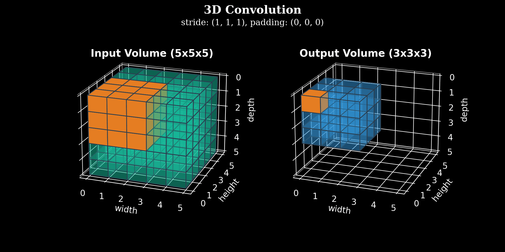

.convolution-operation-on-a-mxnx3-image-matrix-with-a-3x3x3-kernel
image::convolution-operation-on-a-mxnx3-image-matrix-with-a-3x3x3-kernel.gif[]

.Visualization of a 3D convolution of 5x5x5 volume with 3x3x3 kernel, no padding, no strides. It results in a 3x3x3 output volume.

* #_Similarly to 2D convolutions, which encode spatial relationships of objects in a 2D domain, 3D convolutions can describe the spatial relationships of objects in the 3D space._#

.kernel-or-filter (convolution)
image::kernel-or-filter.gif[]

.*#Filter#* as Magnifier
image::filter-as-magnifier.png[]

.2D_Convolution_Animation
image::2D_Convolution_Animation.gif[]
