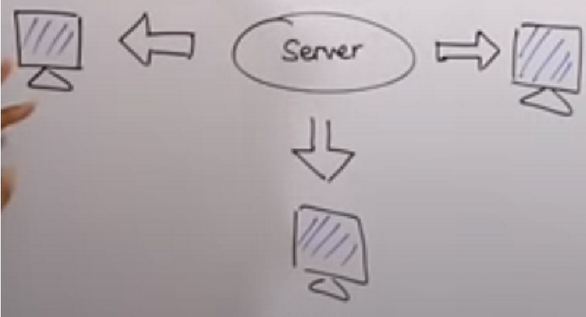
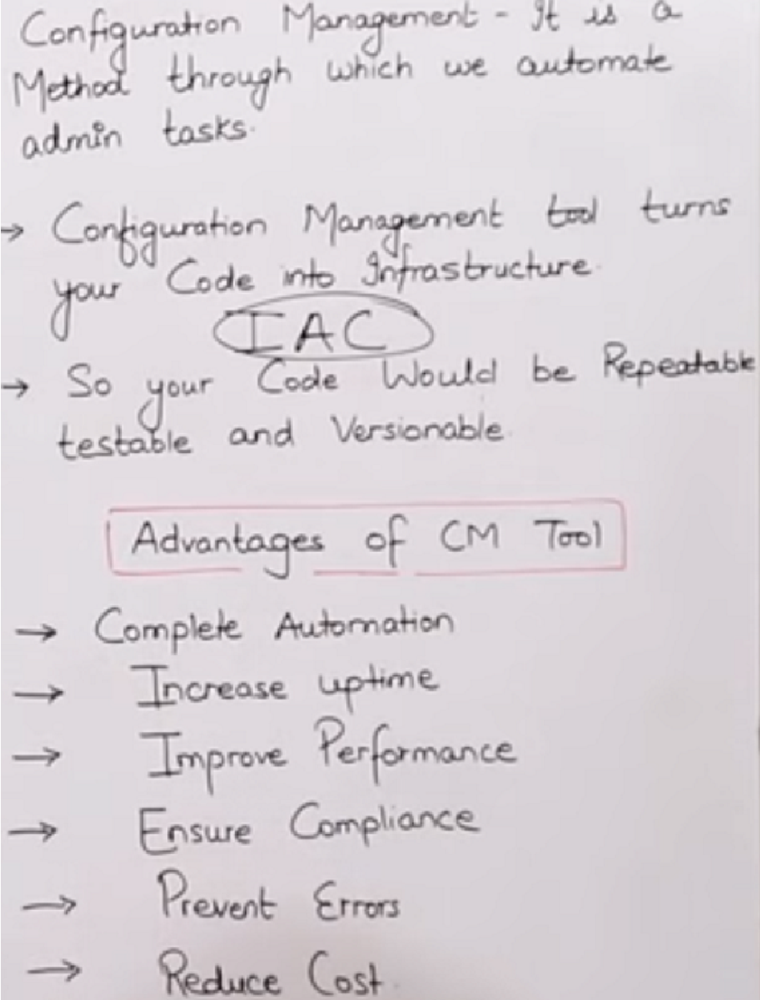
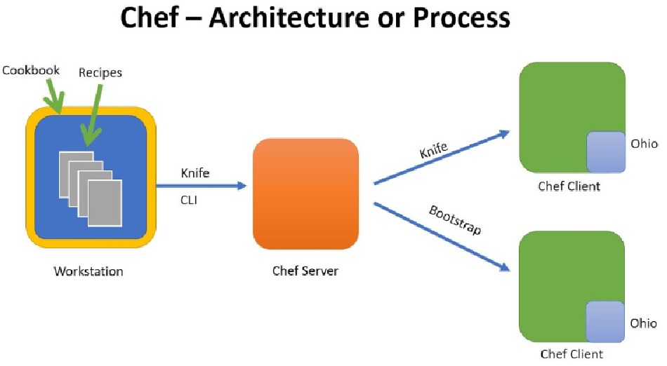
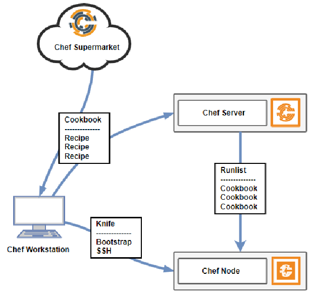
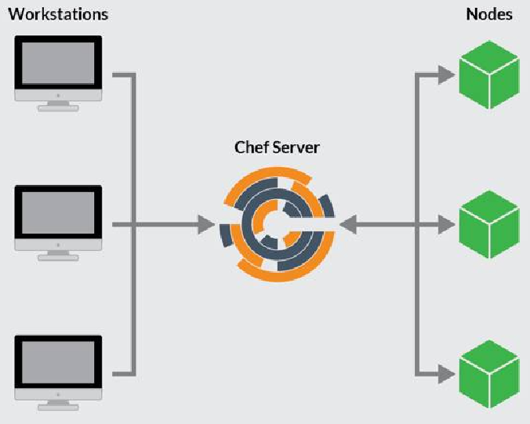

== What is *Chef-server*, Workstation,node, Ohai, recipe and Cookbook image:images/image-2023-02-09-14-52-32-776.png[width=80]

* The Chef is a *#configuration management#* *tool*.
* System administrator role is to manage machines, install any required s/w etc. like in wah university lab admin.

* *DevOps engineer* now replaces the *system administrator* job at those organizations which has moved toward automation & *cloud computing*.

*#Configuration:#* each & every detail of your machine** (storage, server, the whole state of machine in terms of hardware & software).**

* *Configuration management tools:*

** *Push-based* (push configuration server pushes configuration to the nodes)

.Ansibile & saltstack both are push-based tools

** *Pull based* (pull configuration nodes check with the server periodically & fetches the configuration from it)

image::images/image-2023-02-09-15-02-56-552.png[width=300]

*Cheff & puppet* both pull-based tools, chef is new in market & it is open source s/w while puppet is old.

=== what is cheff, Infrastructure as Code (IaC)?

.what is cheff, Infrastructure as Code (IaC)?

=== cheff architecture and process

Chef is a configuration management system designed to bring automation to infrastructure. It can be used to manage nodes running OSs such as Microsoft Windows, Mac OS X and Linux distributions including Ubuntu, RedHat, CentOS, Debian and Fedora.

Chef is an open-source automation platform that provides a way to define *infrastructure as code*. The Chef architecture consists of two main components, *the Chef Client and the Chef Server*.

1. *The Chef Client* runs on each managed *node* and communicates with the Chef Server,
which stores the configurations and data from all of the clients.
The Chef Client processes resources, which are defined in a language called Ruby and stored in files called *“recipes”.*
** These *recipes* contain instructions for configuring the node, such as installing and configuring packages,
creating users and files,
etc.

3. *The Chef Server* then compiles the recipes into instructions that the Chef Client can understand,
allowing it to configure the node according to the recipe.
Additionally, the Chef Server maintains a *library of cookbooks*,
which are Cookbooks that contain more complex recipes
that facilitate the provisioning and configuration of different applications and services.

.cheff architecture and process

.cheff architecture and process

.cheff architecture and process

=== How to create "cookbook & recipe"

==== What is chef attribute
==== Insert Linux command, create user & group, runlist
==== What is bootstrapping in CHEF
*Bootstrap* is a command. Actually, it is software like *#git#*; we give commands of git like: _##Git status, git log --oneline etc.##_ kind of thing.

* Your "*workstation*" & " *node* (Linux machine)" should be in the same *"availability zone or AZ"*. Why? Because it's recommended. But you can deviate from it in case you need it to do so. Given the conditions, you understand the consequences.
** Actually, if you create " *node* (Linux machine)" in the same AZ availability zone, then you can access this node through private IP of this node otherwise you have to use public IP.

==== How to create role in chef
Creating a "role" & uploading the role on chef-server

*Docker & cheff* both work at same level of abstraction, but they've different responsibilites.

1. *Docker* will *#create a container#* for you while
2. *Chef* will do the *#configuration on that container#*