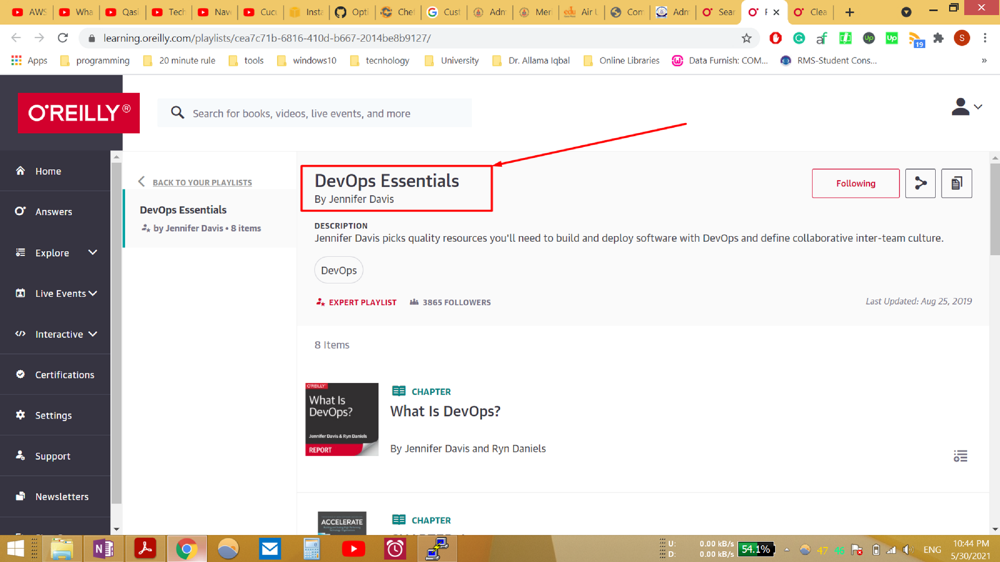
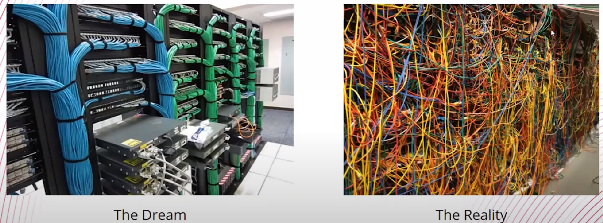
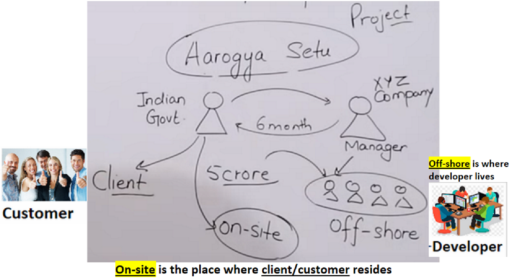
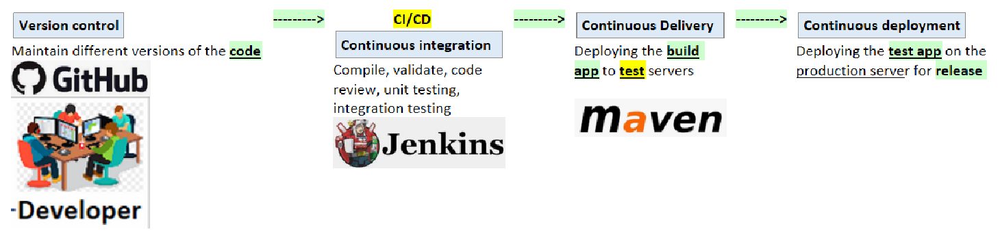
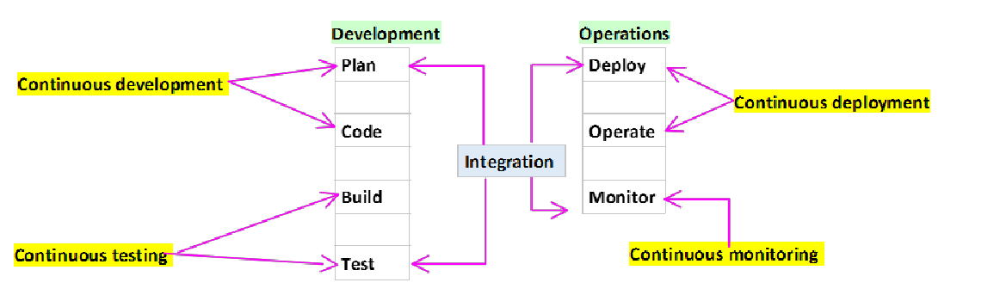
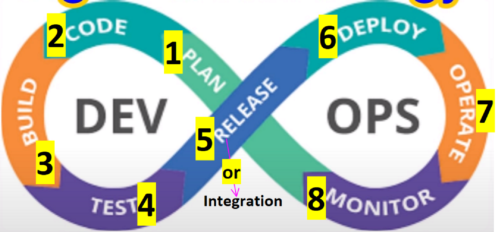
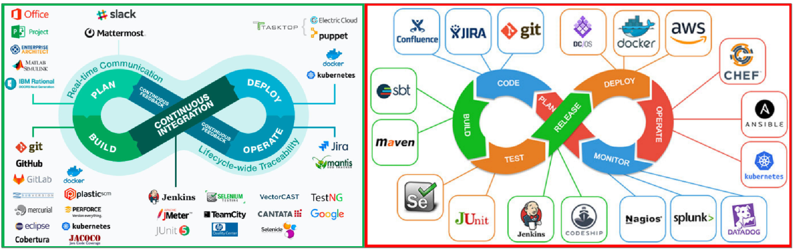
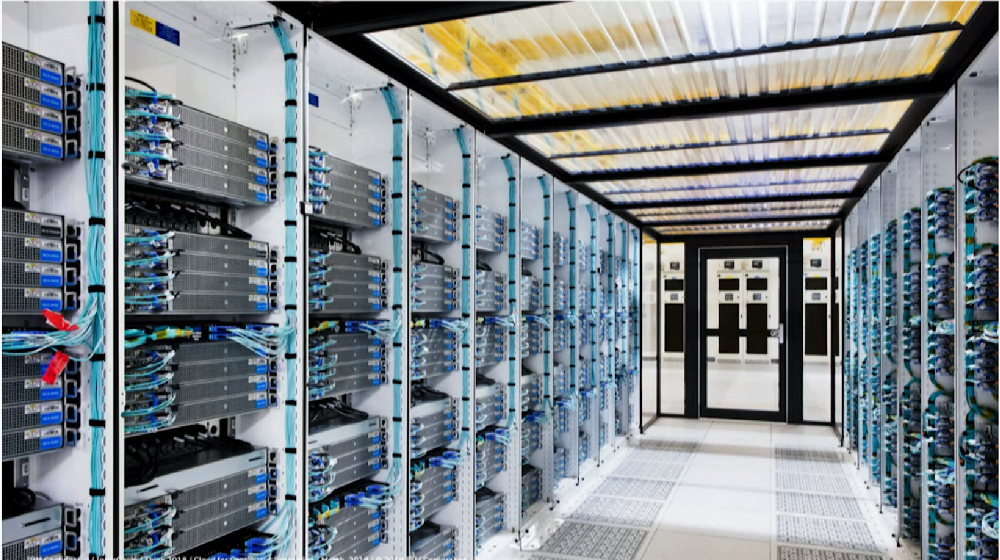

= Open Source DevOps
Author Name Mehmood-ur-Rehman
:sectnumlevels: 4
:toclevels: 4
:sectnums: 4
:toc: left
:icons: font
:toc-title: Table of contents
:doctype: book

*OSS DevOps is (Open Source DevOps*, does not have any *certifications* because you are learning all open source tools, but you can do certification on a single tool like kubernetes, docker)

.*Fun with Networks* and SDN (Software Defined Networking)

.*Production Ready CI/CD Pipeline Using Jenkins, Ansible, Docker, Kubernetes, etc*
+++
<iframe width="560" height="315" src="https://www.youtube.com/embed/8D46Pgbz0gg" title="YouTube video player" frameborder="0" allow="accelerometer; autoplay; clipboard-write; encrypted-media; gyroscope; picture-in-picture; web-share" allowfullscreen></iframe>
+++

== DevOps (Linux OS, git)

Myths about DevOps:

1. Programming knowledge is required (No)
2. Linux experience is required (No)
3. Prior IT experience is required
4. Non-technical background people cannot do

Why do organizations need DevOps specialists? Because organization wants:

• Fast Delivery
• Higher quality
• Less Capex (خرچہ)+ Opex ()
** *Capex:* money required to start the business
** *Opex:* money required to maintain business after the business has started
• Reduced outages Down-time must be less or zero

*#DevOps:#*

1. *AWS DevOps*
    a. Code commit
    b. Code deploy
    c. Code pipeline
    d. Etc.

2. *Azure DevOps*
    a. Repos
    b. Artifact
    c. Etc.

3. *OSS DevOps (open source devops)*
    a. Cheff (open source)
    b. Ansible (open source)
    c. Docker (open source)
    d. Kubernetes (open source)
    e. Github (open source)
    f. Jenkins (open source)
    g. Selenium (open source)
    h. Maven (open source)

.*_DevOps: Implementing automation at each & every stage_*

.DevOps is Development and Operations

*Capital Expenditure* (required before #application development# to an #enterprise#)

* 1-server #*cost $700 to $3640*#. For even a small application like *#Whats-App#* I need at least/minimum *50-servers*.
* *Operating system license costs* for each server if you are installing windows O/S on the server. Or no fee if you are using Linux o/s, if you are using a #Linux O/S enterprise edition# from companies like Red-hat then you have to pay some fee.
* *Networking cost*, #Router, switch, gateway, cabling, AC# to keep *servers* #cool#,
* *Maintenance cost* for the above infrastructure, employee fee, any new (*dependency*) software to install & to keep updating the software & system.

====

* If one-server takes 10-days to set up, then, if I have 50-employees, then it is doable within 10-days to configure all 50-servers. But this results in high cost & time.

* Furthermore, the above-mentioned setup costs at least 2-core.

* *Amazon* solved the above problem through *_#AWS#_*:

** It is the same as renting a house instead of building your own.
** It is the same as renting electricity from WAPDA instead of building your own dam to generate electricity.

#_With the help of AWS, you can bring down 10-days work to 5-minutes._#
====

*Cloud computing* is a way of delivering computing services, such as *_servers, storage, and applications, over the internet_*. These services are typically provided by service providers and can be accessed and used by multiple businesses on a pay-per-use basis. There are different types of cloud computing services, which are usually classified based on the deployment model or service model.

*_There are four main types of cloud computing deployment models: public, private, hybrid, and community._*

. *Public cloud:* A public cloud is a virtual environment that is partitioned and made available to multiple businesses or tenants over the internet. Public clouds are typically owned and operated by a third-party service provider and are used by businesses to reduce costs and increase scalability. [https://www.upgrad.com/blog/types-of-cloud-computing/[1], https://www.geeksforgeeks.org/types-of-cloud/[4], https://www.simplilearn.com/types-of-cloud-computing-article[6], https://www.guru99.com/types-of-cloud-computing.html[9]]
. *Private cloud:* A private cloud is a type of cloud computing environment that provides IT infrastructure services to a particular user or organization. Private clouds are typically owned and operated by the user or organization, and provide more control and security over the cloud infrastructure. [https://www.geeksforgeeks.org/types-of-cloud/[4], https://emeritus.org/blog/technology-types-of-cloud-computing/[8], https://www.guru99.com/types-of-cloud-computing.html[9]]
. *Hybrid cloud:* A hybrid cloud is a combination of public and private cloud infrastructure. It allows businesses to use the benefits of both public and private clouds by using the public cloud for some services and the private cloud for others. [https://www.geeksforgeeks.org/types-of-cloud/[4], https://www.simplilearn.com/types-of-cloud-computing-article[6], https://www.guru99.com/types-of-cloud-computing.html[9]]

. *Community cloud:* A community cloud is a type of cloud computing environment that is shared by a group of organizations that have similar requirements. Community clouds are typically owned and operated by a third-party service provider and provide a way for organizations to share resources and reduce costs. [https://www.upgrad.com/blog/types-of-cloud-computing/[1], https://www.geeksforgeeks.org/types-of-cloud/[4]]

There are also three main cloud computing service models: _##Infrastructure as a Service (IaaS), Platform as a Service (PaaS), and Software as a Service (SaaS).##_

* *Infrastructure as a Service (IaaS):* IaaS is a type of cloud computing in which a service provider is responsible for providing servers, storage, and networking over a virtual interface. The user has control over the storage, operating systems, and deployed applications, but does not need to manage the cloud infrastructure. [https://www.spiceworks.com/tech/cloud/articles/what-is-cloud-computing/[5], https://alterumtech.com/types-of-cloud-computing/[7], https://www.communicationsquare.com/news/a-beginners-guide-to-cloud-technologies/[10]]
* Platform as

=== *_AWS Cloud: provides you 3-things:_*

1. *IaaS*
2. *PaaS*
3. *SaaS*

.IaaS, PaaS & SaaS
image::images/IaasS,PaaS,SaaS.png[]

// what is git, gitOps and its workflow?
include::gitAndGitOps.adoc[]

// what is the Chef?
include::chef_InDevOps.adoc[]

