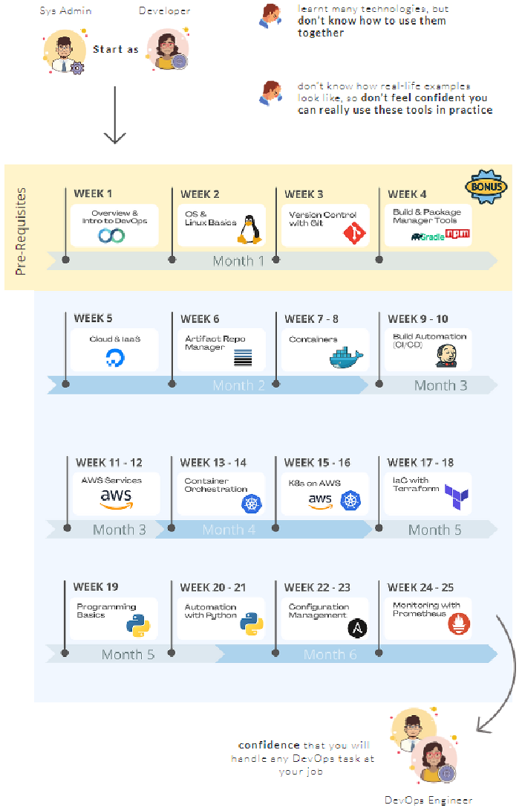
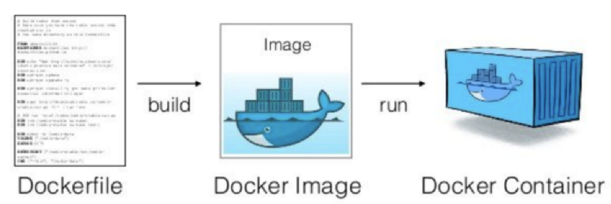
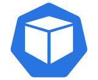
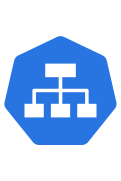
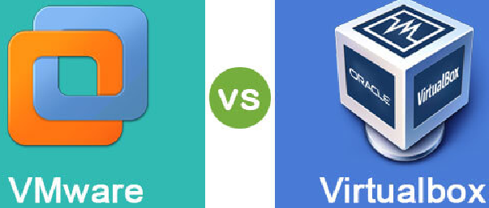
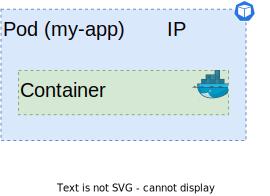
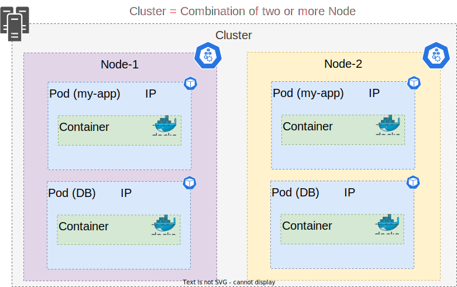

:toc:
:icons: font

= Kubernetes Tutorial for Beginners [FULL COURSE in 4 Hours]

▬▬▬▬▬▬ T I M E S T A M P S ⏰ ▬▬▬▬▬▬

https://www.youtube.com/watch?v=X48VuDVv0do&t=0s[0:00] - Course Overview

https://www.youtube.com/watch?v=X48VuDVv0do&t=138s[2:18] - What is K8s

https://www.youtube.com/watch?v=X48VuDVv0do&t=320s[5:20] - Main K8s Components

https://www.youtube.com/watch?v=X48VuDVv0do&t=1349s[22:29] - K8s Architecture

https://www.youtube.com/watch?v=X48VuDVv0do&t=2087s[34:47] - Minikube and kubectl - Local Setup

https://www.youtube.com/watch?v=X48VuDVv0do&t=2692s[44:52] - Main Kubectl Commands - K8s CLI

https://www.youtube.com/watch?v=X48VuDVv0do&t=3723s[1:02:03] - K8s YAML Configuration File

https://www.youtube.com/watch?v=X48VuDVv0do&t=4576s[1:16:16] - Demo Project: MongoDB and MongoExpress

https://www.youtube.com/watch?v=X48VuDVv0do&t=6376s[1:46:16] - Organizing your components with K8s Namespaces

https://www.youtube.com/watch?v=X48VuDVv0do&t=7312s[2:01:52] - K8s Ingress explained

https://www.youtube.com/watch?v=X48VuDVv0do&t=8657s[2:24:17] - Helm - Package Manager

https://www.youtube.com/watch?v=X48VuDVv0do&t=9487s[2:38:07] - Persisting Data in K8s with Volumes

https://www.youtube.com/watch?v=X48VuDVv0do&t=10718s[2:58:38] - Deploying Stateful Apps with StatefulSet

https://www.youtube.com/watch?v=X48VuDVv0do&t=11623s[3:13:43] - K8s Services explained

Kubernetes, also known as K8s, is the most popular platform for container orchestration for automating deployment, scaling, and management of containerized applications.

+++
<iframe width="560" height="315" src="https://www.youtube.com/embed/X48VuDVv0do" title="YouTube video player" frameborder="0" allow="accelerometer; autoplay; clipboard-write; encrypted-media; gyroscope; picture-in-picture; web-share" allowfullscreen ></iframe>
+++

This is a video tutorial on Kubernetes for beginners. The video covers the basic concepts of what Kubernetes is and the problems it solves. It covers the architecture of Kubernetes, showcasing all the main components. The video explains how to use Kubernetes by installing Minikube for a local Kubernetes cluster and demonstrates how to create, debug, and delete pods using the kubectl command-line tool. The video also covers the basics of kubernetes yaml configuration files, which are used to create and configure components. It includes a practical use case where a simple application is deployed in a local kubernetes cluster to give the viewer hands-on experience with the tool. The second part of the video covers advanced and important concepts in Kubernetes, such as organizing components using namespaces, making an app available from outside using Ingress, and Helm, which is the package manager for Kubernetes. The video also covers how to persist data in Kubernetes using volumes, deploying stateful applications using stateful sets, and the different Kubernetes service types.

== 🔥 What is Kubernetes 🔥

=== ► What #*problems*# does Kubernetes solve?

* Trend from *monolith* to *microservices*

* Increased usage of *containers*

** Demand for a *proper way* of *managing* those hundreds of #containers#

* Open source [.underline]#*container orchestration tool*#

* Developed by *_##Google in "Go" programming language##_*

* Helps you [.underline]#*manage containerized applications*# (docker image) in different [.underline]#*deployment environments*# (GCP, AWS, Azure, Ali baba, Oracle):
** #Physical machines#
** #Virtual machines#
** #Cloud environments#

=== ► What *features/tools* do #"container orchestration tools"# offer?
====

* *#High Availability#* or no downtime
* *#Scalability#* or high performance
* *#Disaster recovery#* - backup & restore
====

====
*#Kubernetes#* provide declarative primitives for the *#"desired state"#*

. *#Self-healing#* (if you tell I need 3-instances for my "application" it makes sure there are exactly three instances if there is an additional one for some reason, it kills it. If there is one less, it will create one for you)
. *#Auto-restarting#* (automatically restarts a container as well)
. *#Schedule across hosts#* (works across multiple hosts that is you can start up a Kubernetes cluster & run across multiple hosts & it works with multiple VM providers etc. Amazon, Google computer engine VMware, etc.)
. *#Replicating#* (it allows you to replicate those containers as well)
====

== 🔥 Main K8s Components 🔥

<1>  *Pod*  is #Abstraction# over the *container* 

<2> Communication through *Service* 

<3> Route traffic into cluster through *ingress* 

<4> External configuration
    * #configMap# through *ingress* 
* #Secretes# 

<5> *Data persistence* using *#volume#* image:images/volume.svg[width=40]

<6> *Pod*  *blueprints* with replica (cloning) mechanism:
    * *Deployment*  
    * *Stateful-Set*  

=== ► *#Node#* & *_Pod_*

* Worker *Node:*  Node (is a #simple server# or *#physical#* image:images/image-2023-02-08-17-59-06-257.png[width=100]
or *#virtual machine#*  )

* *Pod:* is the smallest unit of Kubernetes

.pod & container

** A #"pod"# is basically an *abstraction* over a #"container"#

*** #Pod# is a layer on top of #container#

**** #"*Kubernetes*" wants to abstract away the *"container runtime"* or container technologies (like *docker*) so that you can replace them **(containers). **If you want to avoid vendor lock-in.#

**** Usually "1-application" *per "#pod#"*

**** Each #*pod*# gets its own *_##IP-address##_* (virtual address), or its #"internal IP-address"# meaning it is not exposed to the outer world

***** Two or more different *#pods#* can communicate using there *#IP-address#*

****** *#Pod#* can die/crash (if it happens very often,) then a new pod gets created and a *#"new IP-address"#* is assigned to this newly created pod

******* #IP-address# are *#dynamic#* meaning they keep changing

=== ► Service & Ingress

* *#Service:#* is also a kind of #IP-address# but it's _**#static/permanent IP-address#**_, service address can be attached to each *#pod#*

** The #lifecycle# of *pod* and *#service#* are not connected if the pod dies the service (address) will stay.

*** Service has two functionalities:

**** Permanent IP (Static address)
**** Load-balancer

* *#Ingress:#* App (our application) should be accessible through the *#browser#*, for this you create:

** *#An external service:#* (the public request *#(http)#* first goes to #"ingress"#, then ingress forwards it to the #"pod"# or (*service-address*)

*** In other words, use *#service#* *(static/permanent)* instead of *#IP-address#* *(dynamic)*

** *#An internal service:#* we do not want our database to be exposed to the outer world, so no direct communication for the databases.

=== ► ConfigMap & Secret

* #*ConfigMap:*# does external configuration of your application

** "Database URL" usually in the *_##built##_* application!

*** In Kubernetes, you connect the "pod" with the "ConfigMap" so that "pod" can read configuration from the outside

**** You can put the database password & user-name in the "ConfigMap" in plain text, but it's insecure, to avoid this we use "Secret"

* #*Secret:*# is just like "ConfigMap" but the difference is it is used to store the secret data (user-name & password) etc.

** The data in secret are stored in a "base64 encoded" format

*** The built-in security mechanism is not enabled by default in Kubernetes

**** Use it (secret & ConfigMap) as an "environment variables" or as a "properties files"

.cluster,node, & pod

== 	The Above mention *#setup#* only gives #RAM, CPU & Networking# but no *#data Storage#*
image::images/image-2023-02-03-14-32-20-600.png[width=250,float=right]

=== ► *#Volumes#*

* #*Volumes:*# is data-storage, it attaches a physical storage to your *"pod"* on the *same/local machine* where your *pod* is located or on a *remote/external machine* meaning outside the *Kubernetes cluster*. e.g. on-premise data-center or another cloud-service

** There is a distinction Kubernetes cluster & all of its components & storage regardless of the storage is local or remote

*** *Kubernetes* does not manages data persistence

=== ► Deployment & StatefulSet

* *#Deployment:#,* In order to create replica/clone of pod, you will not create a second pod, but instead you would define a blueprint (like class in OOP) for "my-app pod" and then specify how many replica/clone (like object in OOP) of that pod you would like to run. And deployment is the component of Kubernetes which will help you achieve this goal.

** Blueprint for "my-app pod"

** In practice/real world, you will not create pod instead "you create deployments"

*** Also specify scale-up/down, no. of replicas/clone of pods that you need

** #"Deployment" is another abstraction/layer on top of *"pod"*#

** #*Deployment* can replicate/clone *"compute"* but not *"storage"*#

*#Stateful-Set:#* Databases can't be replicated/cloned or with the help of deployment. Because the database has a state which is its data.

== 🔥 K8s Architecture 🔥

=== ► Worker Nodes
* *Worker nodes* are the main components of a Kubernetes cluster that run containerized applications.
* They communicate with the master node to receive instructions and report their status.
* Worker nodes have the necessary components to run pods and containers, including the container runtime, kubelet, and kube-proxy.

=== ► Master Nodes
* *Master nodes* are responsible for managing the state of the cluster, including scheduling, scaling, and managing the desired state of the cluster.
* They also act as a control plane, coordinating the work of worker nodes and ensuring the desired state is maintained.
* Components that run on the master node include the API server, scheduler, controller manager, and etcd.

=== ► API Server
* The *API server* is the central management component of a Kubernetes cluster.
* It is responsible for exposing the Kubernetes API, which provides the interface for interacting with the cluster.
* The API server processes RESTful API requests and communicates with other components of the cluster to perform actions such as scaling or deploying applications.

=== ► Scheduler
* The *scheduler* is responsible for scheduling pods on worker nodes.
* It receives requests from the API server and uses various algorithms and policies to determine the best node for each pod.
* The scheduler is responsible
for ensuring that the desired state of the cluster is maintained by assigning pods to nodes as needed.

=== ► Controller Manager
* The *controller manager* is responsible for managing the state of the cluster.
* It watches for changes in the cluster and takes actions to reconcile the desired state with the actual state.
* The controller manager performs tasks such as responding to node failures, adjusting the number of replicas of a deployment, or recovering from failures.

=== ► etcd - the cluster brain
* *etcd* is a distributed key-value store that acts as the "brain" of the Kubernetes cluster.
* It stores the configuration data for the cluster, including the desired state and current state of the cluster.
* etcd is critical to the operation of the cluster and must be highly available to ensure the cluster remains healthy.

== 🔥 Minikube and kubectl - Local Setup 🔥

=== ► What is minikube?
Minikube is a tool that makes it easy to run a single-node Kubernetes cluster locally. It is designed for developers and DevOps engineers who want to test their applications and workflows in a local environment before deploying them to a larger cluster.

=== ► What is kubectl?
kubectl is a command-line tool that allows you to manage your Kubernetes cluster. It allows you to interact with your cluster and deploy, inspect, and manage various components, such as pods, services, and configmaps.

=== ► install minikube and kubectl
Installing minikube and kubectl is a straightforward process. You can follow the official installation guide on the Kubernetes website. It provides step-by-step instructions for installing minikube and kubectl on various platforms, such as Windows, macOS, and Linux.

=== ► create and start a minikube cluster
To create and start a minikube cluster, you need to run a few commands in your terminal. First, you need to start minikube using the minikube start command. Then, you can use kubectl to interact with your cluster and deploy your applications. Minikube provides an easy-to-use environment for testing and experimenting with Kubernetes.

== Summary:

* A *Container*  helps an organization to perform maintenance and update without interrupting services
* Kubernetes is an example of a container management system developed in the Google platform.
* The biggest advantage of using Kubernetes is that it can run on-premises OpenStack, public clouds Google, Azure, AWS, etc.
* Kubernetes offers automated Scheduling and Self-Healing Capabilities.
* Cluster, master, node, and namespace are important basics of kubernetes
* Master node and work nodes are important components of Kubernetes architecture.
* Replication Controllers, Replication sets, Deployments, Stateful Sets, Daemon Sets are other important terms used in Kubernetes.
* Docker swarm does not allow auto-scaling while Kubernetes allows auto-scaling.
* The biggest drawback of Kubernetes is that it’s dashboard is not very useful and effective
