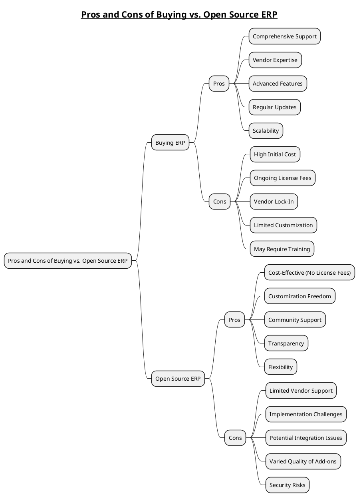

**<U>You are expert in developing and providing consultancy on choosing an ERP system. Now I seek your expert advice. Please elaborate a decision process so that I can easily choose.**</u>

A structured decision process for choosing an ERP system, An outline of the steps. Here's the decision process:

1. **Assessment of Needs:**
  - Identify your organization's specific needs, goals, and pain points.

2. **Stakeholder Involvement:**
  - Involve key stakeholders, including management, IT, and end-users, in the decision-making process.

3. **Budget Determination:**
  - Determine the budget available for ERP implementation, including software, hardware, and ongoing maintenance costs.

4. **Vendor Research:**
  - Research ERP vendors and their offerings.
  - Create a list of potential vendors based on your needs.

5. **Functional Requirements:**
  - Define detailed functional requirements, such as modules, features, and integrations required.

6. **Scalability and Flexibility:**
  - Consider the ERP system's scalability and flexibility to accommodate future growth and changing needs.

7. **Compatibility:**
  - Ensure compatibility with your existing IT infrastructure and software.

8. **User-Friendliness:**
  - Evaluate the user-friendliness of the ERP system to ensure user adoption and productivity.

9. **Customization:**
  - Assess the ability to customize the ERP system to match your unique processes.

10. **Support and Training:**
  - Review the vendor's support and training options to ensure smooth implementation and ongoing assistance.

11. **Data Security and Compliance:**
  - Ensure that the ERP system complies with data security and industry-specific regulations.

12. **Vendor Reputation:**
  - Check the vendor's reputation, customer reviews, and case studies.

13. **ROI Analysis:**
  - Estimate the return on investment (ROI) based on cost savings and efficiency improvements.

14. **Demo and Trial:**
  - Request demos and trials from shortlisted vendors to evaluate their systems firsthand.

15. **Reference Checks:**
  - Contact existing customers of the ERP vendors to gather feedback and insights.

16. **Contract Negotiation:**
  - Negotiate pricing, terms, and service-level agreements (SLAs) with the chosen vendor.

17. **Implementation Plan:**
  - Develop a detailed implementation plan, including timelines and responsibilities.

18. **Training and Change Management:**
  - Plan for user training and change management strategies to ensure a smooth transition.

19. **Testing and Quality Assurance:**
  - Conduct thorough testing and quality assurance before going live.

20. **Go-Live and Support:**
  - Launch the ERP system and provide ongoing support as needed.

21. **Continuous Improvement:**
  - Establish processes for continuous improvement and optimization of the ERP system.

22. **Post-Implementation Evaluation:**
  - Evaluate the ERP system's performance and ROI post-implementation.

Remember that this decision process should be tailored to your organization's unique needs and circumstances. It's important to involve relevant stakeholders at each stage and gather feedback to make an informed decision.

Detailed plantuml mindmap script for the comparison between buying an ERPSystem vs getting open-source ERP system pros and cons.

Explain and give some good estimate so that I can get better insight about **High Initial Cost and Cost-Effective (No License Fees)**

Certainly, let's explain the terms "High Initial Cost" and "Cost-Effective (No License Fees)" in the context of buying a commercial ERP system and getting an open-source ERP system, along with some estimates to provide better insight:

1. **High Initial Cost (Buying ERP):**
  - This refers to the significant upfront expenses associated with purchasing and implementing a commercial ERP system from a vendor.
  - **Estimate Example:** For a medium-sized organization, the initial cost of acquiring commercial ERP software licenses, hardware, consulting services, and customization can range from **$200,000 to $500,000 or more,** depending on the complexity of the system and organization's needs.

2. **Cost-Effective (No License Fees) (Open Source ERP):**
  - This highlights the advantage of open-source ERP systems, which are typically cost-effective because they do not require licensing fees. However, it's important to note that cost-effectiveness extends beyond just the absence of licensing fees.
  - **Estimate Example:** Implementing an open-source ERP system may involve lower initial costs, primarily covering hardware, consulting for customization, and training. For the same medium-sized organization, this might range from **$50,000 to $150,000, but the savings can be substantial due to the absence of licensing fees.**

In summary, "High Initial Cost" with commercial ERP systems means a significant upfront financial investment, while "Cost-Effective (No License Fees)" with open-source ERP systems indicates lower initial expenses, making them an attractive option for organizations with budget constraints. However, it's essential to consider the overall costs, including customization, support, and maintenance, when assessing the cost-effectiveness of both options over the long term.

