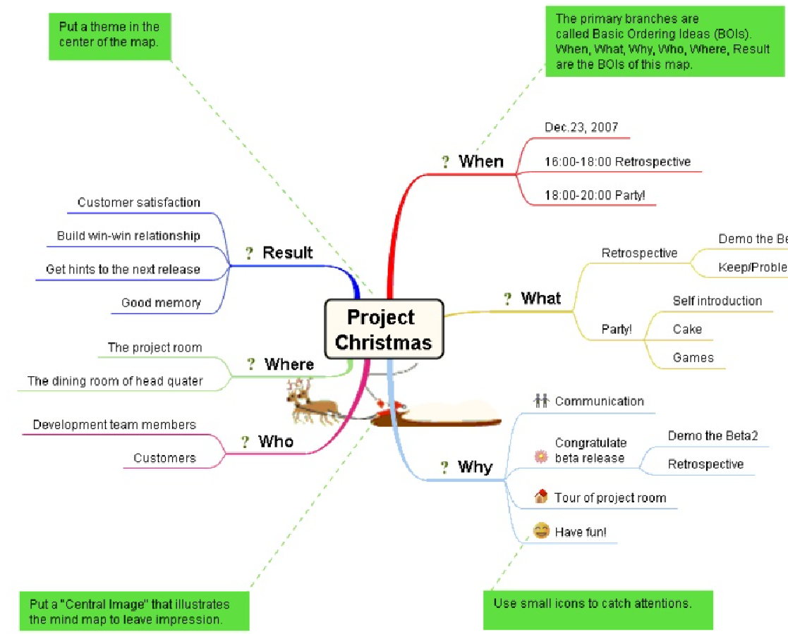
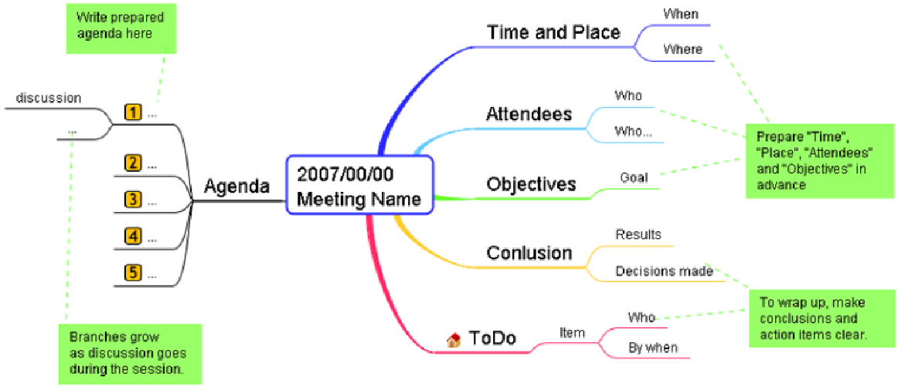
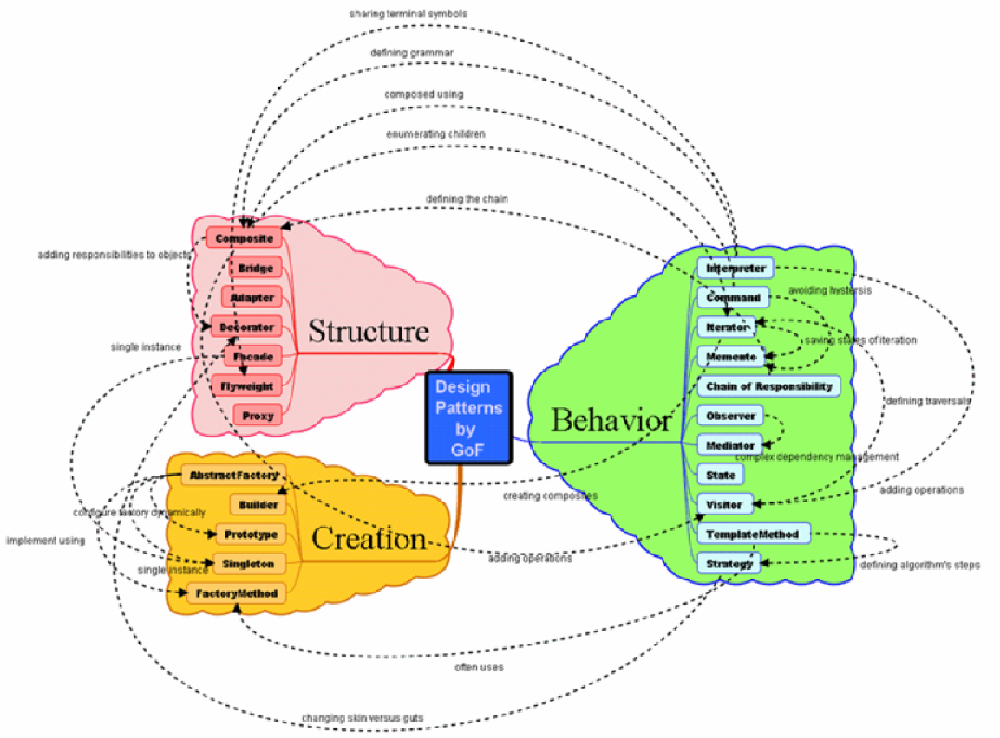
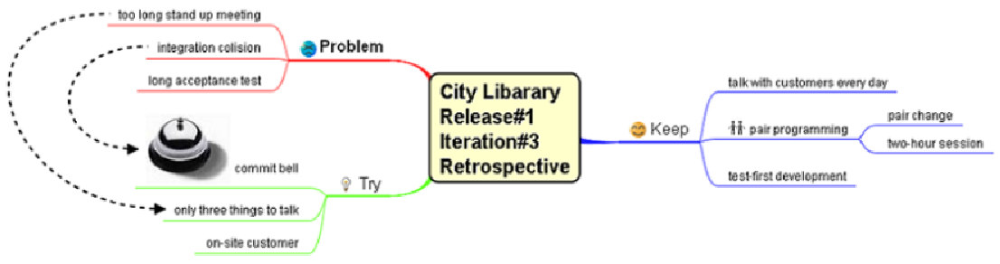
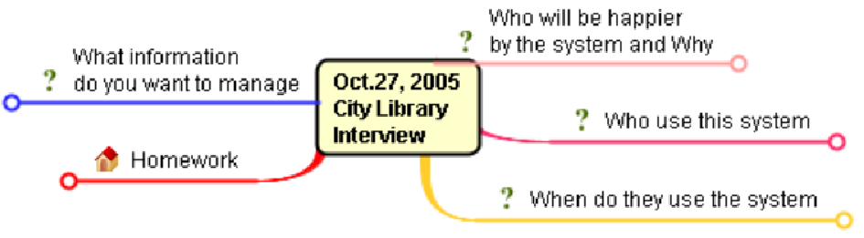
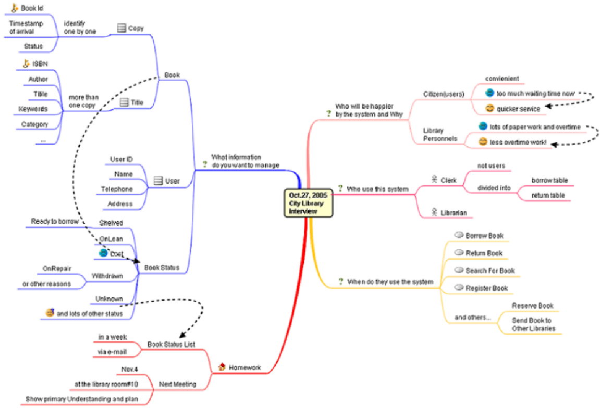
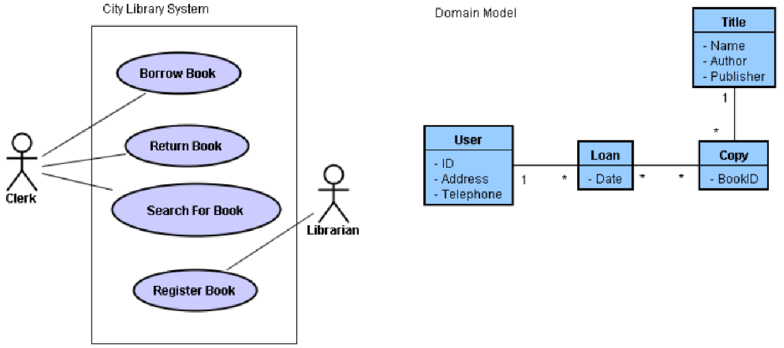
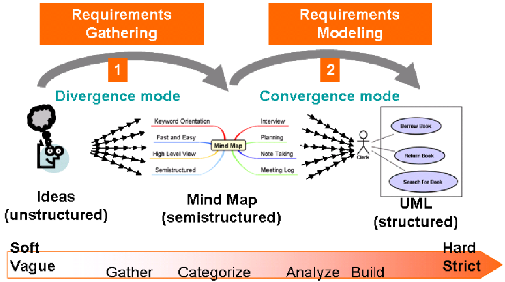

:author: Kenji Hiranabe
:docdate: January 14, 2007
:toc:
:toc-title: Agile Modeling with Mind Map and UML
:doctype: article

====
Use audio/video recording feature then convert the file into the text
using MS Word (or any other tool) transcribe feature,
only available in the online-paid version of the MS-office.
Once obtained, then you can analyze the text.

.*Summary:*
Requirements gathering—or in an agile context, creating user stories—is always a challenging phase in software development. There are no standard processes or notations defined, only the understanding that the primary factors that make this phase effective are communication and facilitation skills. In this article, Kenji Hiranabe proposes using mind maps that focus on those primary factors when exploring user wishes. Then he takes this concept one step further and models the results with UML.
====

=== What Is a Mind Map?
A mind map is a graphical technique of taking notes and visualizing thoughts using a radiant structure, according to mind map inventor Tony Buzan's The Mind Map Book. *_#Basic ordering ideas (BOIs)#_* grow with key words around a central image, and associative sub-branches grow recursively.

Mind maps use colors, pictures, and drawings, because the human brain is much better at recognizing shapes and patterns than words or numbers.

Roger Sperry, a Nobel Prize winner in physiology, found that the cerebral cortex has two hemispheres between which it divides the major intellectual functions. His research shows that the right side appears dominant in rhythm, spatial awareness, gestalt (wholeness), imagination, dreaming, color, and dimension; whereas the left side appears dominant in words, logic, numbers, sequence, linearity, analysis, and lists.

By stimulating both right and left hemispheres, a mind map has greater power to evoke human memories than ordinary linear notes do. Some of the properties of mind maps that make them so effective include:

* #Keyword Orientation#--The structural elements of mind maps are [.underline]#_not sentences but keywords_#.
* #Loose Syntax and Semantics#--[.underline]#*_Association_*# is the only [.underline]#_relationship_# between linked keywords.

* #Fast and Easy-to-use#--You can use mind maps as real-time shorthand minutes for meetings, interviews, and other conversational sessions.
* #High-Level View#--You can overview a whole mind map in a glance.
* #Evocative#--A mind map evokes the context of the scene in which it was created.
* #Semistructured#--A mind map can have a #*_template structure_*# but it can grow branches on demand to capture real-time verbal communication in semistructured interview.

*_Semistructured data_* is a tree-structured data that does't have predefined schema. [.underline]#_Semistructured interview is a type of interview in which the questions are not predefined completely_.#

.An example mind map used to plan a project Christmas party

=== How Software Development Benefits from Using Mind Maps

Chuck Frey's survey (see Further Reading) shows that the top three business applications of mind maps are #*_"To do lists," "Preparing presentations," and "Note taking."_*# The followings are examples of situations and phases in which you can utilize mind maps effectively in your software development activities:

* *Meeting Minutes and Agenda*--Add a visual effect to your agenda items by mapping them out. During the meeting, connect your laptop to the overhead projector and take notes on the conversation in real time. I call this a "meeting log" mind map (see Figure 2). The preset mind map has open BOIs for Conclusion and ToDo items, so that the facilitator can address the final settlement rather than leave the conclusion and action vague.

.Meeting log mind map template

* *Presentation*--A mind map's explicit shape and high-level view allow the audience to keep up with you and not get lost in the discussion.
* *Categorizing Items*--All activities of software development involve categorizing items. Figure 3 is an example of design pattern categorization. In the example, twenty three patterns are divided into three categories: Structure, Creation, and Behavior. The relationship between the patterns is expressed as dashed-line arrows.

.An example of categorization (Design Patterns)

* *Seminar and Book Notes* --Write a book review or seminar memo using a mind map.
* *Retrospectives*--Use mind maps to reflect on a past iteration, release in a project and elicit improvement. Such maps may have three preset BOIs: Keep, Problem, and Try. Members of the team discuss what they should keep doing, problems in the last incremental work, and what to try in the next one (see Figure 5).

.A mind map of a retrospective meeting using Alistair Cockburn's Keep/Problem/Try technique

* *Conversation Notes*--Use a mind map to take notes of user interactions (described in detail in the following sections).

=== User Stories and Mind Maps

Interaction is a core value of agile. The key mind shift, as stated by Mike Cohn in User Story Applied from writing (documentation) to talking (conversation). In XP, story cards are used to record conversations in a user interview session. By restricting written information to a tangible and small card, it naturally helps you to talk and promote conversation with the customer. Story cards often are written by the customer and posted on the walls of the development workspace as a memento of the conversation. If you have a question about the story, you can remove the card from the wall and discuss it with the customer.

=== Exploring User Wishes Through Mind Mapping
A user story is a fragment of a user wish. I suggest utilizing a user-wish mind map to capture user wishes as a whole. Remember that a mind map is as evocative as story cards, yet it is a better tool for seeing the whole story on a high level. Also, a mind map is a flexible data container that supports semistructured interview. An interviewer may use predefined templates to start with, but can also add a new branch impromptu to focus on subjects the interviewee really want to talk about when the conversation goes toward unexpected directions.

.User-wish mind map template

*Figure 5* shows a template mind map prepared for a user conversation to capture user wishes. I prepare the following BOIs in advance as questions to ask the users:

* Who will be happy because of this system and why? I always ask this question first to capture the system's stakeholders and their values, current problems, context, and expectations. These are the essential success factors and risk drivers behind requirements.
* Who will use the system? This question captures system users and potential use case actors.
* When will they use the system? This captures the system's story or use case candidates.
* What information do you want to manage with the system? This question can gather entities or objects of the domain model, including user concerns and domain keywords.

The final BOI, Homework, is not a question but a place holder for items you cannot resolve during the session.

I used this format to capture a city library system. During the interview with a librarian, I asked questions and concurrently noted a mind map.

I connected my laptop to an overhead projector, editing the map in real time. Note the items in the Homework BOI--an action to follow up on a session question and the schedule of the next meeting. Mind maps have a flexible format that accommodates these accidental topics, which shows a benefit of semistructured data handling capability of mind maps.

=== Converting Mind Maps to UML
After exploring the whole picture of what the user wants, there are two ways to proceed. One is to gather user stories, as in XP planning games. The other is to create an agile model of use case models and domain entity models. For either process, the user-wish mind map is a good starting point.

When creating a user-wish mind map, I add icons of actors, use cases, and classes to their candidates (see Figure 7). The prepared BOI questions are designed to capture information for the icons.

.Conversion from a user-wish mind map to domain models

.Converted Domain Models in Usecases and Class diagrams

Using mind maps in conjunction with UML means dividing requirements exploring into two modes: requirements gathering, which quickly captures and shares vague ideas and keywords at a high-level view; and requirements modeling with UML, in which you model domain objects and use cases from the keywords gathered in the first mode. I find that gathering requires divergent thinking, whereas modeling involves convergent thinking.

=== Conclusion
Mind map templates offer the interviewer a semistructured format of inquiry that supports asking important questions as well as accommodating unexpected topics. It also helps eliminate communication errors and captures a soft structure of user wishes at a high-level view. In addition, mind maps help users recall the scene of the session in which the information was recorded. After gathering ideas in a mind map, you can use the keywords as seeds of UML model elements. By the rigorous syntax of UML, you can build a rich semantics of domain model and use them as a design of the application program.

Agile software development discovered that one of the key success factors of software development projects is communication among involved people. There are many ways for transporting and sharing information but neither formal documents nor casual conversations are adequate. Nothing is quite as effective as just the right set of concise diagrams and graphs that capture the essence of the situation. In this context, mind maps and UML diagrams work quite well in each suitable area for capturing vague and unstructured user wishes, making them semistructured then structured to transport them through software development lifecycle.

.An illustration of how mind maps and UML work during requirements gathering and modeling.

