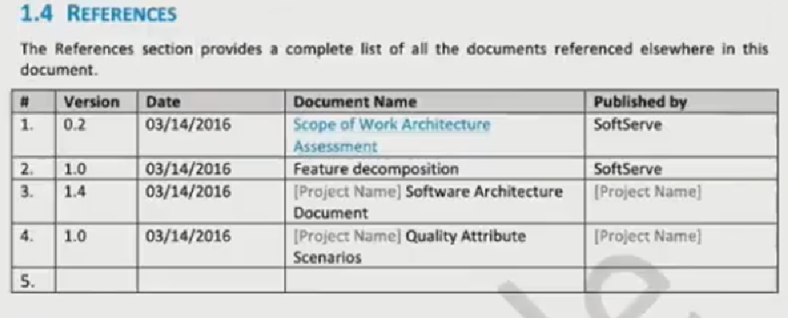
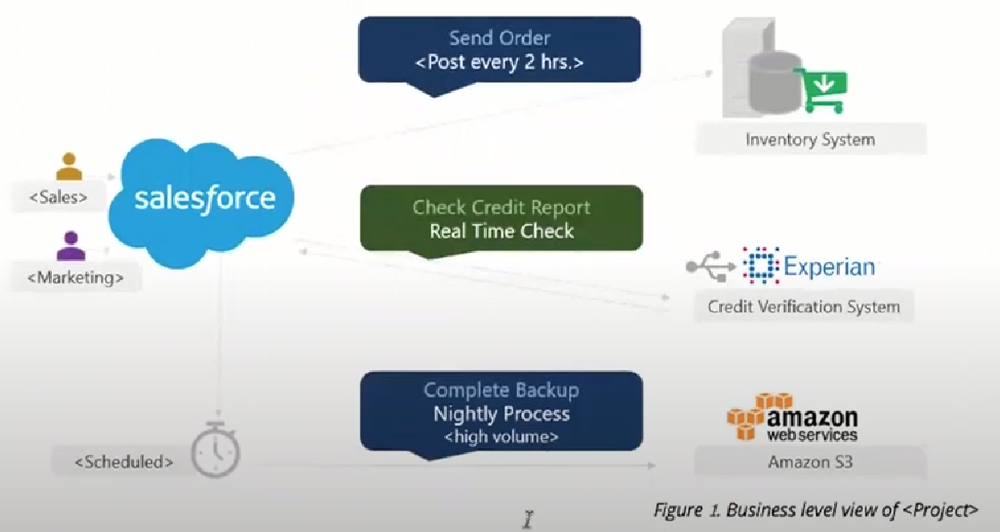
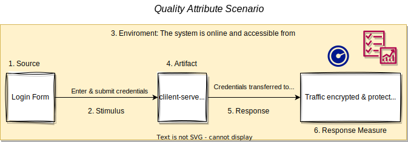
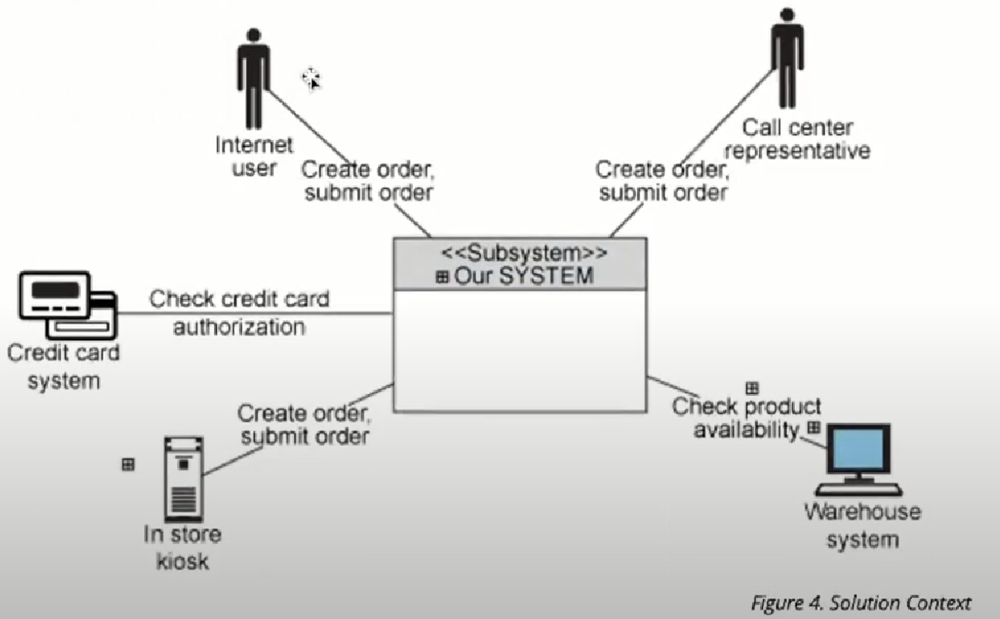
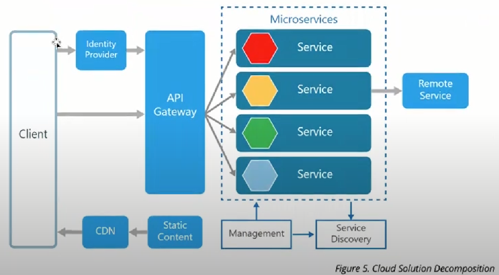
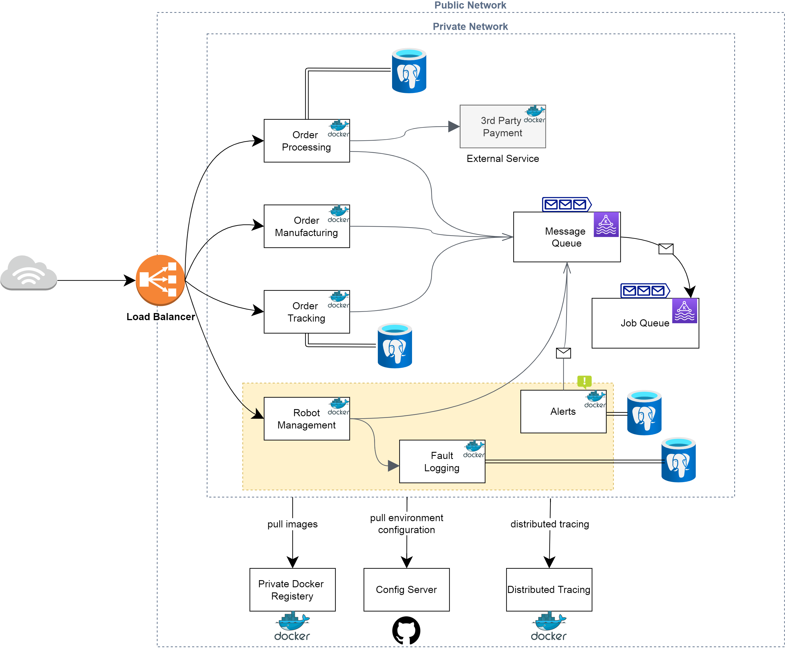
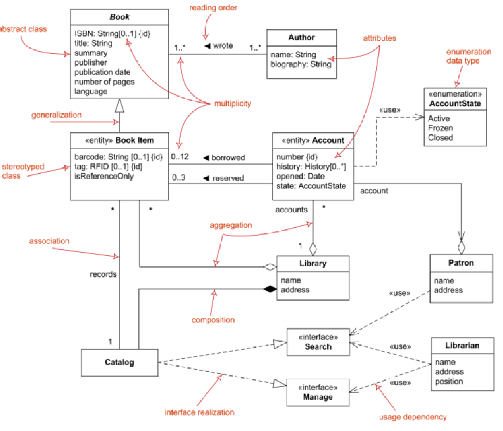
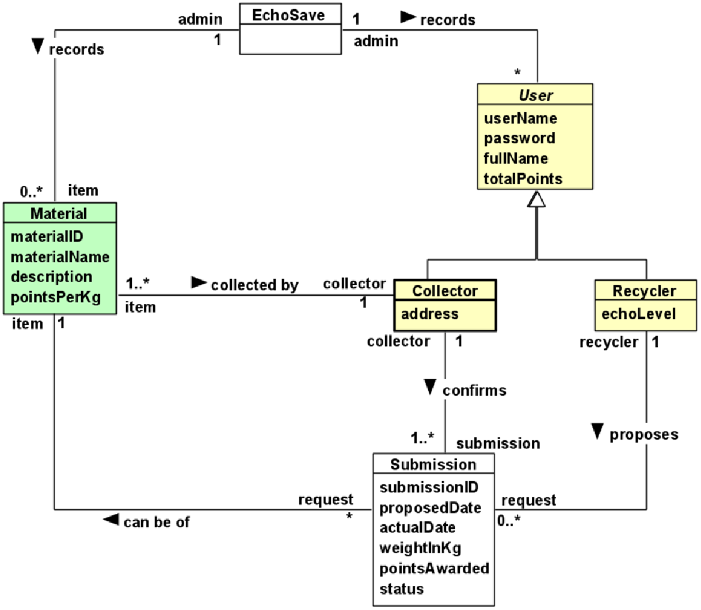
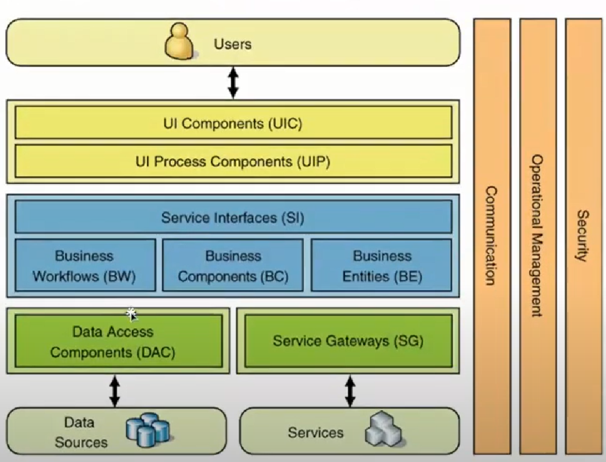
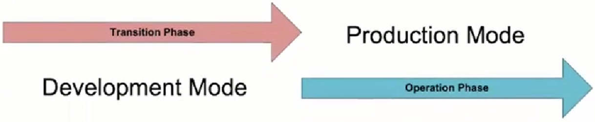

= Software Architecture Document
Author name Mehmood-ur-Rehman <mehmood_hashmi2009@outlook.com>
:sectnumlevels: 4
:toclevels: 4
:sectnums: 4
:toc: left
:icons: font
:toc-title: Table of contents
:doctype: pdf

.Revesion History
|===
|Date|Version |Description |Author

|
|<x,x>
|

|<name>

|
|<x,x>
|Approved
|<name>

|
|
|
|

|
|
|
|

|===

== 	Introduction

=== Purpose

This SAD specifies the software architecture for #<insert scope of SAD>#.
All information regarding the software architecture may be found in this document,
although much information is incorporated by reference to other documents.

SAD elicits significant architecture drivers such as business, functional, non-functional requirements, constraints, and defines architecture.

This SAD is designed following ISO/lEC/lEEE42010 and based on the Software Engineering Institute's "View and Beyond" method for documenting software architectures

=== 	Scope
SAD specifies the order in which architecture descriptions of systems are organized and expressed.
The document describes an architecture that will satisfy business functional,
non-functional requirements, and constraints provided by the Client.

This SAD covers the following information:

1.  Significant architectural drivers
2.	Software architecture based on these drivers
3.	Technology Stack and environment definitions
4.	Operations Specific perspectives

=== 	Definitions
The Definition section lists the acronyms and terms used in this document that might possess less familiarity or double meaning to the reader.

.Terms definitions
[options="header", cols= "1, 5 , 10", width="100%"]
|===
|#|Term |Definition

|1.
|
|

|2.
|
|

|3.
|
|

|4.
|
|

|5.
|
|
|===

=== 	References

The references sections provide a complete list of all the documents referenced elsewhere in this document.

.References
[options="header", cols= "1, 3 , 2 , 5, 4", width="100%"]
|===
|#|Version |Date |Document Name |Published by

|1.
|<x,x>
|<mm/dd/yyyy>
|<Document Name>
|<Publishing Organization>

|2.
|
|
|
|

|3.
|
|
|
|

|4.
|
|
|
|

|5.
|
|
|
|
|===

.this image is for taking help when filling the above-given mentioned table.

=== 	Relationship to other SADs
This section describes the relationship between this SAD and other architecture documents, both system and software.
For example, a large project may choose to have one SAD that defines the [.underline]#*system-of-systems*# architecture,
and other SADs to define the architecture of
[.underline]#*systems or subsystems*#.
An embedded system may well have a system architecture document;
in which case this section would explain how the information in here traces to information there.

.relationship to another SAD
[options="header", cols= "1, 3 , 2 , 5, 4", width="100%"]
|===
|#|Version |Date |SAD Name |Published by

|1.
|<x,x>
|<mm/dd/yyyy>
|<SAD Name>
|<Publishing Organization>

|2.
|
|
|
|

|3.
|
|
|
|

|4.
|
|
|
|

|5.
|
|
|
|
|===
#<if none, say “Not applicable.”>#

=== 	Documentation Roadmap
This section guides into the SAD structure to help find information of interest.

. [.underline]#Architectural Background# elicits the known essential requirements and constraints for the solution to design which play a key role in forming architecture decisions and overall architecture.
. [.underline]#System Overview:# describes the general function and purpose of the system or subsystem whose architecture is described
. [.underline]#Business Case# describes the solution from the business standpoint including major features
. [.underline]#Architecture and Business Constraints# lists the constraints that provided a significant influence over architecture
. [.underline]#Service Level Agreement# defines the important technical constraints and guarantees under which the solution will be serviced to its clients
. [.underline]#Quality Attribute Scenarios# are a set of the testable scenarios clarifying non-functional requirements for the system quality attributes such as performance, maintainability, and others
. [.underline]#Stakeholder Representation# provides a list of the stakeholder roles considered in the development of the architecture
. [.underline]#Solution Background# provides a description of why the architecture is the way that it is, and a convincing argument that the architecture is the right one to satisfy the behavioral and quality attribute goals levied upon it
. [.underline]#Product Line Reuse Considerations# details how the software covered by this SAD is planned or expected to be reused in order to support the product line vision
. [.underline]#Architecture Description# contains the views of the software architecture, relations among them, and technology stack
. [.underline]#Architecture Views# defines the proposed architecture as a set of architectural views in the format defined in [.underline]#Appendix C - How View is Documented#.
. [.underline]#Relations Among Views# section describes the relations that exist among the views given in Architecture Views
. [.underline]#Technology-Stack# selects the tools, frameworks, libraries, external services, and other technologies the solution implementation will rely on.
. [.underline]#Operation Plan# defines the environments, structures, toolsets, processes, and activities essential to build and operate the solution implementation.
. [.underline]#Transition Phase# talks about the part of the Operation Plan related to the solution implementation phase, including the design and development of the solution operation framework.
. [.underline]#Operation Phase# defines the processes to operate the solution in production using the framework built in the Transition Phase.

==	Architecture Drivers
===	System Overviews
This section describes the general function and purpose of the system or subsystem whose architecture is described in the SAD.

===	Business Case
The section lays out the business case for the solution #<Project>.#

*High level #Business# Context Diagram (e.g., as shown below or you can do standard context diagram)*

.Business Level View of #<Project>#

The envisioned solution will enable the users to manage their payment transactions from their mobile devices while allowing access to the rich reporting from the desktop browsers and backing up their transaction logs in the form of the pdf files to their accounts open with the third-party cloud storage services such as Dropbox for later access. The solution will be deployed on the Amazon cloud as a SaaS (software as a service) web application.

====	Business Goals

The section enumerates essential business goals for the solution.

[options="header", cols= "1,7 ", width="100%"]
.Business Goals
|===
|#|Description

|BG-1
|Modernize the company’s current approach of interfacing with our existing users.

|BG-2
|Achieve competitive advantage in TCO by moving to the Cloud-based SaaS model.

|BG-3
|Enable access to the system from a wider range of devices to target a large user base.

|BG-4
|

|#<goal id>#
|#<goal description>#

|===

====	Major Features
The Section enumerates solution major features.

[options="header", cols= "1,5 ", width="100%"]
.Major Features
|===
|#|Description

|F-1
|Centralized transaction data Storage and management on the cloud.

|F-2
|Seamless integration the third-party cloud storage providers.

|F-3
|access from mobile devices and text top browsers without loss of quality in user experience.

|F-4
|Secure data access, transmission, and storage protected from unauthorized access.

|F-5
|Service uptime not less than 99.9%.

|#<feature id>#
| #<feature description>#

|===

===	Use Case View #<View Name>#
=====	View Context
The interaction outlined in Figure 3. happens between the user and the user-facing with the application.

=====	Representation

.#usecase diagram name#
image::images/Tomplot-Use-Case-diagram.svg[]

OR

.Use case diagram
image::images/_UseCaseDiagram-Page-1.drawio (1).svg[]

This view defines Primary Use Cases for the feature, Figure 3. corresponding to the types of interaction between the user and the web application supported by the solution.

=====	Element Catalog

[options="header", cols= "1,2,6", width="100%"]
.Element-Catalog
|===
|#|Name|Description

|ACT-1
|User/actor
|A business user of the system.

|UC-1
|Use Case 1
|The user logs into the system.

|UC-2
|Use Case 2
|The user pays with the registered credit card.

|UC-3
|Use Case 3
|#<use case description or scenario.>#

|UC-4
|Use Case 4
|#<use case description or scenario.>#

|#<id>#
|#<element name>#
|#<use case description or scenario.>#
|===

=====	Stakeholders and Their Concerns addressed
Stakeholders and concerns…

===	Architecture and Business Constraints
The section lists the significant constraints that provided the significant influence over the architecture. Accounted for in the designed solution. These can be business, technical, resource, and other types.

[options="header", cols= "1,6", width="100%"]
.Architecture and Business Constraints
|===
|#|Description

|CON-1
|A minimum of 1000 simultaneous users must be supported.

|CON-2
|Time to the market must be within one year.

|CON-3
|Java + RDBMS on Amazon technology stack must be used

|CON-4
|The existing client’s [.underline]#*development team skill set*# is based on a [.underline]#*_Spring framework and JPA_*#

|CON-5
|#<constraint description>#

|#<constraint id>#
|#<constraint description>#

|===

===	Architecture Concern

[options="header", cols= "1,6", width="100%"]
.Architecture Concern
|===
|#|Description

|CONS-1
|Define the architecture pattern

|CONS-2
|Define system monitoring and logging

|CONS-3
|#<concern description>#

|CONS-4
|#<concern description>#

|CONS-5
|#<concern description>#

|#<concern id>#
|#<concern description>#

|===

===	Service Level Agreement
The SLA section provides key parts of the Service Level Agreement applicable to the designed solution be supported by the proposed solution architecture.

====	Scope and applicability
This Service Level Agreement ("SLA") establishes the service quality parameters that are to be applied to the use of #<Project># services and is part of the #<Project># Services Customer Agreement.

The terms and conditions specified in this agreement apply solely to the services provided as callable API hosted by the company, herein called "Covered Services." This SLA applies separately to each service consumer ("Consumed') that is using the Covered Services. #<Client># reserves the right to change the terms of this SLA in accordance with the #<Project># Services Customer Agreement at any time.

====	Service Quality Guarantees
The Covered Services will be operational and available to Consumers at least 99.95% of the time in any calendar month. If #<Client># does not meet this SLA requirement while the Consumer succeeds in meeting its SLA obligations, the Consumer will be eligible to receive Financial Credits as compensation. This SLA states the Consumer's exclusive right to compensation for any failure on part to fulfill the SLA requirements.

====	Definitions
The following definitions are to be applied to SLA:

"Unavailability' is defined as the entirety of the Consumer's running instances as having no external connectivity for a duration that is at least five consecutive minutes in length, during which the Consumer is unable to launch commands against the remote API through either the Web application or Web service API.

"Downtime Period" is defined as a period of five or more consecutive minutes of the service remaining in a state of Unavailability. Periods of "Intermittent Downtime" that are less than five minutes long do not count towards Downtime Periods.

===	Quality Attribute Scenario
A Quality Attribute Scenario is an unambiguous and testable requirement for one or more Solution Quality Attributes such as Performance, Usability, Maintainability, and others. The scenario consists of six parts: Source of Stimulus, Stimulus, Environment, Artifact, Response, testable and accurate Response Measure.

This section lists and prioritizes the scenarios pertinent to the designed solution.

[options="header", cols= "0,2,5,1,1", width="100%"]
[.small]
|===
|#|Quality Attribute|Scenario |Business Priority |Related to

|QA-1
|Security (credentials transport security)
|At all times, the credentials entered by the user during log-in are transferred to the server over encrypted, secure channel without the chance of being sniffed by a third party.
|High
|[.underline]#UC-1#

|QA-2
|Usability (Easiness of payment)
|When logged in and navigated to the payment page, it takes the user up to 3 clicks to pay with the pre-registered valid credit card
|Medium
|[.underline]#UC-2#

|QA-3
|
|#<quality attribute scenario description>#
|
|

|QA-4
|
|#<quality attribute scenario description>#
|
|

|#<scenario id>#
|#<attribute name (Scenario meaning)>#
|#<quality attribute scenario description>#
|#<High, Medium, Low>#
|#<Use case, feature, constraint id>#

|===

#Or alternative notation:#
====
*Scenario:* QA-1

*Quality Attributes:* Security

*Business Priority:* High

*Related To:* UC-1

*Description:* The credentials entered by the user during log-in are *always* transferred to the server over an encrypted, secure channel without the chance of being sniffed by a third party.

*Environment:* Normal operation conditions.
====

====
*_Editable QAS Version:_*

.Quality attribute scenario

====

===	Stakeholder Representation
This section provides a list of the stakeholder roles considered in the development of the architecture described by this SAD. For each, the section lists the concerns that the stakeholder has that can be addressed by the information in this SAD.

This information is represented as a matrix, where the rows list stakeholder roles, the columns list concerns, and a cell in the matrix contains an indication of how serious the concern is to a stakeholder in that role.

|===
|Role|System is reliable  |Schedule  |Concern 3 |Concern 4

|Users
|High
|Low
|N/A
|Choose an item.

|Acquirers
|Medium
|Choose an item.
|Choose an item.
|Choose an item.

|Developers
|Low
|Choose an item.
|Choose an item.
|Choose an item.

|Maintainers
|Choose an item.
|Choose an item.
|Choose an item.
|Choose an item.

|Project Manager
|Choose an item.
|High
|Choose an item.
|Choose an item.

|===

*_You may wish to consider the following additional stakeholders:_* Customer, Application software developers, Infrastructure software developers, End users, Application system engineers, Application hardware engineers, Project manager, Communications engineers, Chief Engineer/Chief Scientist, Program management, System and software integration and test engineers, Safety engineers and certifiers, External organizations, Operational system managers, Trainers, Maintainers, Auditors , Security engineers and certifiers.

===	Solution Background
This section provides a description of why architecture is the way that it is, and a convincing argument that architecture is the right one to satisfy the behavioral and quality attribute goals levied upon it.

====	Architectural Approaches
This section provides a rationale for the major design decisions embodied by the software architecture. It describes any design approaches applied to software architecture, including the use of architectural styles or design patterns, when the scope of those approaches transcends any single architectural view. The section also provides a rationale for the selection of those approaches. It also describes any significant alternatives that were seriously considered and why they were ultimately rejected. The section describes any relevant COTS issues, including any associated trade studies.

====	Analysis Results
This section describes the results of any quantitative or qualitative analyses that have been performed that provide evidence that the software architecture is fit for purpose. If an Architecture Tradeoff Analysis Method evaluation has been performed, it is included in the analysis sections of its final report. This section refers to the results of any other relevant trade studies, quantitative modeling, or other analysis results.

====	Requirements Coverage
This section describes the requirements (original or derived) addressed by the software architecture, with a short statement about where in the architecture each requirement is addressed.

====	Summary of Background Changes Reflected in Current Version
For versions of the SAD after the original release, this section summarizes the actions, decisions, decision drivers, analysis and trade study results that became decision drivers, requirements change that became decision drivers, and how these decisions have caused the architecture to evolve or change.

===	Product Line Reuse Considerations
//This is like there are companies who have more than one product, e.g. Microsoft. Google etc. I know this concept is usually applicable with large enterprise having more than one product.

When a software product line is being developed, this section details how the software covered by this SAD is planned or expected to be reused in order to support the product line vision. In particular, this section includes a complete list of the variations that are planned to be produced and supported. "Variation" refers to a variant of the software produced through the use of pre-planned variation mechanisms made available in the software architecture. It may refer to a variant of one of the modules identified in this SAD, or a collection of modules, or the entire system or subsystem covered by this SAD. For each variation, the section identifies the increment(s) of the software build in which (a) the variation will be available; and (b) the variation will be used. Finally, this section describes any additional potential that exists to reuse one or more of the modules or their identified variations, even if this reuse is not currently planned for any increment.

#<if none, say "Not applicable.">#

==	Architecture Description
This section contains the views of the software architecture. A view is a representation of an entire system from the perspective of a related set of concerns [IEEE 14711. Concretely, a view shows a particular type of software architectural elements that occur in a system, their properties, and the relations among them.

===	Architecture Views
The section includes a list of architectural views covering the designed solution along with the context it runs in on the high-level.

====	Context View
=====	Intent

The view defines the primary solution components collaborating with the external systems and services.
It is driven by the *[.underline]#Business Case#.*

=====	Context
Context for the decision as diagram or text

=====	Representation
.Solution Context

Diagram and text documenting decision.

=====	Element Catalog

[width="100", cols="2,7"]
.of annotated elements
|===
|Name|Description

|Cloud Based Solution
|Responsible for implementing the REST API to serve data on request from the mobile and web clients.

|Element-2
|Define system monitoring and logging

|Element -3
|Responsible for a, b, c

|Element -4
|Responsible for a, b, c

|Element -5
|Responsible for a, b, c

|#< Element name>#
|#<Element description and responsibilities >#

|===

=====	Behavior

Behavior diagram and scenarios. E.g., Sequence diagram, Activity diagram

=====	Variability
Points of decision’s configuration, customization, etc.

=====	Reasoning
Reasoning

=====	Stakeholders and Their Concerns Addressed
Stakeholder and concern

====	Decomposition View

=====	Intent
The view defines the runtime decomposition of the server-side part of the solution. It is driven by the Business Case and the architecture best practices applicable to cloud-based applications.

=====	Context
The view context is defined by the view *Solution Context* where this section represents decomposition of a *Cloud Based Solution component*.

=====	Representation

.Cloud Solution Decomposition

OR

.Cloud Solution Decomposition

The cloud-based part of the solution is decomposed into several parts documented below combining several standard architectural patterns applicable to the highly loaded Cloud-based SaaS applications: Load Balancer, Data Cache, Background Process, Shared Storage, and Static Content Provider. The subsection reasoning provides detailed discussion of these choices.

=====	Element Catalog

.annotated elements
|===
|#|Description

|Element-1
|Responsible for a, b, c

|Element-2
|Responsible for a, b, c

|Element -3
|Responsible for a, b, c

|Element -4
|Responsible for a, b, c

|Element -5
|Responsible for a, b, c

|#< Element name>#
|#< Element description and responsibilities >#

|===

=====	Behavior

Behavior diagram and scenarios. E.g., Sequence diagram, Activity diagram

=====	Variability
Points of decision’s configuration, customization, etc.

=====	Reasoning
Reasoning.

=====	Stakeholders and Their Concerns Addressed
*project managers,* who must define work assignments, form teams, and formulate project plans and budgets and schedules;

*COTS specialists,* who need to have software elements defined as units of functionality, so they can search the marketplace and perform trade studies to find suitable COTS

candidates;

*testers and integrators* who use the modules as their unit of work;

*configuration management specialists* who are in charge of maintaining current and past versions of the elements;

*system build engineers* who use the elements to produce a running version of the system;

*maintainers,* who are tasked with modifying the software elements;

*implementers,* who are required to implement the elements;

*software architects* for those software elements sufficiently large or complex enough to warrant their own software architectures;

*the customer,* who is concerned that projected changes to the system over its lifetime can be made economically by confining the effects of each change to a small number of elements.

====	Domain View #<View Name>#
=====	View Context
User facing functionality involves the entities and relationships captured by this view.

=====	Representation

.Domain Model

OR

.Domain Model

This view addresses the primary entities participating in interaction defined by the Use Cases UC-1 and UC-2. The important concern of is-a “the relationship between Class1 and Class3” is addressed with the logical extension of/on the view.

=====	Element Catalog
The catalog defines the business entities and relationships included in the representation of this Domain View.

[width= "100", cols="1,4"]
.entities and their brief description
|===
|#|Description

|Class-1
|Responsible for a, b, c

|Class -2
|Responsible for a, b, c

|Class -3
|Responsible for a, b, c

|Class -4
|Responsible for a, b, c

|Class -5
|Responsible for a, b, c

|#< Class  name>#
|#< Class description and responsibilities >#

|===

=====	Stakeholder and Their Concerns Addressed
Stakeholder and concern.

====	Layered Application Structure View

=====	Intent
The view defines the runtime decomposition of the *server-side* part of the solution. It is driven by the *+++Business Case+++* and the architecture best practices applicable to *+++cloud-based applications.+++*

=====	Context
The view context is defined by the view *+++Solution Context+++* where this section represents the decomposition of the *+++Cloud-Based Solution component+++*.

=====	Representation

.Layered Application Structure

The *cloud-based* part of the solution is decomposed into several parts documented below combining several standard architectural patterns applicable to the highly loaded *Cloud-based SaaS applications:* Load Balancer, Data Cache, Background Process, Shared Storage, and Static Content Provider. The subsection reasoning provides detailed discussion of these choices.

=====	Element Catalog
.annotated elements
[width= "100", cols="1,4"]
|===
|#|Description

|Element-1
|Responsible for a, b, c

|Element-2
|Responsible for a, b, c

|Element -3
|Responsible for a, b, c

|Element -4
|Responsible for a, b, c

|Element -5
|Responsible for a, b, c

|#< Element name>#
|#< Element description and responsibilities >#

|===

=====	Behavior
Behavior diagrams and scenarios

=====	Variability
Points of decision’s configurations, customization, etc.

=====	Reasoning
Reasoning Text.

=====	Stakeholders and Their Concerns Addressed
Stakeholder and concern.

====	Decision View #<View Name>#

=====	Intent
Use Cases, QAS, etc.

=====	Context
Context of the decision as *#diagram or text#*

=====	Representation
Diagram and text documenting decision

=====	Element Catalog
[width= "100", cols="1,4"]
.annotatied elements
|===
|#|Description

|Element-1
|Responsible for a, b, c

|Element-2
|Responsible for a, b, c

|Element -3
|Responsible for a, b, c

|Element -4
|Responsible for a, b, c

|Element -5
|Responsible for a, b, c

|< Element name>
|< Element description and responsibilities >

|===

=====	Interfaces
Element interfaces

=====	Behavior
Behavior diagrams and scenarios

=====	Variability
Points of decision’s configuration, customization, etc.

=====	Reasoning
Reasoning

=====	Stakeholders and Their Concerns Addressed
Stakeholders and concern.

===	Relations Among Views
Each of the views provides a different perspective and design handle on a system, and each is valid and useful in its own right. Although the views give different system perspectives, they are not independent. Elements of one view will be related to elements of other views, and we need to reason about these relations. For example, a module in a decomposition view may be manifested as one, part of one, or several components in one of the component-and-connector views, reflecting its runtime altarage. In general, mappings between views are many to many. This section describes the relations that exist among the views given in Architecture Views.

====	General Relations Among Views
This section describes the general relationship among the views chosen to represent the architecture. Also, in this section, consistency among those views is discussed and any known inconsistencies are identified.

====	View-to-View Relations
For each set of views related to each other, this section shows how the elements in one view are related to elements in another.

===	Technology Stack
The section selects the tools, frameworks, libraries, external services, and other technologies the solution implementation will rely on.

====	Development Languages, Frameworks, and Libraries

=====	Intent
The view lists the set of programming languages, frameworks, and libraries on the solution implementation will depend on.

=====	Context
The context is provided by the Solution Context.

=====	Element Catalog

[width="100", cols="1,1,3"]
.tools
|===
|Name|Version|Description

|Framework-1
|x.x
|Responsible for a, b, c

|Library-2
|3.0-RC1
|Responsible for a, b, c

|Library-3
|x.x.x.x
|Responsible for a, b, c

|Library-4
|x.x.x.x
|Responsible for a, b, c

|Library-5
|x.x.x.x
|Responsible for a, b, c

|#< name>#
|#<version>#
|#< description and responsibilities >#

|===

=====	Variability
Points of decision’s configuration, customization, etc.

=====	Reasoning
Text

====	Development Tools
=====	Intent
The view lists the set of tools the development team will rely upon in solution implementation.

=====	Context
The context is provided by the view *Solution Context*.

=====	Element Catalog

[width="100", cols="1,1,3"]
.development tools
|===
|Name|Version|Description

|Framework-1
|x.x
|Responsible for a, b, c

|Library-2
|3.0-RC1
|Responsible for a, b, c

|Library-3
|x.x.x.x
|Responsible for a, b, c

|Library-4
|x.x.x.x
|Responsible for a, b, c

|Library-5
|x.x.x.x
|Responsible for a, b, c

|#< name>#
|#<version>#
|#< description and responsibilities >#

|===

=====	Variability
Points of decision’s configuration, customization, etc.

=====	Reasoning
Text

====	External Integration Points
The view lists the set of programming languages, frameworks, and libraries on which the solution implementation will depend on.

=====	Intent
The view lists the set of programming languages, frameworks, and libraries on which the solution implementation will depend on.

=====	Context
The context is provided by the view Solution Context.

=====	Element Catalog
[width="100", cols="1,1,3"]
.integration points
|===
|Name|Version|Description

|Framework-1
|x.x
|Responsible for a, b, c

|Library-2
|3.0-RC1
|Responsible for a, b, c

|Library-3
|x.x.x.x
|Responsible for a, b, c

|Library-4
|x.x.x.x
|Responsible for a, b, c

|Library-5
|x.x.x.x
|Responsible for a, b, c

|#< name>#
|#<version>#
|#< description and responsibilities >#

|===

=====	Variability
Points of decision’s configuration, customization, etc.

=====	Reasoning
text

=====	Intent context element catalog variability reasoning

==	Operation Plan
Typically, each service has two key phases of its lifecycle: Transition Phase and Operation Phase.

.service lifecycle

The state where the solution stays in active development mode is called *Transition Phase.* During this period main activities related to Infrastructure management will be performed by the system engineering team, especially by Configuration Managers (CMs). Their goal is to implement all technical solutions to make the product ready to enter the Operation Phase.

The transition Phase ends up with the Production Release.

The operations team will be responsible for performing the activities during the *Operation Phase*. The key goal at this phase is to maintain the desired quality of service and Service Level Agreement.

===	Transition Phase
The section includes a list of architectural views covering #<List of Concerns, Solution Part, etc.>.#

====	Infrastructure
=====	Hosting Platform
Text

=====	Hardware Resources
Text

=====	Virtualized Resources
Text

====	Environments
Text

=====	Development Environment
Text

=====	Continues Integration Environment
Text

=====	Testing Environment
Text

=====	Staging Environment Production Environment
Text

====	Provisioning
=====	Packaging
Text

=====	Deployment
Text

=====	Unemployment
Text

====	Management
=====	Application Management
Text

=====	Data Management
Text

=====	Infrastructure Management
Text

=====	System Security Management
Text

=====	Backup and Restore

Text

====	Monitoring
=====	Availability and Capacity Monitoring
Text

=====	Logging and Audit
Text

=====	Performance Monitoring
Text

=====	Health Monitoring
Text

===	Operation Phase
All activities during Operation Phase are performed in the cycle.

Some of the Transition Phase tasks can be transferred to Operation Phase if they are considered as not vitally important to start Service Operation Phase.

====	Service Operation Support
Text

====	CMOD Activities

Text

====	Continuous Improvement Process
Text

