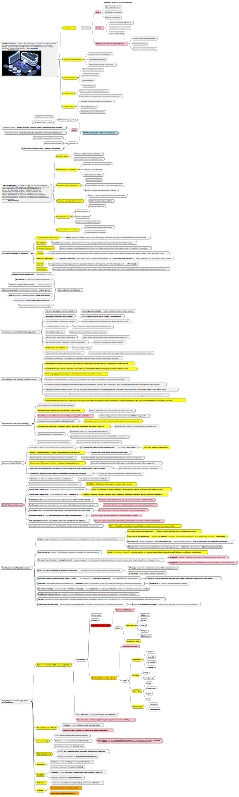

.mindmap

.The detailed summary of the book *The Phoneix Pproject*

"*The Phoenix Project:* A Novel About IT, DevOps, and Helping Your Business Win" is a novel written by Gene Kim, Kevin Behr, and George Spafford. The book tells the story of an IT manager named Bill Palmer, who is tasked with saving a failing project at a fictional company called Parts Unlimited.

The story begins with Bill, who is the VP of IT Operations at Parts Unlimited, being promoted to the position of interim CIO. The company's board of directors has given Bill three months to turn around the IT department, which is mired in problems and has become a bottleneck for the entire organization.

To make matters worse, the company's biggest project, a new online retail system, is months behind schedule and over budget. Bill's job is to get the project back on track and deliver it on time and on budget.

As he starts his new job, Bill quickly discovers that the IT department is a mess. There are too many projects, too many priorities, and too much work in progress. Bill realizes that he needs to implement a new way of working, one that focuses on collaboration, communication, and continuous improvement.

To help him with this task, Bill enlists the help of a mentor named Erik, who teaches him the principles of the *"Three Ways" of DevOps: flow, feedback, and continuous learning and experimentation*. With Erik's guidance, Bill begins to implement changes in the IT department, such as creating cross-functional teams, implementing a Kanban system, and using metrics to measure progress.

As Bill and his team work to improve the IT department, they encounter many challenges, including resistance from other departments, budget constraints, and technical problems. However, they persevere and eventually succeed in delivering the new online retail system on time and on budget.

In the end, "*The Phoenix Project*" is a story about the challenges of IT management and how the principles of DevOps can help organizations overcome those challenges. The book provides practical insights and advice for anyone involved in IT management, software development, or operations. It is a must-read for anyone who wants to understand how to build a high-performing IT organization.

.Here are some key takeaways from *"The Phoenix Project":*

. Focus on flow: One of the core principles of DevOps is to optimize the flow of work through the system. This means eliminating bottlenecks, reducing work in progress, and improving collaboration between teams.

. Embrace feedback: Feedback is essential to continuous improvement. By measuring and monitoring performance, organizations can identify areas for improvement and make changes quickly.

. Foster a culture of experimentation: Organizations that are willing to experiment and take risks are more likely to innovate and succeed. Leaders should create an environment that encourages experimentation and rewards learning.

. Implement a continuous delivery pipeline: Automating the software delivery process can help organizations deliver software faster and with fewer errors. By implementing a continuous delivery pipeline, teams can release software more frequently and with more confidence.

. Break down silos: Silos can be a major impediment to collaboration and communication. By breaking down silos and creating cross-functional teams, organizations can improve communication, reduce handoffs, and speed up delivery.

. Focus on customer value: Ultimately, the goal of IT is to deliver value to customers. By focusing on customer needs and preferences, organizations can create products and services that meet their customers' needs and expectations.

. Develop a learning culture: Organizations that embrace a culture of continuous learning and improvement are more likely to succeed. By encouraging employees to learn and grow, organizations can stay ahead of the curve and adapt to changing market conditions.

Overall, "*The Phoenix Project"* provides a roadmap for organizations that want to improve their IT operations and deliver value to their customers. By following the principles of DevOps and focusing on continuous improvement, organizations can build high-performing teams that are capable of delivering high-quality software quickly and efficiently.

.The detailed summary of the book *The Unicorn Project*

"*The Unicorn Project*" is a novel by Gene Kim, which focuses on the challenges faced by IT organizations in large enterprises. The book follows the journey of a software developer named Maxine, who is tasked with improving the company's struggling IT department. Throughout the story, Maxine faces a variety of obstacles, from entrenched bureaucracy to outdated technology to a lack of trust between different teams.

As she works to transform the IT department, Maxine learns a number of valuable lessons about how to build and run a successful organization. Some of the key themes and concepts explored in the book include:

. The importance of focusing on customer needs: One of the core themes of "*The Unicorn Project*" is the idea that organizations should prioritize the needs and desires of their customers. By understanding customer needs and preferences, organizations can create products and services that truly add value.

. The benefits of cross-functional collaboration: Another key theme of the book is the idea that silos and functional boundaries can be a major impediment to collaboration and innovation. By breaking down these barriers and creating cross-functional teams, organizations can speed up delivery and improve the quality of their products.

. The value of automation and DevOps practices: Throughout the book, Maxine uses automation and DevOps practices to streamline and improve the software delivery process. By automating routine tasks and implementing continuous delivery, organizations can deliver software faster and with fewer errors.

. The importance of continuous learning and improvement: Finally, "*The Unicorn Project*" emphasizes the importance of continuous learning and improvement. By encouraging employees to learn and grow, organizations can stay ahead of the curve and adapt to changing market conditions.

Overall, "*The Unicorn Project*" offers a compelling story about the challenges faced by modern IT organizations and the strategies that can be used to overcome these challenges. By focusing on customer needs, fostering cross-functional collaboration, embracing automation and DevOps, and creating a culture of continuous learning, organizations can build high-performing teams that are capable of delivering value to customers and staying ahead of the competition.

.Some key takeaways from "*The Unicorn Project*":

. Emphasize customer needs: Prioritizing the needs and preferences of customers is crucial for building successful products and services.

. Break down silos: Silos and functional boundaries can impede collaboration and innovation, so it's important to create cross-functional teams that can work together effectively.

. Automate routine tasks: Automation can help streamline the software delivery process, making it faster and more efficient.

. Embrace DevOps practices: DevOps practices, such as continuous delivery, can help improve software quality and speed up delivery.

. Encourage continuous learning and improvement: Organizations that foster a culture of continuous learning and improvement are better equipped to adapt to changing market conditions and stay ahead of the curve.

. Cultivate trust and collaboration: Building trust between different teams and stakeholders is crucial for creating a collaborative and productive work environment.

. Prioritize simplicity and flow: Simplifying processes and minimizing bottlenecks can help improve flow and speed up delivery.

. Foster experimentation and innovation: Encouraging experimentation and risk-taking can lead to new ideas and innovations that drive business growth.

Overall, "*The Unicorn Project*" emphasizes the importance of customer focus, collaboration, automation, DevOps, and continuous learning and improvement. By adopting these principles and practices, organizations can build high-performing teams that are capable of delivering value to customers and staying ahead of the competition.

.The detailed summary of the book *The DevOps Handbook*
"*The DevOps Handbook*" is a book by Gene Kim, Jez Humble, Patrick Debois, and John Willis that provides a comprehensive guide to implementing DevOps practices in organizations. The book is structured around three main sections, each of which covers a different aspect of DevOps.

The first section, "The Three Ways," introduces the core principles of DevOps. These principles include flow, feedback, and continual experimentation and learning. The authors explain how these principles can be applied to software development and delivery to improve speed, quality, and reliability.

The second section, "The Technical Practices of Flow," focuses on the technical aspects of implementing DevOps. The authors discuss practices such as continuous integration, continuous delivery, infrastructure as code, and monitoring and logging. They explain how these practices can be used to streamline the software delivery process and reduce errors and downtime.

The third section, "The Technical Practices of Feedback," focuses on how to use feedback to improve software development and delivery. The authors discuss practices such as automated testing, telemetry, and anomaly detection. They explain how these practices can be used to provide real-time feedback and insights into the performance and reliability of software systems.

Throughout the book, the authors provide numerous case studies and examples of organizations that have successfully implemented DevOps practices. They also provide practical advice and guidance for organizations that are looking to adopt DevOps.

Some of the key themes and concepts explored in "*The DevOps Handbook*" include:

. The importance of collaboration and communication: DevOps emphasizes collaboration and communication between different teams and stakeholders, which can help improve efficiency and reduce errors.

. The benefits of automation: Automation can help streamline the software delivery process and reduce errors and downtime.

. The value of continuous improvement: DevOps emphasizes the importance of continuous improvement and experimentation, which can help organizations stay ahead of the curve and adapt to changing market conditions.

. The importance of feedback: Feedback is crucial for improving software development and delivery, and DevOps provides numerous practices and tools for providing real-time feedback.

Overall, "*The DevOps Handbook*" provides a comprehensive guide to implementing DevOps practices in organizations. By emphasizing collaboration, automation, continuous improvement, and feedback, organizations can improve the speed, quality, and reliability of their software delivery processes.

.Some key takeaways from "*The DevOps Handbook*":
. Collaboration and communication are essential for successful DevOps: DevOps emphasizes the importance of breaking down silos and encouraging collaboration and communication between teams and stakeholders.

Automation can help streamline the software delivery process: Automation can help reduce errors and improve efficiency, allowing organizations to deliver software faster and more reliably.

Continuous improvement is crucial: DevOps emphasizes the importance of continually evaluating and improving software development and delivery processes to stay ahead of the competition.

Feedback is essential for improving software quality: DevOps provides numerous practices and tools for providing real-time feedback on software performance and reliability, allowing organizations to quickly identify and address issues.

Infrastructure as code is a key DevOps practice: Infrastructure as code allows organizations to automate the management and provisioning of infrastructure, making it easier to scale and manage complex systems.

Security is a critical component of DevOps: DevOps emphasizes the importance of integrating security into every stage of the software delivery process, rather than treating it as an afterthought.

. Culture change is necessary for successful DevOps: Successfully implementing DevOps practices often requires a culture change within organizations, with a focus on collaboration, experimentation, and continuous improvement.

Overall, "*The DevOps Handbook*" emphasizes the importance of collaboration, automation, continuous improvement, feedback, infrastructure as code, security, and culture change in successful DevOps implementations. By adopting these principles and practices, organizations can improve the speed, quality, and reliability of their software delivery processes and stay ahead of the competition.

.The detailed summary of the book *Effective DevOps*
"*Effective DevOps*" by Jennifer Davis and Katherine Daniels is a comprehensive guide to implementing DevOps practices within organizations. The book emphasizes the importance of collaboration, communication, and automation in streamlining the software delivery process and improving business outcomes.

The book is organized into three parts: "Cultural Foundations," "Technical Practices," and "Case Studies."

In the first part, "Cultural Foundations," the authors explain the importance of creating a DevOps culture within organizations. They highlight the need for strong leadership, continuous learning, and a focus on customer needs. The authors also explore how to build effective teams and provide guidance on managing change.

In the second part, "Technical Practices," the authors dive into the technical aspects of DevOps. They provide detailed guidance on topics such as continuous integration, continuous delivery, and infrastructure as code. They also cover areas such as monitoring, logging, and testing, and provide advice on how to implement security in a DevOps environment.

In the final part, "Case Studies," the authors provide real-world examples of organizations that have successfully implemented DevOps practices. These case studies illustrate how DevOps can improve the software delivery process and business outcomes.

Throughout the book, the authors emphasize the importance of collaboration, communication, and automation. They provide practical guidance on how to implement DevOps practices, highlighting common pitfalls and offering advice on how to avoid them.

Overall, "*Effective DevOps*" is a comprehensive guide to implementing DevOps practices within organizations. The book provides practical guidance on how to build a DevOps culture, implement technical practices, and measure success. By following the advice in this book, organizations can improve the speed, quality, and reliability of their software delivery process and stay ahead of the competition.

.Some key takeaways from "*Effective DevOps*" by Jennifer Davis and Katherine Daniels:

. Collaboration and communication are crucial to the success of DevOps. Breaking down silos and encouraging cross-functional teams can help improve the software delivery process.

Automation is essential for streamlining the software delivery process and reducing errors. It can help organizations deliver software faster and more reliably.

Continuous learning and improvement are key components of DevOps. Organizations should continually evaluate their software development and delivery processes and look for ways to improve.

Infrastructure as code can help organizations automate the management and provisioning of infrastructure. This can make it easier to scale and manage complex systems.

Security should be integrated into every stage of the software delivery process. Organizations should implement security testing and use secure coding practices.

DevOps requires a cultural shift within organizations. Leaders should encourage collaboration, experimentation, and continuous improvement.

. Real-world case studies can provide valuable insights into how to implement DevOps practices. Organizations can learn from the experiences of others and adapt their own practices accordingly.

Overall, "*Effective DevOps*" emphasizes the importance of collaboration, automation, and continuous improvement in implementing DevOps practices. It provides practical guidance on how to implement these practices and highlights the importance of a cultural shift within organizations. By following the advice in this book, organizations can improve the speed, quality, and reliability of their software delivery process and achieve better business outcomes.

.The detailed summary of the book *Cloud Native Infrastructure*
"*Cloud Native Infrastructure*" is a book that provides guidance on how to build and manage modern, scalable infrastructure in the cloud. It is written by experts in the field of cloud computing and infrastructure, and covers a range of topics, including automation, containers, microservices, and serverless computing.

The book is divided into three parts, starting with an introduction to cloud native infrastructure and its benefits. The authors explain why traditional approaches to infrastructure are no longer sufficient in the cloud era and provide an overview of the key concepts and technologies involved in cloud native infrastructure.

The second part of the book focuses on the practical aspects of building cloud native infrastructure. The authors provide guidance on how to design, deploy, and manage infrastructure using tools such as Kubernetes, Docker, Terraform, and Ansible. They also cover topics such as monitoring, logging, and security, which are critical for ensuring the reliability and security of cloud native infrastructure.

The final part of the book discusses the organizational and cultural changes required to implement cloud native infrastructure successfully. The authors provide guidance on how to build a culture of collaboration, agility, and experimentation, which is essential for the success of cloud native projects.

Overall, "*Cloud Native Infrastructure*" is a valuable resource for anyone involved in building and managing modern infrastructure in the cloud. The book provides a detailed understanding of the key concepts, technologies, and best practices involved in cloud native infrastructure, and offers practical guidance and examples of how to implement these principles in practice. By following the guidance and best practices outlined in the book, readers can build and manage scalable, reliable, and secure infrastructure in the cloud, and deliver value to their customers with high levels of uptime and performance.

.Some key takeaways from "*Cloud Native Infrastructure*":

. Cloud native infrastructure is a new approach to building and managing modern, scalable infrastructure in the cloud.

. Cloud native infrastructure is characterized by its use of automation, containers, microservices, and serverless computing.

. Tools such as Kubernetes, Docker, Terraform, and Ansible are essential for building and managing cloud native infrastructure.

. Monitoring, logging, and security are critical aspects of cloud native infrastructure, which must be carefully managed to ensure reliability and security.

. Cloud native infrastructure requires a cultural shift in organizations, with an emphasis on collaboration, agility, and experimentation.

. By building cloud native infrastructure, organizations can achieve greater agility, scalability, and cost efficiency, while also delivering better performance and reliability to their customers.

. The adoption of cloud native infrastructure is a journey, and organizations should start by identifying the key areas where they can gain the most benefits and focus their efforts there.

. Cloud native infrastructure requires a different approach to team organization and skill sets, with a focus on cross-functional teams and a culture of learning and continuous improvement.

. Cloud native infrastructure is not a one-size-fits-all solutions, and organizations should carefully evaluate their needs and choose the right tools and technologies for their specific use case.

Overall, "*Cloud Native Infrastructure*" provides a comprehensive guide to building and managing modern infrastructure in the cloud. By following the guidance and best practices outlined in the book, readers can build and manage scalable, reliable, and secure infrastructure in the cloud, and deliver value to their customers with high levels of uptime and performance.

.The detailed summary of the book *Cloud Computing*
"*Cloud Computing*" is a book that provides an overview of the key concepts, technologies, and applications of cloud computing. The book is written by experts in the field of cloud computing and covers a range of topics, including the history of cloud computing, cloud infrastructure, cloud services, cloud security, and cloud computing applications.

The book is divided into four parts, starting with an introduction to cloud computing and its benefits. The authors explain how cloud computing has evolved and how it is changing the way businesses and organizations operate. They also provide an overview of the key concepts and technologies involved in cloud computing, such as virtualization, multi-tenancy, and elasticity.

The second part of the book focuses on cloud infrastructure, including the hardware and software components that make up cloud computing environments. The authors cover topics such as data centers, networking, storage, and virtualization, providing readers with a detailed understanding of how cloud infrastructure works.

The third part of the book covers cloud services, including Software as a Service (SaaS), Platform as a Service (PaaS), and Infrastructure as a Service (IaaS). The authors explain the differences between these service models, and provide examples of popular cloud services and their use cases.

The final part of the book focuses on cloud security, including the risks and challenges associated with cloud computing and the strategies and best practices for securing cloud environments. The authors cover topics such as data privacy, compliance, identity and access management, and network security.

Overall, "*Cloud Computing*" is a valuable resource for anyone looking to understand the fundamentals of cloud computing. The book provides a comprehensive overview of the key concepts, technologies, and applications of cloud computing, and offers practical guidance and examples of how to implement these principles in practice. By following the guidance and best practices outlined in the book, readers can build and manage scalable, reliable, and secure cloud environments, and deliver value to their customers with high levels of uptime and performance.

.Some key takeaways from "*Cloud Computing*":

. Cloud computing has revolutionized the way businesses and organizations operate, enabling them to scale quickly, reduce costs, and increase agility.

. The key technologies involved in cloud computing include virtualization, multi-tenancy, and elasticity, which allow organizations to optimize resource utilization and improve efficiency.

. Cloud infrastructure is made up of a variety of hardware and software components, including data centers, networking, storage, and virtualization. Understanding how these components work together is essential for building and managing cloud environments.

. Cloud services come in three main flavors: Software as a Service (SaaS), Platform as a Service (PaaS), and Infrastructure as a Service (IaaS). Each service model offers different levels of control and flexibility, and choosing the right service model is critical for meeting specific business requirements.

. Cloud security is a key concern for organizations deploying cloud computing, and requires careful planning and implementation of best practices. Key security considerations include data privacy, compliance, identity and access management, and network security.

. Adopting cloud computing requires a cultural shift within organizations, with a focus on collaboration, agility, and experimentation. Teams need to be cross-functional and have the right skill sets to build and manage cloud environments effectively.

. Cloud computing is not a one-size-fits-all solutions, and organizations need to carefully evaluate their needs and choose the right tools and technologies for their specific use case. This requires a deep understanding of the key principles and best practices of cloud computing.

Overall, "*Cloud Computing*" provides a comprehensive overview of the key concepts, technologies, and applications of cloud computing. By following the guidance and best practices outlined in the book, organizations can build and manage scalable, reliable, and secure cloud environments, and deliver value to their customers with high levels of uptime and performance.

.Summary of the book *Designing Data-Intensive Applications*

"*Designing Data-Intensive Applications*" is a book written by Martin Kleppmann that explores the world of data systems and the challenges involved in designing, building, and maintaining them. The book covers a wide range of topics, including data storage, data processing, distributed systems, and scalability.

The book is divided into three parts. Part one focuses on data storage and covers topics such as data models, storage engines, indexing, and query optimization. Part two focuses on data processing and covers topics such as batch processing, stream processing, and distributed systems. Part three focuses on reliability and covers topics such as fault tolerance, replication, and consensus algorithms.

One of the key themes of the book is the importance of choosing the right data model for your application. The book covers a range of data models, including relational, document, graph, and key-value stores, and provides guidance on when to use each one. The book also covers the pros and cons of various storage engines and indexing techniques.

Another key theme of the book is the importance of scalability and fault tolerance. The book covers a range of techniques for achieving scalability, including sharding, replication, and partitioning. The book also covers techniques for achieving fault tolerance, such as replication, consensus algorithms, and distributed transactions.

The book is highly recommended for software engineers, architects, and data professionals who are interested in building data-intensive applications. The book provides a wealth of knowledge and practical advice on designing and building robust, scalable, and reliable data systems. The book is also highly readable and accessible, making it a great resource for both experienced professionals and newcomers to the field. Overall, "*Designing Data-Intensive Applications*" is an essential resource for anyone working in the world of data systems.

.Some key takeaways from the book "*Designing Data-Intensive Applications*" by Martin Kleppmann:

. Choose the right data model for your application: The book emphasizes the importance of selecting the right data model for your application. Each data model has its own strengths and weaknesses, and choosing the right one can significantly impact the performance and scalability of your application.

. Data storage and retrieval: The book covers various techniques for data storage and retrieval, including indexing, caching, and compression. The choice of data storage technique can have a significant impact on the performance and scalability of your application.

. Data processing: The book covers batch processing and stream processing, and discusses various techniques for implementing these systems, such as MapReduce and Apache Kafka. The book also emphasizes the importance of fault tolerance in data processing systems.

. Distributed systems: The book provides an overview of distributed systems, including distributed databases, distributed messaging, and consensus algorithms. The book emphasizes the importance of fault tolerance and replication in distributed systems.

. Scalability: The book covers various techniques for achieving scalability, including sharding, partitioning, and replication. The book emphasizes the importance of designing systems that can scale horizontally as demand increases.

. Reliability: The book covers techniques for achieving reliability, including replication, consensus algorithms, and failure detection. The book emphasizes the importance of designing systems that can tolerate and recover from failures.

. Performance: The book provides guidance on how to optimize the performance of data-intensive applications, including techniques for reducing latency, increasing throughput, and optimizing resource utilization.

. Trade-offs: The book emphasizes that every design decision involves trade-offs, and that there is no one-size-fits-all solution. The book encourages designers to understand the trade-offs involved in each design decision and make informed choices.

Overall, "*Designing Data-Intensive Applications*" is an essential resource for anyone working with data-intensive applications. The book provides a comprehensive overview of the challenges involved in designing, building, and maintaining data systems, and provides practical guidance on how to address these challenges.