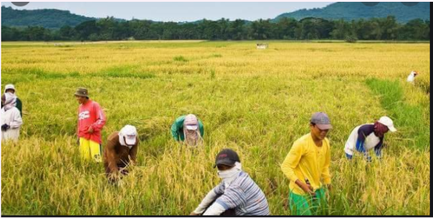
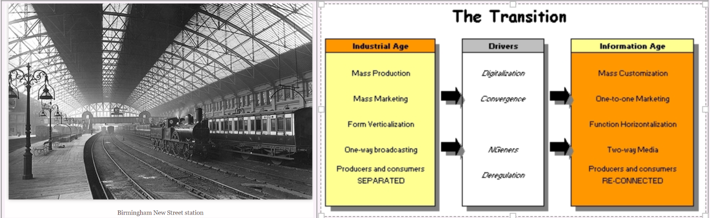
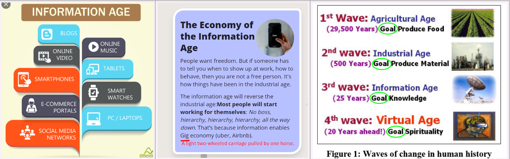
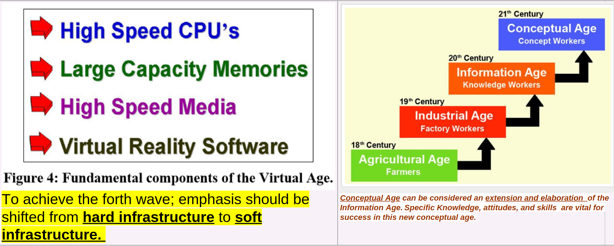
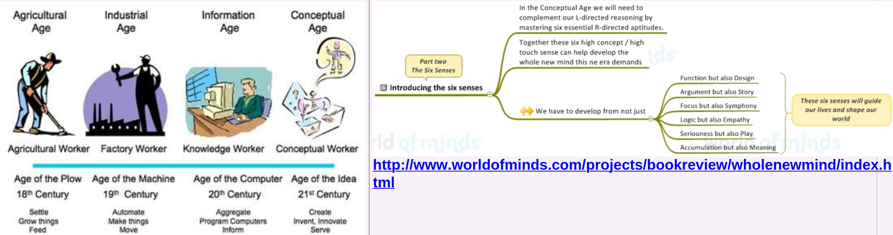

== 1- Agricultural age
. The invention of farming about #*12,000 years ago*# gave humans access to #new food and energy resources.#

. Farming has dramatically transformed the way humans lived.

. This eventually led to the development of agrarian civilization.

.agriculture age

== 2- Industrial Revolution## (1750s–1900)##

The industrial revolution is a phase of social development that saw the growth of mass industrial production and the shift from a largely #agrarian economy# to an #industrial economy# based on #coal, steel, railways and specialization of labor.#

The Industrial Revolution was a period between the late 18th Century and early 20th Century, which saw rapid growth in mechanization, industrial production and #change in society.#

=== Two stages of Industrial Revolution

. The #*first stage of the Industrial Revolution (1770-1870)*# – Centered on #*steam engine, water, iron and shift from agriculture.*#

. The #*second stage of Industrial Revolution (1870-1914)*# – New technologies of #*electricity, development of petrol engine, oil, and greater use of cheap steel.*#

== 3- Information Age (1971–present)

The Information age refers to the new modern technologies which have shaped the modern world. These technologies include #*computers, the Internet and mobile phones.*# Key figures include business entrepreneurs, such as Bill Gates and Steve Jobs.

.Information age

.4rth wave drivers (conceptual age)

https://www.worldofminds.com/projects/bookreview/wholenewmind/index.html[*Daniel Pink- A Whole New Mind Why Right-Brainers will rule the future*]

