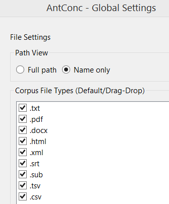

How to search for the specific content of the book?
You can use AntConc software.
Simply load the supported files.
**The following are the files supported by AntConc:**

If you load many pdf files, then it will slow down the task, meaning that it takes a long time to complete.

| Books backlog | Collection of all the books I want to study      |
|---------------|--------------------------------------------------|
| **In progress**   | These are all those books I'm currently reading. |
| **Done**          | All those books which I've read.                 |
