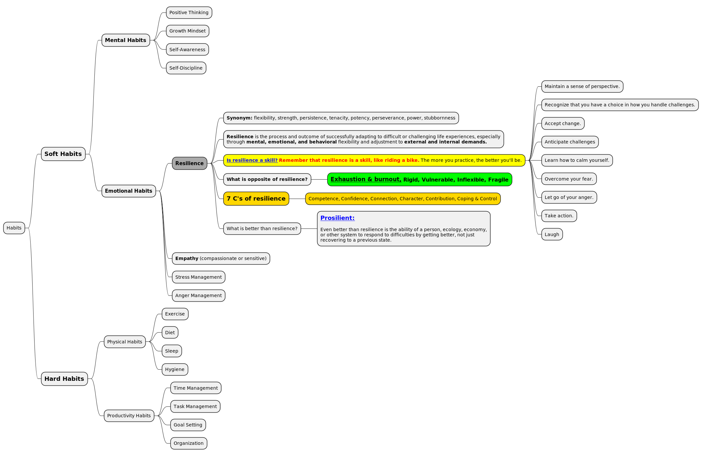

Yes, there is a terminology and concept like soft habits and hard habits. It is often used in the context of personal development and habit formation.

**Soft habits** are those that are more difficult to define and measure, such as:

* Being polite and respectful
* Being a good listener
* Being positive and optimistic
* Being adaptable and flexible
* Being creative and innovative

**Hard habits** are those that are more concrete and measurable, such as:

* Exercising for 30 minutes every day
* Eating a healthy diet
* Getting enough sleep
* Meditating for 10 minutes every morning
* Reading one book per month

*#Soft habits are often more difficult to develop and maintain than hard habits. This is because they are less tangible and require more self-awareness and discipline. However, soft habits can have a significant impact on our overall well-being (health or happiness) and success.*#

Here are some tips for developing soft habits:

* *#Start small.#* Don't try to change too many things at once. Pick one soft habit that you want to focus on and work on that one until it becomes second nature.
* #*Be consistent.*# The key to developing any habit is consistency. Try to do your desired behavior every day, even if it's just for a few minutes.
* *#Track your progress.#* Keeping track of your progress can help you stay motivated and on track. You can use a habit tracker, journal, or simply keep a mental tally of how often you do your desired behavior.
* *#Reward yourself.#* When you reach a milestone, reward yourself with something you enjoy. This will help you associate positive feelings with your new habit and make it more likely to stick.

It is important to note that the distinction between soft and hard habits is not always clear-cut. Some habits may have elements of both. For example, the habit of exercising regularly is a hard habit, but it can also be seen as a soft habit because it requires discipline and motivation.

Ultimately, the best way to develop good habits is to focus on what works for you. There is no one-size-fits-all approach. Experiment with different things and find what helps you stay consistent and motivated.

.soft and hard habits

